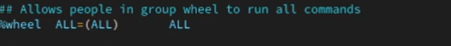
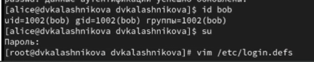
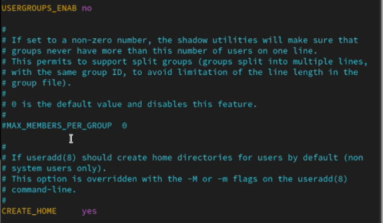
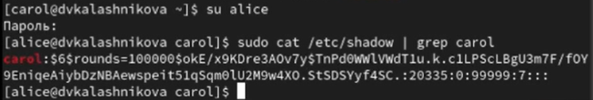
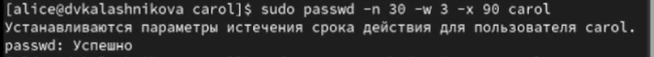
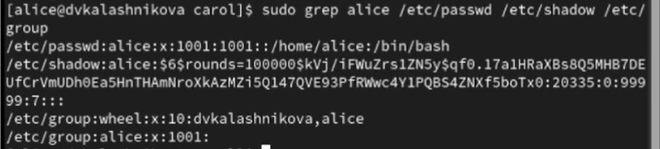
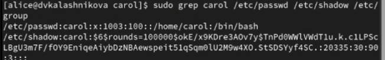
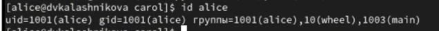

---
## Front matter
lang: ru-RU
title: Презентация
subtitle: Лабораторная работа №2
author:
  - Калашникова Д. В.
institute:
  - Российский университет дружбы народов, Москва, Россия
date: 13 сентября 2025

## i18n babel
babel-lang: russian
babel-otherlangs: english

## Formatting pdf
toc: false
toc-title: Содержание
slide_level: 2
aspectratio: 169
section-titles: true
theme: metropolis
header-includes:
 - \metroset{progressbar=frametitle,sectionpage=progressbar,numbering=fraction}
---

# Информация

## Докладчик

:::::::::::::: {.columns align=center}
::: {.column width="70%"}

  * Калашникова Дарья Викторовна
  * Российский университет дружбы народов
  * [1132243108@pfur.ru](mailto:1132243108@pfur.ru)

:::
::: {.column width="30%"}

:::
::::::::::::::

## Цель работы 

Получить представление о работе с учетными записями пользователей и группами пользователей в операционной системе типа Linux

## Задание 

Создать пользователей и научиться работать с группой пользователей.

## Учетная запись

Для начала ввводим команду whoami  для того чтобы определить учетную запись

{width=70%}

## Подробная информация

Вводим команду id

1. uid=1000(dvkalashnikova) - индификатор пользователя
2. gid=1000(dvkalashnikova) - индификатор основной группы 
3. groups=1000(dvkalashnikova) - список дополнительных групп в которые входит пользователь 

{width=70%}

## Возвращение к учетной записи

И затем прописываем команду su dvkalashnikova для того чтобы вернуться к учетной записи 

{width=70%}

## Открытие файла

Затем пропишем команду sudo -i visudo

1. sudo -i visudo  нам позволяет смотреть файл в безопасном режиме и редактировать его, а также редактор проверяет синтаксис при сохранении, предотвращая случайное повреждение файла и поломку системы sudo.

{width=70%}

## Строка wheel

Далее находим в файле %wheel all=(all) all

1. %wheel - указывает на группу wheel в системе 
2. all= - разрешает выполнение команд на любом хосте 
3. (all) - разрешает выполнение команд от имени Любого пользователя
4. all - разрешает выполение любой команды 

{width=70%}

## Создание пользователя alice

Создаем пользователя под именем alice, проверяем добавилась ли alicе в группу wheel, введя команду id alice и зададим пароль для этого пользователя

{width=70%}

## Создание пользователя bob

После чего переключаемся на пользователя alice и создаем нового пользователя bob

{width=70%}

## Смотрим в какие группы входит пользователь  bob

Создаем пароль для пользователя bob и проверяем id

{width=70%}

## Установка параметров

Переключаемся в пользователя root и открываем файл конфигурации /etc/login.defs для редактирования и проверяем, что CREATE_HOME
стоит в значение yes, а также устанавливаем в USERGROUPS_ENAB параметр no 

{width=70%}

## Создание каталогов

После чего переходим в каталог /etc/skel и создаем там каталоги Pictures и Documents

{width=70%}

## Изменяем файл

После чего изменяем содержимое файла .bashrc, добавив строку - export EDITOR=/usr/bin/mceditor

{width=70%}

## Создание пользователя carol

После переключения в терминале на учетную запись alice создаем нового пользователя carol и устанавливаем его пароль

{width=70%}

## Проверка

Затем переходим в пользователя carol и проверяем в какую первоначальную группу входит данный пользователь и проверяем, что создались каталоги Pictures и Documents

{width=70%}

## Пароль пользователя carol

Переключаемся в терминале на пользователя alice и пишем команду sudo cat /etc/shadow | grep carol

У нас выводится зашифрованный пароль, где будет дата изменение пароля, минимальный срок действия (у нас это 0), далее срок действия пароля (99999) и количество дней на предупреждение пользователя об истечении срока действия пароля

{width=70%}

## Изменение свойст пароля пользователя carol

 После чего меняем свойства пароля пользователя carol командой sudo passwd -n 30 -w 3 -x 90 carol

{width=70%}

## Пароль carol

В этой записи срок действия пароля истекает через 90 дней, за 3 дня до истечения будет предупреждение и пароль должен использоваться как минимум за 30 дней до его изменения

{width=70%}

## Проверка пользователя alice

Проверяем что индификатор alice существует во всех трех файлах

{width=70%}

## Проверка пользователя carol

И убеждаемся что индификатор  carol существует не во всех трех файлах

{width=70%}

## Работа с группами 

Используя usermod для добавления пользователей alice и bob в группу main, а carol, dan, dave и david — в группу third:

Прописав данные команды 

sudo usermod -aG main alice
sudo usermod -aG main bob
sudo usermod -aG third carol

{width=70%}

## Проверка пользователя carol

Проверяем, что пользователь carol правильно был добавлен в группу third 

{width=70%}

## Проверка пользователя bob

Проверяем, что пользователь bob правильно был добавлен в группу main

{width=70%}

## Проверка пользователя alice

Проверяем, что пользователь alice правильно была добавлена в группу main

{width=70%}

## Выводы

В результате выполнения лабораторной работы я получила опыт работы  с учетными записями пользователей и группами пользователей в операционной системе типа Linux

