---
## Front matter
title: "Отчет о лабораторной работе"
subtitle: "Лабораторная работа №2"
author: "Калашникова Дарья Викторовна"

## Generic otions
lang: ru-RU
toc-title: "Содержание"

## Bibliography
bibliography: bib/cite.bib
csl: pandoc/csl/gost-r-7-0-5-2008-numeric.csl

## Pdf output format
toc: true # Table of contents
toc-depth: 2
lof: true # List of figures
lot: true # List of tables
fontsize: 12pt
linestretch: 1.5
papersize: a4
documentclass: scrreprt
## I18n polyglossia
polyglossia-lang:
  name: russian
  options:
	- spelling=modern
	- babelshorthands=true
polyglossia-otherlangs:
  name: english
## I18n babel
babel-lang: russian
babel-otherlangs: english
## Fonts
mainfont: IBM Plex Serif
romanfont: IBM Plex Serif
sansfont: IBM Plex Sans
monofont: IBM Plex Mono
mathfont: STIX Two Math
mainfontoptions: Ligatures=Common,Ligatures=TeX,Scale=0.94
romanfontoptions: Ligatures=Common,Ligatures=TeX,Scale=0.94
sansfontoptions: Ligatures=Common,Ligatures=TeX,Scale=MatchLowercase,Scale=0.94
monofontoptions: Scale=MatchLowercase,Scale=0.94,FakeStretch=0.9
mathfontoptions:
## Biblatex
biblatex: true
biblio-style: "gost-numeric"
biblatexoptions:
  - parentracker=true
  - backend=biber
  - hyperref=auto
  - language=auto
  - autolang=other*
  - citestyle=gost-numeric
## Pandoc-crossref LaTeX customization
figureTitle: "Рис."
tableTitle: "Таблица"
listingTitle: "Листинг"
lofTitle: "Список иллюстраций"
lotTitle: "Список таблиц"
lolTitle: "Листинги"
## Misc options
indent: true
header-includes:
  - \usepackage{indentfirst}
  - \usepackage{float} # keep figures where there are in the text
  - \floatplacement{figure}{H} # keep figures where there are in the text
---

# Цель работы 

Получить представление о работе с учетными записями пользователей и группами пользователей в операционной системе типа Linux

# Задание 

Создать пользователей и научиться работать с группой пользователей.

# Выполнение лабораторной работы

Для начала ввводим команду whoami  для того, чтобы определить учетную запись (рис. [-@fig:001]).

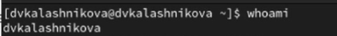{#fig:001 width=70%}

Вводим команду id(рис. [-@fig:002]).

1. uid=1000(dvkalashnikova) - индификатор пользователя
2. gid=1000(dvkalashnikova) - индификатор основной группы 
3. groups=1000(dvkalashnikova) - список дополнительных групп в которые входит пользователь 

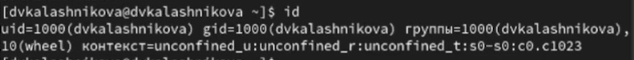{#fig:002 width=70%}

Далее используем команду su для переключения к учетной записи root  и набераем id(рис. [-@fig:003]).

1. uid=0(root) - индификатор пользователя
2. gid=0(root) - индификатор основной группы 
3. groups=1000(root) - список дополнительных групп в которые входит пользователь 

И затем прописываем команду su dvkalashnikova для того чтобы вернуться к учетной записи 

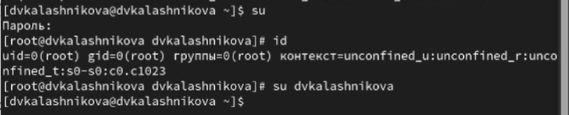{#fig:003 width=70%}

Затем пропишем команду sudo -i visudo (рис. [-@fig:004]).

1. sudo -i visudo  нам позволяет смотреть файл в безопасном режиме и редактировать его, а также редактор проверяет синтаксис при сохранении, предотвращая случайное повреждение файла и поломку системы sudo.

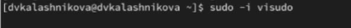{#fig:004 width=70%}

Далее находим в файле %wheel all=(all) all (рис. [-@fig:005]).

1. %wheel - указывает на группу wheel в системе 
2. all= - разрешает выполнение команд на любом хосте 
3. (all) - разрешает выполнение команд от имени Любого пользователя
4. all - разрешает выполение любой команды 

{#fig:005 width=70%}

Создаем пользователя под именем alice, проверяем добавилась ли alicе в группу wheel командой id alice и зададаем пароль для этого пользователя (рис. [-@fig:006]).

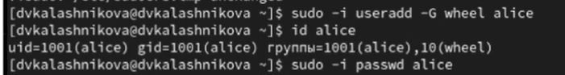{#fig:006 width=70%}

После чего переключаемся на пользователя alice и создаем нового пользователя bob (рис. [-@fig:007]).

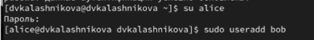{#fig:007 width=70%}

Создаем пароль для пользователя bob и проверяем id (рис. [-@fig:008]).

{#fig:008 width=70%}

Переключаемся на пользователя root и открываем файл конфигурации /etc/login.defs для редактирования и проверяем, что CREATE_HOME
стоит в значение yes, а также устанавливаем в USERGROUPS_ENAB параметр no (рис. [-@fig:009]).

{#fig:009 width=70%}

После чего переходим в каталог /etc/skel и создаем там каталоги Pictures и Documents (рис. [-@fig:010]).

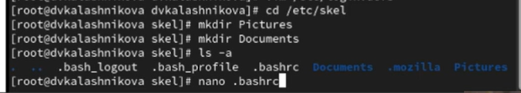{#fig:010 width=70%}

Далее изменяем содержимое файла .bashrc, добавив строку - export EDITOR=/usr/bin/mceditor (рис. [-@fig:011]).

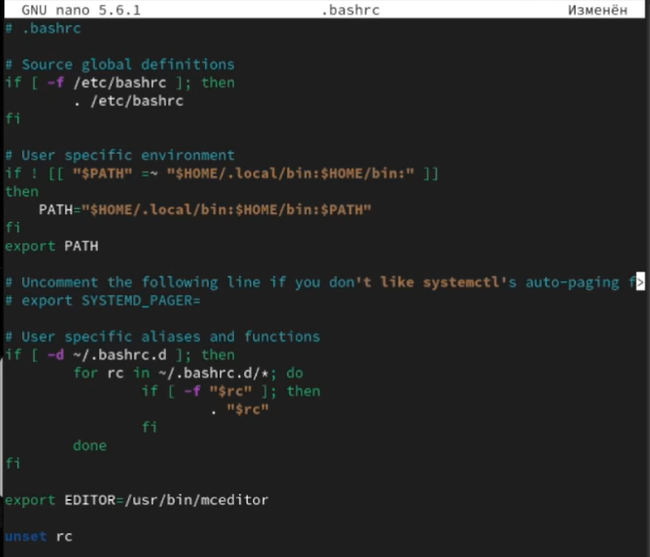{#fig:011 width=70%}

После переключения в терминале на учетную запись alice создаем нового пользователя carol и устанавливаем его пароль (рис. [-@fig:012]).

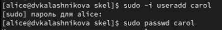{#fig:012 width=70%}

Затем переходим в пользователя carol и проверяем в какую первоначальную группу входит данный пользователь и проверяем, что создались каталоги Pictures и Documents (рис. [-@fig:013]).

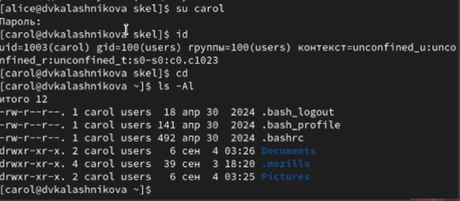{#fig:013 width=70%}

Переключаемся в терминале на пользователя alice и пишем команду sudo cat /etc/shadow | grep carol(рис. [-@fig:014]).

У нас выводится зашифрованный пароль, где будет дата изменение пароля, минимальный срок действия (у нас это 0), далее срок действия пароля (99999) и количество дней на предупреждение пользователя об истечении срока действия пароля

{#fig:014 width=70%}

После чего меняем свойства пароля пользователя carol (рис. [-@fig:015]).

{#fig:015 width=70%}

В этой записи срок действия пароля истекает через 90 дней, за 3 дня до истечения будет предупреждение и пароль должен использоваться как минимум за 30 дней до его изменения  (рис. [-@fig:016]). 

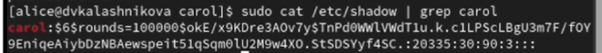{#fig:016 width=70%}

Проверяем что индификатор alice существует во всех трех файлах(рис. [-@fig:017]). 

{#fig:017 width=70%}

И убеждаемся что индификатор  carol существует не во всех трех файлах (рис. [-@fig:018]). 

{#fig:018 width=70%}

# Работа с группами 

Используя usermod для добавления пользователей alice и bob в группу main, а carol, dan, dave и david — в группу third:(рис. [-@fig:019]). 

Прописав данные команды 

sudo usermod -aG main alice
sudo usermod -aG main bob
sudo usermod -aG third carol

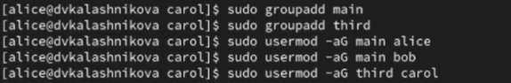{#fig:019 width=70%}

Проверяем, что пользователь carol правильно был добавлен в группу third(рис. [-@fig:020]). 

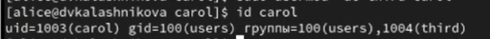{#fig:020 width=70%}

Проверяем, что пользователь bob правильно был добавлен в группу main(рис. [-@fig:021]). 

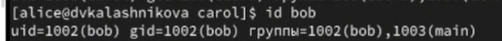{#fig:021 width=70%}

Проверяем, что пользователь alice правильно была добавлена в группу main(рис. [-@fig:022]). 

{#fig:022 width=70%}

# Контрольные вопросы

1. При помощи каких команд можно получить информацию о номере (идентификаторе),назначенном пользователю Linux, о группах, в которые включён пользователь?

При помощи команды  id - показывает uid, gid и группы пользователя, groups показывает список групп, whoami- имя текущего пользователя 

2. Какой UID имеет пользователь root? При помощи какой команды можно узнать UID пользователя? Приведите примеры.

У пользователя root всегда 0, с помошью команды id -u "имя пользователя" Привер: id -u root

3. В чём состоит различие между командами su и sudo?

Su для переключение на другого пользователя с вводом пароля, а sudo для выполнения отдельных команд от имени root с вводом своего пароля 

4. В каком конфигурационном файле определяются параметры sudo?

Конфигурация sudo создается в файле /etc/suddoers

5. Какую команду следует использовать для безопасного изменения конфигурации sudo?

Для безоппасного редактирования используют команду visudo

6. Если вы хотите предоставить пользователю доступ ко всем командам администрирования системы через sudo, членом какой группы он должен быть?

Чтобы дать пользователю полный доступ ко всем командам через sudo, он должен быть членом группы sudo

7. Какие файлы/каталоги можно использовать для определения параметров, которые будут использоваться при создании учётных записей пользователей? Приведите при-меры настроек.

1)/etc/default/useradd - общие параметры по умолчанию  
Пример: HOME =/home 
2) /etc/login.defs - параметр для паролей  uid/gid 
Пример: PASS_MAX_DAYS 90

8. Где хранится информация о первичной и дополнительных группах пользователей ОС типа Linux? В отчёте приведите пояснение таких записей для пользователя alice.

1) файл /etc/passwd - указывакет uid и первичную группу пользователей 
2)файл /etc/group хранит список всех групп и их участников

Пример: alice в /etc/passwd, вывод - alice:x:1001:1001:Alice USer:/home/alice:/bin/bash, а при команде  /etc/group будет - developers:x:1002:alice,bob

9. Какие команды вы можете использовать для изменения информации о пароле пользователя (например о сроке действия пароля)?

Passwd "username" - смена пароля, chage "username" управление сроком действия пароля 
Пример о смене действия пароля: chage -M 90 alice

10. Какую команду следует использовать для прямого изменения информации в файле /etc/group и почему?

Используют visudo для безоппасного редактирования 
 

# Выводы

В результате выполнения лабораторной работы я получила опыт работы  с учетными записями пользователей и группами пользователей в операционной системе типа Linux

