---
## Front matter
lang: ru-RU
title: Презентация
subtitle: Лабораторная работа № 3
author:
  - Калашникова Д. В.
institute:
  - Российский университет дружбы народов, Москва, Россия
  
date: 17 сентября 2025

## i18n babel
babel-lang: russian
babel-otherlangs: english

## Formatting pdf
toc: false
toc-title: Содержание
slide_level: 2
aspectratio: 169
section-titles: true
theme: metropolis
header-includes:
 - \metroset{progressbar=frametitle,sectionpage=progressbar,numbering=fraction}
---

# Информация

## Докладчик

:::::::::::::: {.columns align=center}
::: {.column width="70%"}

  * Калашникова Дарья Викторовна
  * Российский университет дружбы народов
  * [1132243108@pfur.ru](mailto:1132243108@pfur.ru)

:::
::: {.column width="30%"}

:::
::::::::::::::

## Цель работы

Получение навыков настройки базовых и специальных прав доступа для групп пользователей в операционной системе типа Linux.

## Задание

Нужно выполнить действия по управлению базовыми разрешениями для групп пользователей и специальными разрешениями для групп пользователей.

## Создание каталогов

Открываем терминал с учётной записью root и в корневом каталоге создаем каталоги и смотрим кто является их владельцем

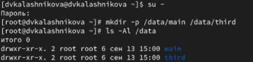{width=70%}

## Смена владельцев каталогов

Меняем владельцев этих каталогов с root на main и third соответственно, прежде чем установим разрешения и смотрим кто теперь является их владельцем

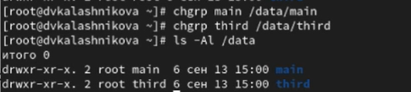{width=70%}

## Смена разрешений
Устанавливаем разрешения, позволяющие владельцам каталогов записывать файлы в эти каталоги и запрещающие доступ к содержимому каталогов всем другим пользователям и группам

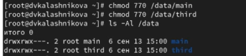{width=70%}

## Создание файла

Далее переходим под учётную запись пользователя bob и переходим в каталог /data/main и создаем файл emptyfile в этом каталоге 

{width=70%}

## Создание файла

Теперь под пользователем bob пробуем перейти в каталог /data/third и создать файл emptyfile в этом каталоге, но у нас не получится это, так как  bob находится в  main и принадлежит группе  main 

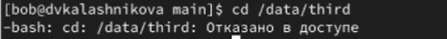{width=70%}

## Создание файлов

Далее открываем новый терминал под пользователем alice и создаем два файла

{width=70%}

## Удаление файлов

В другом терминале переходим под учётную запись пользователя bob и переходим в нужный каталог, при помощи команды ls -l мы увидим два файла alice и нам нужно их удалить

{width=70%}

## Создание файлов

Далее создаем два файла, которые принадлежат пользователю bob 

{width=70%}

## Установка разрешений
В терминале под пользователем root устанавливаем для каталога /data/main бит идентификатора группы, а также stiky-бит для разделяемого (общего) каталога группы 

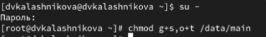{width=70%}

## Создание файлов

Далее в терминале пользователя alice создаем два файла 

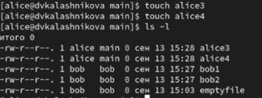{width=70%}

## Попытка удаления

Теперь в терминале пробуем удалить файлы, принадлежащие
пользователю bob и убеждаемся, что stiky-бит предотвратит их удаление

{width=70%}

## Установка прав

Следующим шагом открываем терминал с учётной записью root и устанавливаем права на чтение и выполнение в каталоге /data/main для группы third и права на чтение и выполнение для группы main в каталоге /data/third 

{width=70%}

## Проверка становки разрешений

Теперь используем команду getfacl, чтобы убедиться в правильности установки разрешений 

{width=70%}

## Создание и проверка

Создаем новый файл newfile1 в каталоге /data/main и используем команду getfacl для проверки. Такие же действия выполняем для каталога /data/third 

1. Владелец - root - чтение и запись
2. Группа владелец - group main - только чтение
3. Все остальные - other - только чтение

{width=70%}

## Создание и проверка

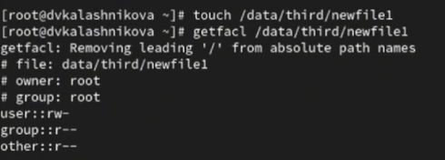{width=70%}

## Создание и проверка

Далее устанавливаем ACL по умолчанию для каталога /data/main и добавляем ACL по умолчанию для каталога /data/third, а также проверям что эти настройки работают, добавив новый файл в оба каталога

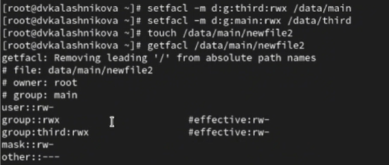{width=70%}

## Создание и проверка

Теперь для проверки полномочий группы third в каталоге /data/third войдем в другом терминале под учётной записью члена группы third и проверим возможность удаления файлов и возможность осуществления в них записи 

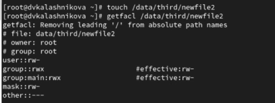{width=70%}

## Проверка 

После чего переходим под учетную запись carol и проверяем операции с файлом

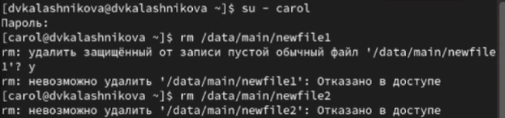{width=70%}

## Проверка 

Затем проверяем возможно ли осуществить запись в файл

1. Файлы не удалились, так как у пользователя carol нет прав на удаление.

2. В первый файл не удалось ничего записать, так как не было для этого нужных прав. А во второй файл удалось осуществить запись, так как были права на это.

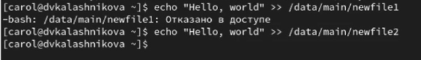{width=70%}

## Выводы

В результате выполнения лабораторной работы я получила опыт работы с настройками базовых и специальных прав доступа для групп пользователей в операционной системе типа linux 

