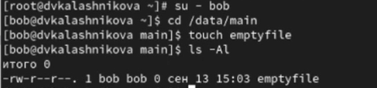
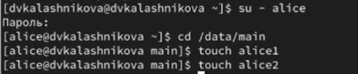
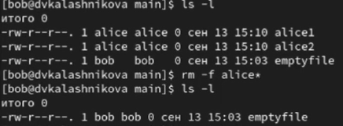
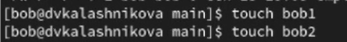
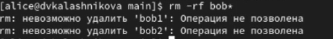
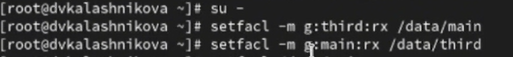
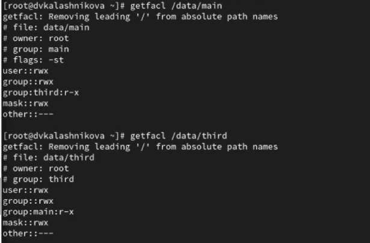
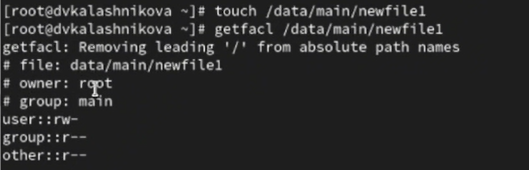

---
## Front matter
title: "Лабораторная работа № 3"
subtitle: "Настройка прав доступа"
author: "Калашникова Дарья Викторовна"

## Generic otions
lang: ru-RU
toc-title: "Содержание"

## Bibliography
bibliography: bib/cite.bib
csl: pandoc/csl/gost-r-7-0-5-2008-numeric.csl

## Pdf output format
toc: true # Table of contents
toc-depth: 2
lof: true # List of figures
lot: true # List of tables
fontsize: 12pt
linestretch: 1.5
papersize: a4
documentclass: scrreprt
## I18n polyglossia
polyglossia-lang:
  name: russian
  options:
	- spelling=modern
	- babelshorthands=true
polyglossia-otherlangs:
  name: english
## I18n babel
babel-lang: russian
babel-otherlangs: english
## Fonts
mainfont: IBM Plex Serif
romanfont: IBM Plex Serif
sansfont: IBM Plex Sans
monofont: IBM Plex Mono
mathfont: STIX Two Math
mainfontoptions: Ligatures=Common,Ligatures=TeX,Scale=0.94
romanfontoptions: Ligatures=Common,Ligatures=TeX,Scale=0.94
sansfontoptions: Ligatures=Common,Ligatures=TeX,Scale=MatchLowercase,Scale=0.94
monofontoptions: Scale=MatchLowercase,Scale=0.94,FakeStretch=0.9
mathfontoptions:
## Biblatex
biblatex: true
biblio-style: "gost-numeric"
biblatexoptions:
  - parentracker=true
  - backend=biber
  - hyperref=auto
  - language=auto
  - autolang=other*
  - citestyle=gost-numeric
## Pandoc-crossref LaTeX customization
figureTitle: "Рис."
tableTitle: "Таблица"
listingTitle: "Листинг"
lofTitle: "Список иллюстраций"
lotTitle: "Список таблиц"
lolTitle: "Листинги"
## Misc options
indent: true
header-includes:
  - \usepackage{indentfirst}
  - \usepackage{float} # keep figures where there are in the text
  - \floatplacement{figure}{H} # keep figures where there are in the text
---

# Цель работы

Получение навыков настройки базовых и специальных прав доступа для групп пользователей в операционной системе типа Linux.

# Задание

Нужно выполнить действия по управлению базовыми разрешениями для групп пользователей и специальными разрешениями для групп пользователей.

# Выполнение лабораторной работы

Открываем терминал с учётной записью root и в корневом каталоге создаем каталоги и смотрим кто является их владельцем (рис. [-@fig:001]).

{#fig:001 width=70%}

Меняем владельцев этих каталогов с root на main и third соответственно, прежде чем установим разрешения и смотрим кто теперь является их владельцем (рис. [-@fig:002]).

{#fig:002 width=70%}

Устанавливаем разрешения, позволяющие владельцам каталогов записывать файлы в эти каталоги и запрещающие доступ к содержимому каталогов всем другим пользователям и группам (рис. [-@fig:003]).

{#fig:003 width=70%}

Далее переходим под учётную запись пользователя bob и переходим в каталог /data/main и создаем файл emptyfile в этом каталоге (рис. [-@fig:004]).

{#fig:004 width=70%}

Теперь под пользователем bob пробуем перейти в каталог /data/third и создать файл emptyfile в этом каталоге, но у нас не получится это, так как  bob находится в  main и принадлежит группе  main  (рис. [-@fig:005]).

{#fig:005 width=70%}

Далее открываем новый терминал под пользователем alice и создаем два файла  (рис. [-@fig:006]).

{#fig:006 width=70%}

В другом терминале переходим под учётную запись пользователя bob и переходим в нужный каталог, при помощи команды ls -l мы увидим два файла alice и нам нужно их удалить (рис. [-@fig:007]).

{#fig:007 width=70%}

Далее создаем два файла, которые принадлежат пользователю bob (рис. [-@fig:008]).

{#fig:008 width=70%}

В терминале под пользователем root устанавливаем для каталога /data/main бит идентификатора группы, а также stiky-бит для разделяемого (общего) каталога группы (рис. [-@fig:009]).

{#fig:009 width=70%}

Далее в терминале пользователя alice создаем два файла (рис. [-@fig:010]).

{#fig:010 width=70%}

Теперь в терминале пробуем удалить файлы, принадлежащие
пользователю bob и убеждаемся, что stiky-бит предотвратит их удаление(рис. [-@fig:011]).

{#fig:011 width=70%}

Следующим шагом открываем терминал с учётной записью root и устанавливаем права на чтение и выполнение в каталоге /data/main для группы third и права на чтение и выполнение для группы main в каталоге /data/third (рис. [-@fig:012]).

{#fig:012 width=70%}

Теперь используем команду getfacl, чтобы убедиться в правильности установки разрешений (рис. [-@fig:013]).

{#fig:013 width=70%}

Создаем новый файл newfile1 в каталоге /data/main и используем команду getfacl для проверки. Такие же действия выполняем для каталога /data/third (рис. [-@fig:014]).

1. Владелец - root - чтение и запись
2. Группа владелец - group main - только чтение
3. Все остальные - other - только чтение

{#fig:014 width=70%}

{#fig:015 width=70%}

Далее устанавливаем ACL по умолчанию для каталога /data/main и добавляем ACL по умолчанию для каталога /data/third, а также проверям что эти настройки работают, добавив новый файл в оба каталога (рис. [-@fig:016]).

{#fig:016 width=70%}

Теперь для проверки полномочий группы third в каталоге /data/third войдем в другом терминале под учётной записью члена группы third и проверим возможность удаления файлов и возможность осуществления в них записи (рис. [-@fig:017]).

{#fig:017 width=70%}

После чего переходим под учетную запись carol и проверяем операции с файлом (рис. [-@fig:018]).

{#fig:018 width=70%}

Затем проверяем возможно ли осуществить запись в файл (рис. [-@fig:019]).

1. Файлы не удалились, так как у пользователя carol нет прав на удаление.

2. В первый файл не удалось ничего записать, так как не было для этого нужных прав. А во второй файл удалось осуществить запись, так как были права на это.

{#fig:019 width=70%}

# Контрольные вопросы

1. Как следует использовать команду chown, чтобы установить владельца группы для файла? Приведите пример

Чтобы установить владельца группы для файла нужно использовать команду chown user:group file
Пример: chown daria:developers report.txt 

2. С помощью какой команды можно найти все файлы, принадлежащие конкретномупользователю? Приведите пример.

С помощью команды  find / -user user_name
Пример:  find /home -user daria

3. Как применить разрешения на чтение, запись и выполнение для всех файлов в каталоге /data для пользователей и владельцев групп, не устанавливая никаких прав для других? Приведите пример

Для того чтобы  применить разрешения на чтение, запись и выполнение для всех файлов в каталоге /data для пользователей нужно выдать права чтение,запись и выполнение  только владельцу группе а для других убрать 
Пример: chmod 770 /data/file1

4. Какая команда позволяет добавить разрешение на выполнение для файла, который необходимо сделать исполняемым?

Команда  chmod +x file.sh

5. Какая команда позволяет убедиться, что групповые разрешения для всех новых файлов, создаваемых в каталоге, будут присвоены владельцу группы этого каталога? Приведите пример.

Команда chmod g+s каталог
Пример: chmod g+s /projects

6. Необходимо, чтобы пользователи могли удалять только те файлы, владельцами которых они являются, или которые находятся в каталоге, владельцами которого они являются. С помощью какой команды можно это сделать? Приведите пример.

Команда  chmod +t каталог
Пример: chmod +t /projects

7. Какая команда добавляет ACL, который предоставляет членам группы права доступа на чтение для всех существующих файлов в текущем каталоге?

Команда setfacl -m g:groupname:r * 

8. Что нужно сделать для гарантии того, что члены группы получат разрешения на чтение для всех файлов в текущем каталоге и во всех его подкаталогах, а также для всех файлов, которые будут созданы в этом каталоге в будущем? Приведите пример.

Чтобы гарантировать что члены группы всегда будут иметь доступ на чтение к файлам в текущем каталоге его подкаталогах и ко всем будущим файлам нужно использовать acl

Пример: setfacl -R m g:groupname:rX - это команда для установки прав чтения
Пример: setfacl -d -m g:groupname:rX. - это для установки прав по умолчанию для будущих прав файлов и каталов 

9. Какое значение umask нужно установить, чтобы «другие» пользователи не получали какие-либо разрешения на новые файлы? Приведите пример.

Чтобы другие пользователи не получали никаких прав на новые файлы нужно выставить umask обнуляющий все разрешения для категорий  others.
Пример: umask 007

10. Какая команда гарантирует, что никто не сможет удалить файл myfile случайно?

Команда chattr +i myfile  гаранитирует что никто не сможет удалить файл myfile случайно.

# Выводы

В результате выполнения лабораторной работы я получила опыт работы с настройками базовых и специальных прав доступа для групп пользователей в операционной системе типа linux 

