---
## Front matter
lang: ru-RU
title: Презентация
subtitle: Лабораторная работа № 4
author:
  - Калашникова Д. В.
institute:
  - Российский университет дружбы народов, Москва, Россия
  
date: 23 сентября 2025

## i18n babel
babel-lang: russian
babel-otherlangs: english

## Formatting pdf
toc: false
toc-title: Содержание
slide_level: 2
aspectratio: 169
section-titles: true
theme: metropolis
header-includes:
 - \metroset{progressbar=frametitle,sectionpage=progressbar,numbering=fraction}
---

# Информация

## Докладчик

:::::::::::::: {.columns align=center}
::: {.column width="70%"}

  * Калашникова Дарья Викторовна
  * Российский университет дружбы народов
  * [1132243108@pfur.ru](mailto:1132243108@pfur.ru)
 

:::
::: {.column width="30%"}

:::
::::::::::::::

## Цель работы

Получить навыки работы с репозиториями и менеджерами пакетов

## Задание

Нужно изучить, как подключаются репозитории для программного обеспечения, повторить процесс установки и удаления, используя dnf и rpm

## Репозитории

Переходим в режим работы суперпользователя и переходим в каталог /etc/yum.repos.d и изучим содержание каталога и посмотрим содержимое файла rocky-addons.repo

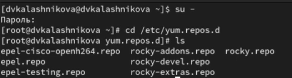{width=70%}

## Подробная информация

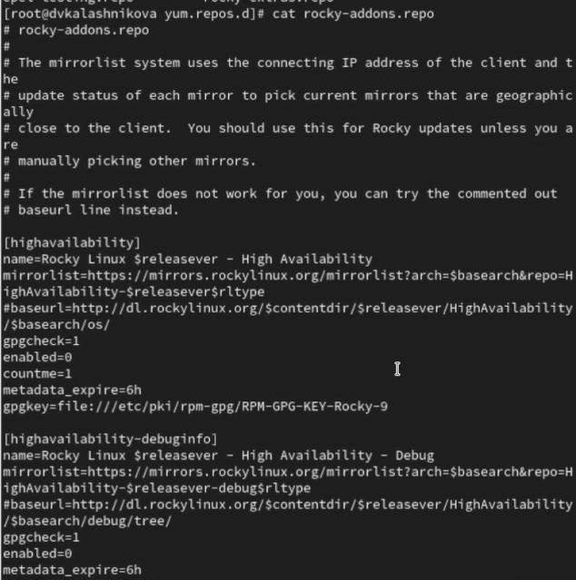{width=40%}

## Список епозиториев

Выводим на экран список репозиториев. Мы увидим название репозиториев
и их индификатор 

{width=70%}

## Список пакетов

Выводим на экран список пакетов, в названии или описании которых есть слово user, у нас выведутся все пакеты с именем user

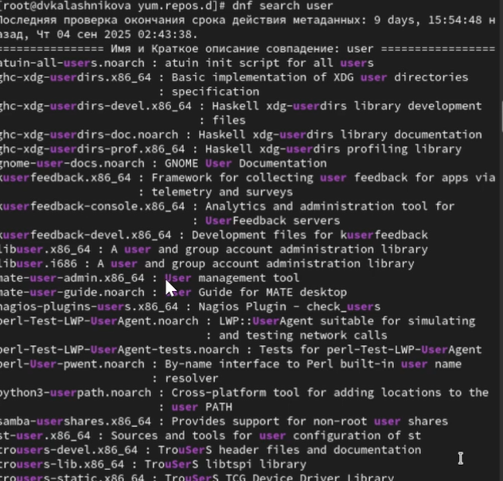{width=40%}

## Команды

Установим nmap, предварительно изучив информацию по имеющимся пакетам. Разница между dnf install nmap и dnf install nmap * в том, что nmap *,он будет устанавливать все где есть nmap, а nmap без звездочки установит только пакет nmap 

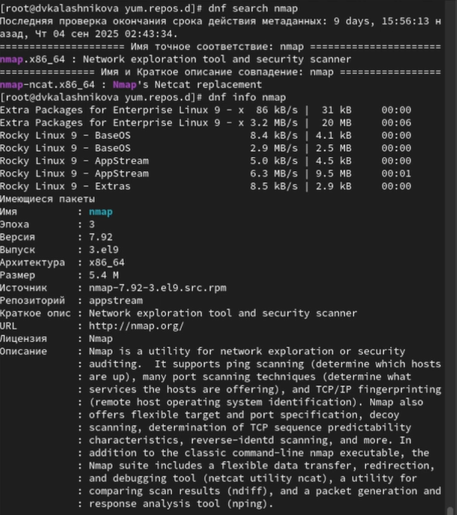{width=30%}

## Команды

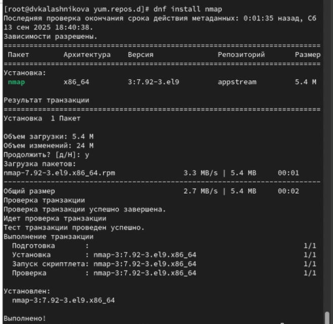{width=40%}

## Команды

{width=40%}

## Удаление

После установки нужных пакетов удаляем их 

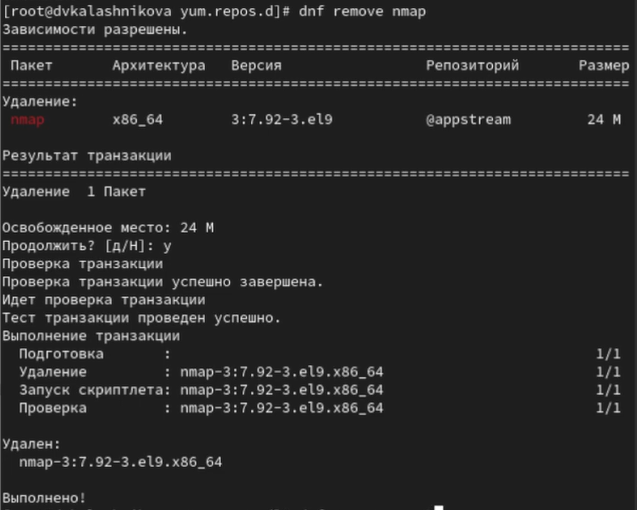{width=40%}

## Удаление

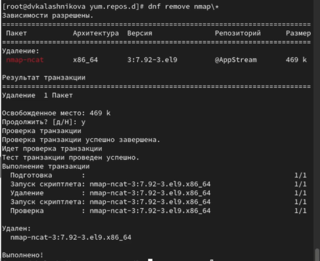{width=40%}

## Установка

Получаем список имеющихся групп пакетов, затем устанавливаем группу пакетов
RPM Development Tools. С помощью команды dnf groups list посмотрим списки групп пакетов, а команда LANG=C dnf groups list, выведет нам тот же самый список пакетов, только на английском

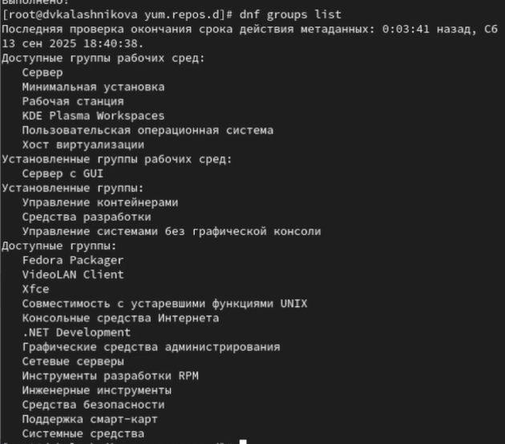{width=30%}

## Установка

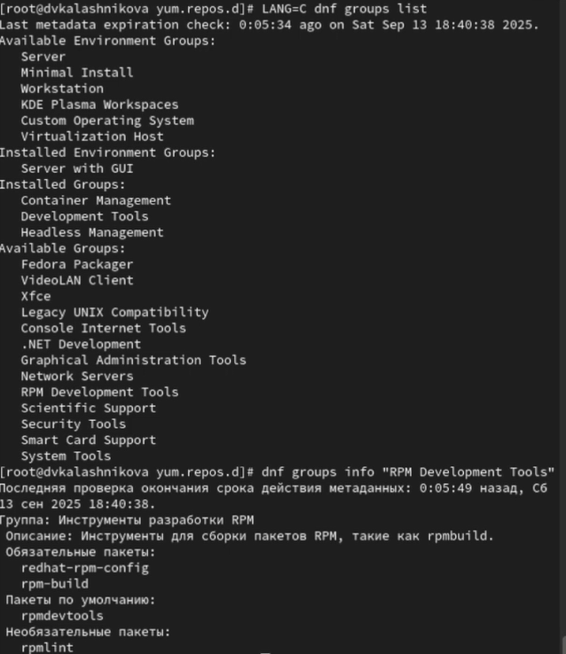{width=40%}

## Установка

{width=70%}

## Установка

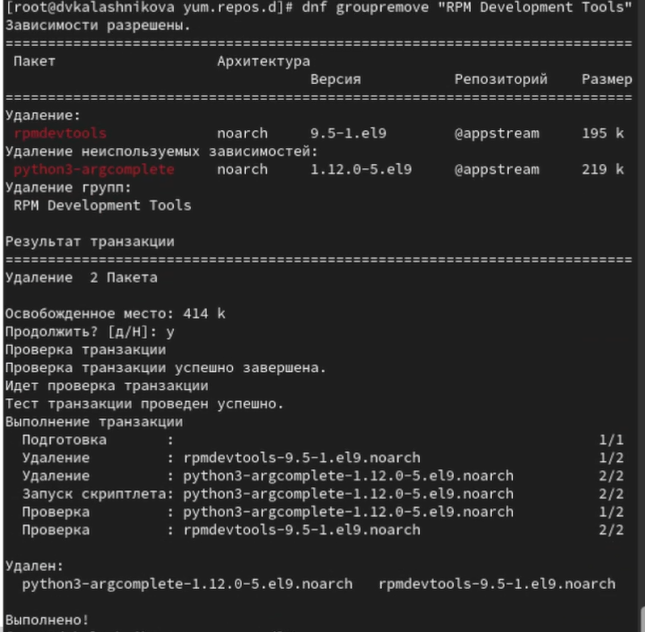{width=40%}

## История

Посмотрим историю использования команды dnf и отменим 15 действие 

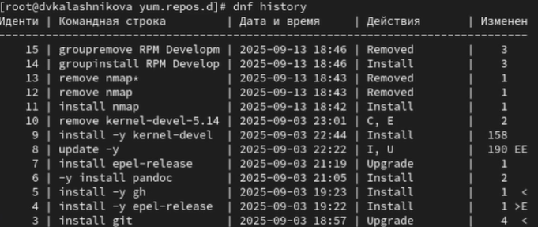{width=70%}

## Отмена действия

{width=70%}

## Скачивание

Скачаем rpm-пакет lynx 

{width=40%}

## Установка

Найдем каталог, в который был помещён пакет после загрузки, перейдем  этот каталог и затем установите rpm-пакет и Определите расположение исполняемого файла 

{width=70%}

## Принадлежность файла

Используя rpm, определим по имени файла, к какому пакету принадлежит lynx и и получим дополнительную информацию о содержимом пакета 

{width=40%}

## Перечень файлов

Получим список всех файлов в пакете, а также выведим перечень файлов с документацией пакета и посмотрим файлы документа при помощи команды man lynx 

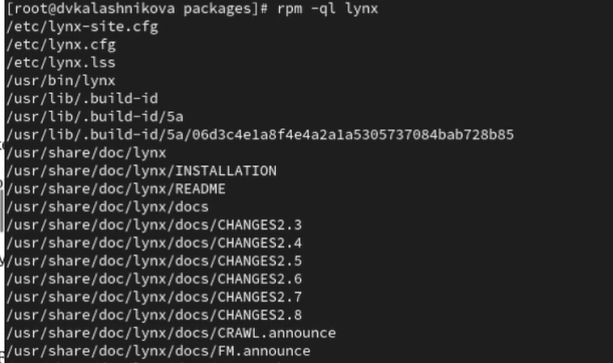{width=40%}

## Документация

{width=40%}

## Скрипты

Выведим на экран расположение и содержание скриптов, выполняемых при установке пакета 

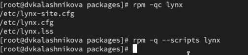{width=70%}

## Проверка установки

В отдельном терминале под своей учётной записью запустим текстовый браузер lynx, чтобы проверить корректность установки пакета 

{width=40%}

## Удаление пакета

Далее вернемся в терминал с учётной записью root и удалим пакет 

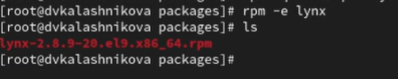{width=70%}

## Установка

Для начала установим пакет dnsmasq и посмотрим расположение  исполняемого файла 

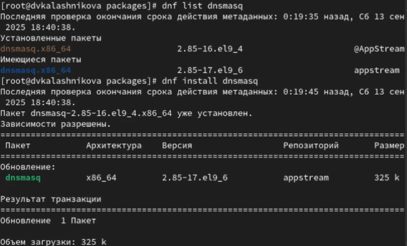{width=70%}

## Расположение

{width=70%}

## Пренадлежность и информация

Определим по имени файла, к какому пакету принадлежит dnsmasq и получим дополнительную информацию о содержимом пакета 

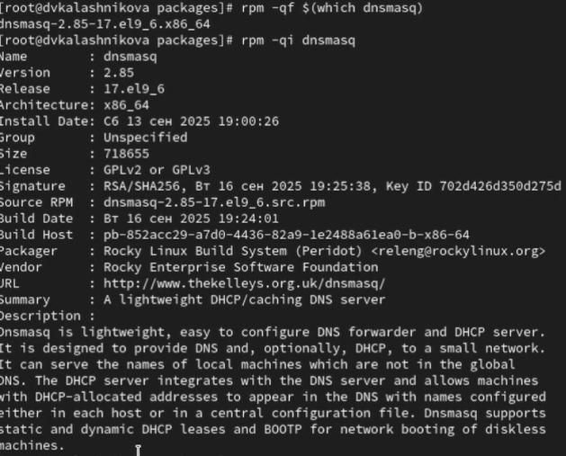{width=40%}

## Список файлов

Далее получим список всех файлов в пакете, а также выведим перечень файлов с документацией пакета и посмотрим содержимое документации, применив команду man dnsmasq 

{width=30%}

## Документация

{width=40%}

## Перечень файлов

Выводим на экран перечень и месторасположение конфигурационных файлов пакета 

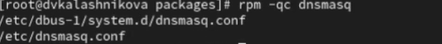{width=70%}

## Скрипты

Выводим на экран расположение и содержание скриптов, выполняемых при установке пакета 

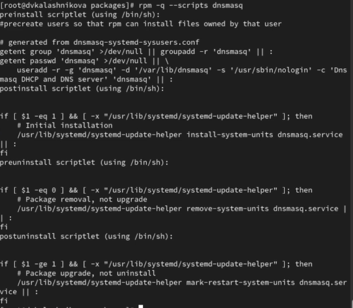{width=40%}

## Удаление пакета

Далее возвращаемся в терминал с учётной записью root и удаляем пакет 

{width=70%}

## Выводы
 
В результате выполнения лабораторной работы я получила навыки работы с
репозиториями и менеджерами пакетов.

