---
## Front matter
title: "Лабораторная работа № 4"
subtitle: "Работа с программными пакетами"
author: "Калашникова Дарья Викторовна"

## Generic otions
lang: ru-RU
toc-title: "Содержание"

## Bibliography
bibliography: bib/cite.bib
csl: pandoc/csl/gost-r-7-0-5-2008-numeric.csl

## Pdf output format
toc: true # Table of contents
toc-depth: 2
lof: true # List of figures
lot: true # List of tables
fontsize: 12pt
linestretch: 1.5
papersize: a4
documentclass: scrreprt
## I18n polyglossia
polyglossia-lang:
  name: russian
  options:
	- spelling=modern
	- babelshorthands=true
polyglossia-otherlangs:
  name: english
## I18n babel
babel-lang: russian
babel-otherlangs: english
## Fonts
mainfont: IBM Plex Serif
romanfont: IBM Plex Serif
sansfont: IBM Plex Sans
monofont: IBM Plex Mono
mathfont: STIX Two Math
mainfontoptions: Ligatures=Common,Ligatures=TeX,Scale=0.94
romanfontoptions: Ligatures=Common,Ligatures=TeX,Scale=0.94
sansfontoptions: Ligatures=Common,Ligatures=TeX,Scale=MatchLowercase,Scale=0.94
monofontoptions: Scale=MatchLowercase,Scale=0.94,FakeStretch=0.9
mathfontoptions:
## Biblatex
biblatex: true
biblio-style: "gost-numeric"
biblatexoptions:
  - parentracker=true
  - backend=biber
  - hyperref=auto
  - language=auto
  - autolang=other*
  - citestyle=gost-numeric
## Pandoc-crossref LaTeX customization
figureTitle: "Рис."
tableTitle: "Таблица"
listingTitle: "Листинг"
lofTitle: "Список иллюстраций"
lotTitle: "Список таблиц"
lolTitle: "Листинги"
## Misc options
indent: true
header-includes:
  - \usepackage{indentfirst}
  - \usepackage{float} # keep figures where there are in the text
  - \floatplacement{figure}{H} # keep figures where there are in the text
---

# Цель работы

Получить навыки работы с репозиториями и менеджерами пакетов

# Задание

Нужно изучить, как подключаются репозитории для программного обеспечения, повторить процесс установки и удаления, используя dnf и rpm

# Выполнение лабораторной работы

Переходим в режим работы суперпользователя и переходим в каталог /etc/yum.repos.d и изучим содержание каталога и посмотрим содержимое файла rocky-addons.repo (рис. [-@fig:001]).

{#fig:001 width=70%}

{#fig:002 width=70%}

Выводим на экран список репозиториев. Мы увидим название репозиториев
и их индификатор (рис. [-@fig:003]).

{#fig:003 width=70%}

Выводим на экран список пакетов, в названии или описании которых есть слово user, у нас выведутся все пакеты с именем user(рис. [-@fig:004]).

{#fig:004 width=70%}

Установим nmap, предварительно изучив информацию по имеющимся пакетам. Разница между dnf install nmap и dnf install nmap * в том, что nmap *,он будет устанавливать все где есть nmap, а nmap без звездочки установит только пакет nmap (рис. [-@fig:005]).

{#fig:005 width=70%}

{#fig:006 width=70%}

{#fig:007 width=70%}

После установки нужных пакетов удаляем их (рис. [-@fig:008]).

{#fig:008 width=70%}

{#fig:009 width=70%}

Получаем список имеющихся групп пакетов, затем устанавливаем группу пакетов
RPM Development Tools. С помощью команды dnf groups list посмотрим списки групп пакетов, а команда LANG=C dnf groups list, выведет нам тот же самый список пакетов, только на английском( (рис. [-@fig:010]).

{#fig:010 width=70%}

{#fig:011 width=70%}

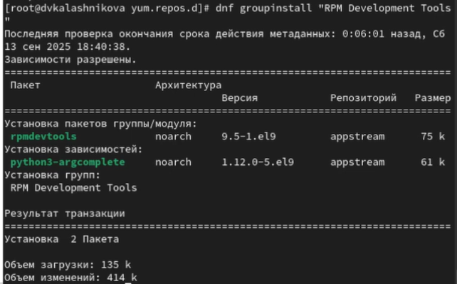{#fig:012 width=70%}

{#fig:013 width=70%}

Посмотрим историю использования команды dnf и отменим 15 действие (рис. [-@fig:014]).

{#fig:014 width=70%}

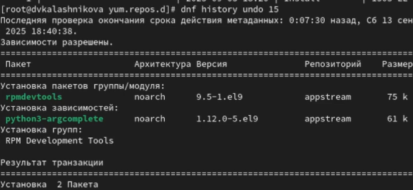{#fig:015 width=70%}

Скачаем rpm-пакет lynx (рис. [-@fig:016]).

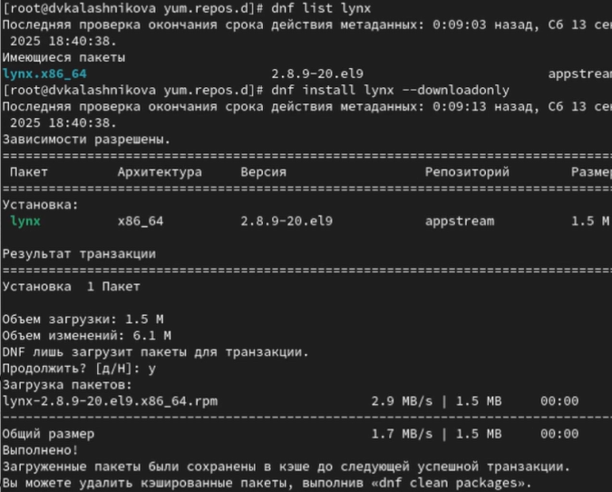{#fig:016 width=70%}

Найдем каталог, в который был помещён пакет после загрузки, перейдем  этот каталог и затем установите rpm-пакет и Определите расположение исполняемого файла (рис. [-@fig:017]).

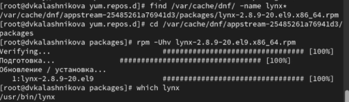{#fig:017 width=70%}

Используя rpm, определим по имени файла, к какому пакету принадлежит lynx и и получим дополнительную информацию о содержимом пакета (рис. [-@fig:018]).

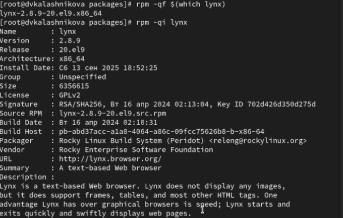{#fig:018 width=70%}

Получим список всех файлов в пакете, а также выведим перечень файлов с документацией пакета и посмотрим файлы документа при помощи команды man lynx (рис. [-@fig:019]).

{#fig:019 width=70%}

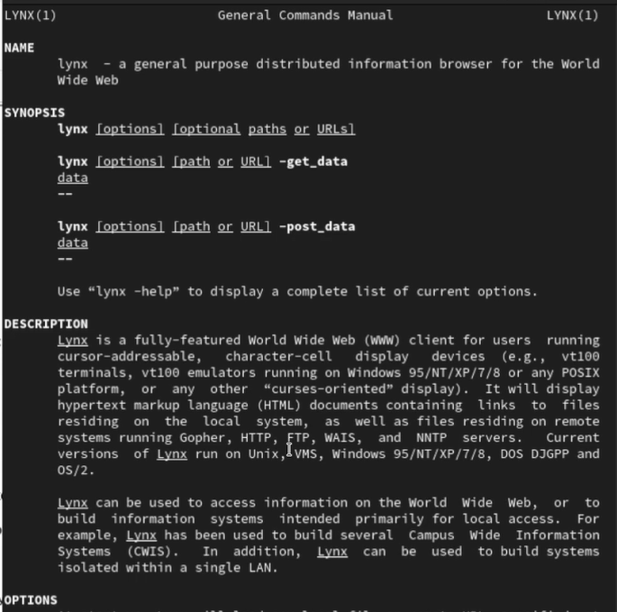{#fig:020 width=70%}

Выведим на экран расположение и содержание скриптов, выполняемых при установке пакета (рис. [-@fig:021]).

{#fig:021 width=70%}

В отдельном терминале под своей учётной записью запустим текстовый браузер lynx, чтобы проверить корректность установки пакета (рис. [-@fig:022]).

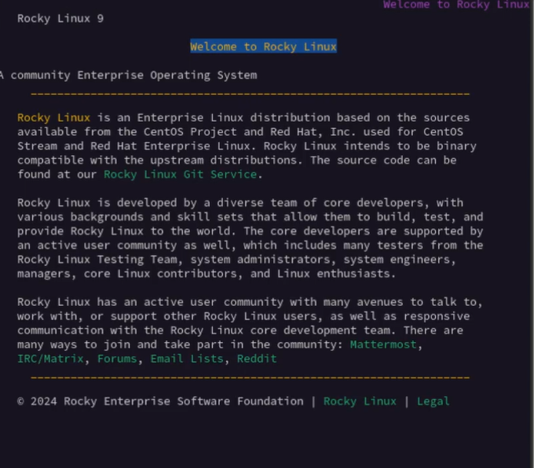{#fig:022 width=70%}

Далее вернемся в терминал с учётной записью root и удалим пакет (рис. [-@fig:023]).

{#fig:023 width=70%}

Для начала установим пакет dnsmasq и посмотрим расположение  исполняемого файла (рис. [-@fig:024]).

{#fig:024 width=70%}

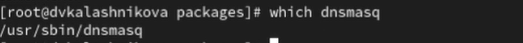{#fig:025 width=70%}

Определим по имени файла, к какому пакету принадлежит dnsmasq и получим дополнительную информацию о содержимом пакета (рис. [-@fig:026]).

{#fig:026 width=70%}

Далее получим список всех файлов в пакете, а также выведим перечень файлов с документацией пакета и посмотрим содержимое документации, применив команду man dnsmasq (рис. [-@fig:027]).

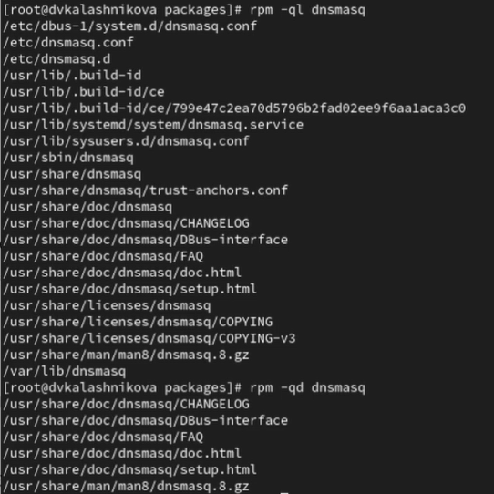{#fig:027 width=70%}

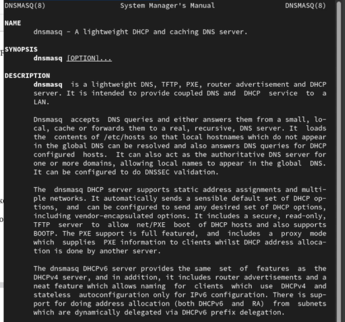{#fig:028 width=70%}

Выводим на экран перечень и месторасположение конфигурационных файлов пакета (рис. [-@fig:029]).

{#fig:029 width=70%}

Выводим на экран расположение и содержание скриптов, выполняемых при установке пакета (рис. [-@fig:030]).

{#fig:030 width=70%}

Далее возвращаемся в терминал с учётной записью root и удаляем пакет (рис. [-@fig:031]).

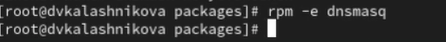{#fig:031 width=70%}

# Контрольные вопросы

1. Какая команда позволяет вам искать пакет rpm, содержащий файл useradd?

Ответ: команда rpm -qf $(Which useradd)

2. Какие команды вам нужно использовать, чтобы показать имя группы dnf,
которая содержит инструменты безопасности и показывает, что находится
в этой группе?

Ответ: команды dnf group list -v (найти группу) и dnf group info “имя группы”

3. Какая команда позволяет вам установить rpm, который вы загрузили из
Интернета и который не находится в репозиториях?

Ответ: команда dnf install /путь/к/файлу.rpm

4. Вы хотите убедиться, что пакет rpm, который вы загрузили, не содержит
никакого опасного кода сценария. Какая команда позволяет это сделать?

Ответ: команда rpm –checksig имя_пакета.rpm

5. Какая команда показывает всю документацию в rpm?

Ответ: команда rpm -qd имя_пакета

6. Какая команда показывает, какому пакету rpm принадлежит файл?

Ответ: команда rpm -qf /путь/к/файлу

# Выводы

В результате выполнения лабораторной работы я получила навыки работы с
репозиториями и менеджерами пакетов.

