---
## Front matter
title: "Управление системными службами"
subtitle: "отчет лабораторная работа № 5"
author: "Калашникова Дарья Викторовна"

## Generic otions
lang: ru-RU
toc-title: "Содержание"

## Bibliography
bibliography: bib/cite.bib
csl: pandoc/csl/gost-r-7-0-5-2008-numeric.csl

## Pdf output format
toc: true # Table of contents
toc-depth: 2
lof: true # List of figures
lot: true # List of tables
fontsize: 12pt
linestretch: 1.5
papersize: a4
documentclass: scrreprt
## I18n polyglossia
polyglossia-lang:
  name: russian
  options:
	- spelling=modern
	- babelshorthands=true
polyglossia-otherlangs:
  name: english
## I18n babel
babel-lang: russian
babel-otherlangs: english
## Fonts
mainfont: IBM Plex Serif
romanfont: IBM Plex Serif
sansfont: IBM Plex Sans
monofont: IBM Plex Mono
mathfont: STIX Two Math
mainfontoptions: Ligatures=Common,Ligatures=TeX,Scale=0.94
romanfontoptions: Ligatures=Common,Ligatures=TeX,Scale=0.94
sansfontoptions: Ligatures=Common,Ligatures=TeX,Scale=MatchLowercase,Scale=0.94
monofontoptions: Scale=MatchLowercase,Scale=0.94,FakeStretch=0.9
mathfontoptions:
## Biblatex
biblatex: true
biblio-style: "gost-numeric"
biblatexoptions:
  - parentracker=true
  - backend=biber
  - hyperref=auto
  - language=auto
  - autolang=other*
  - citestyle=gost-numeric
## Pandoc-crossref LaTeX customization
figureTitle: "Рис."
tableTitle: "Таблица"
listingTitle: "Листинг"
lofTitle: "Список иллюстраций"
lotTitle: "Список таблиц"
lolTitle: "Листинги"
## Misc options
indent: true
header-includes:
  - \usepackage{indentfirst}
  - \usepackage{float} # keep figures where there are in the text
  - \floatplacement{figure}{H} # keep figures where there are in the text
---

# Цель работы

Получить навыки управления системными службами операционной системы посред-
ством systemd.

# Задание

Выполнить основные операции по запуску, определению статуса, добавлению в автозапуск и пр. службы Very Secure FTP. Разрешить конфликты и продемонстрировать навыки работы с изолированными цепями.

# Выполнение лабораторной работы

Получаем полномочия администратора (рис. [-@fig:001]).

{#fig:001 width=70%}

Проверяем статус службы Very Secure FTP и видим, что сервис в настоящее время отключён, так как служба Very Secure FTP не установлена (рис. [-@fig:002]).

{#fig:002 width=70%}

Устанавливаем службу Very Secure FTP (рис. [-@fig:003]).

{#fig:003 width=70%}

Запускаем службу Very Secure FTP (рис. [-@fig:004]).

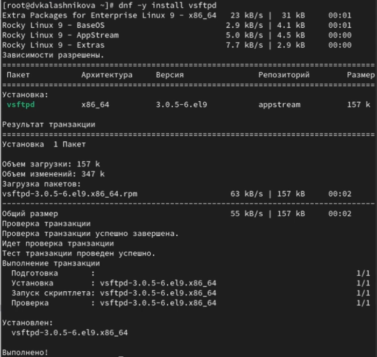{#fig:004 width=70%}

Проверяем статус службы Very Secure FTP. Вывод команды должен показать, что служба в настоящее время работает (рис. [-@fig:005]).

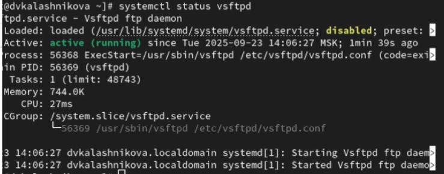{#fig:005 width=70%}

Добавляем службу  Very Secure FTP в автозапуск при загрузке операционной системы, используя команду systemctl enable. Затем проверяем статус службы. Удаляем службу из автозапуска, используя команду systemctl disable, и снова проверяем её статус (рис. [-@fig:006]).

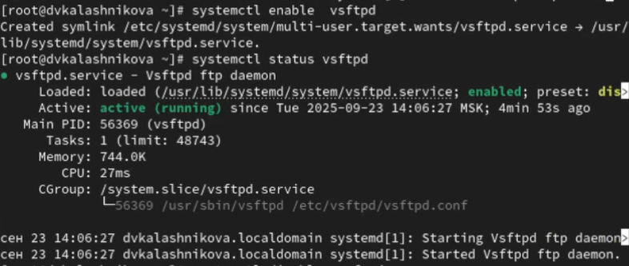{#fig:006 width=70%}

Выведим на экран символические ссылки, ответственные за запуск различных сервисов (рис. [-@fig:007]).

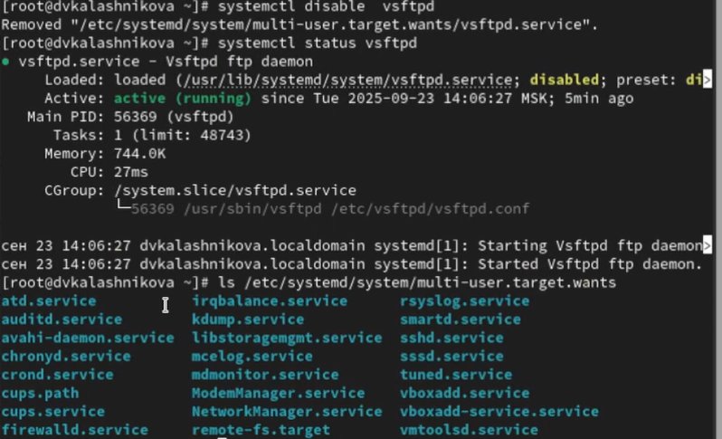{#fig:007 width=70%}

Снова добавляем службу Very Secure FTP в автозапуск. Вывод команды покажет, что создана символическая ссылка (рис. [-@fig:008]).

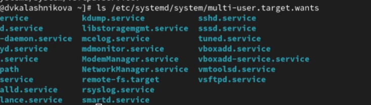{#fig:008 width=70%}

Проверяем еще раз статус службы Very Secure FTP. Теперь мы увидим, что для файла юнита состояние изменено с disabled на enabled (рис. [-@fig:009]).

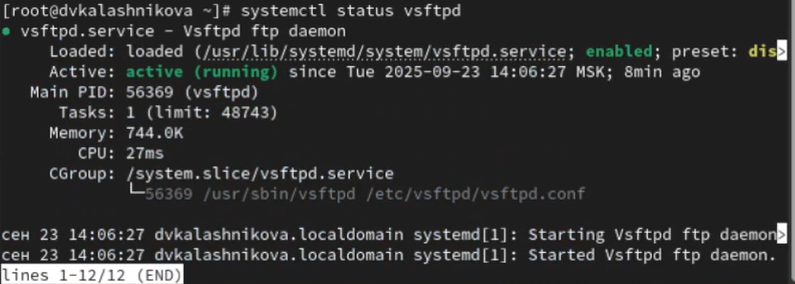{#fig:009 width=70%}

Далее выводим на экран список зависимостей юнита (рис. [-@fig:010]).

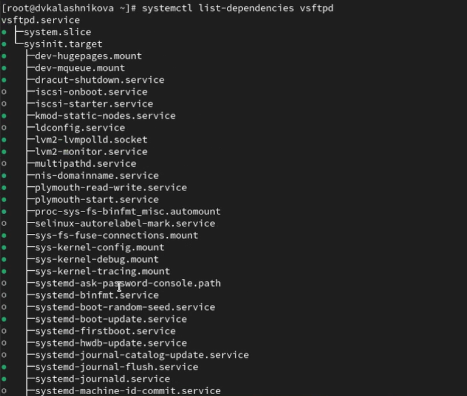{#fig:010 width=70%}

Выведим на экран список юнитов, которые зависят от данного юнита (рис. [-@fig:011]).

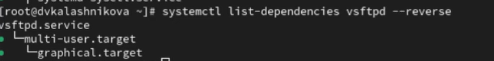{#fig:011 width=70%}

Получим полномочия администратора и установим iptables (рис. [-@fig:012]).

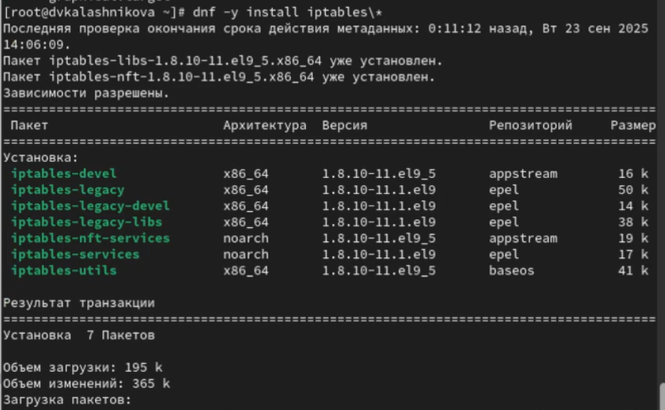{#fig:012 width=70%}

Теперь проверим статус firewalld и iptables (рис. [-@fig:013]).

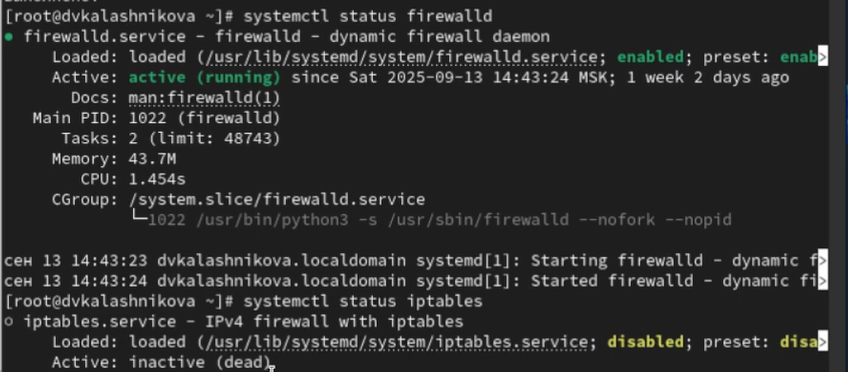{#fig:013 width=70%}

Далее попробуем запустить firewalld и iptables и мы увидим , что при запуске одной службы вторая дезактивируется или не запускается (рис. [-@fig:014]).

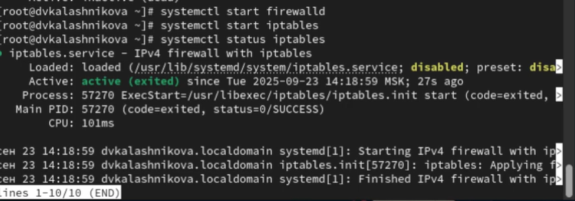{#fig:014 width=70%}

Вводим команду cat /usr/lib/systemd/system/firewalld.service (рис. [-@fig:015]).

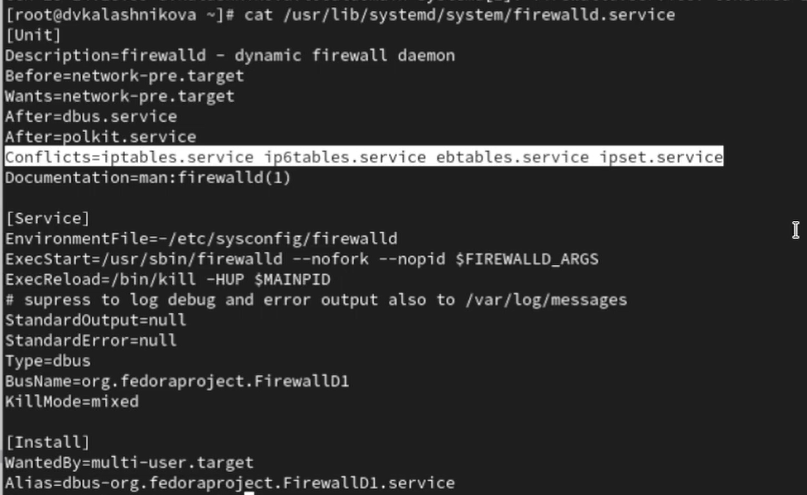{#fig:015 width=70%}

И вводим еще одну команду cat /usr/lib/systemd/system/iptables.service (рис. [-@fig:016]).

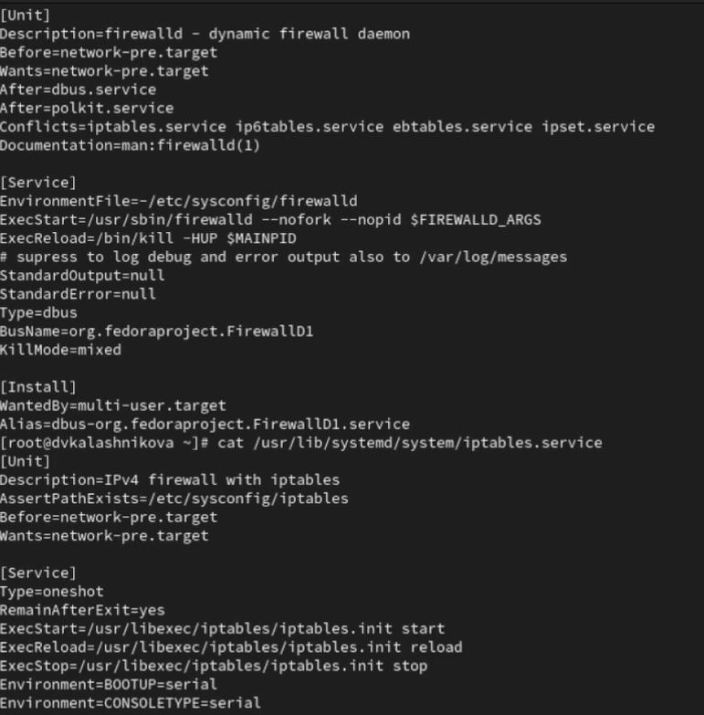{#fig:016 width=70%}

Выгружаем службу iptables и загружаем службу firewalld (рис. [-@fig:017]).

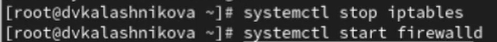{#fig:017 width=70%}

Блокируем запуск iptables. У нас будет создана символическая ссылка на /dev/null для /etc/systemd/system/iptables.service (рис. [-@fig:018]).

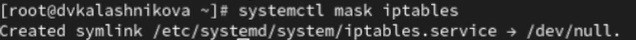{#fig:018 width=70%}

Запускаем iptables и видим сообщение об ошибке, указывающее, что служба замаскирована и по этой причине не может быть запущена (рис. [-@fig:019]).

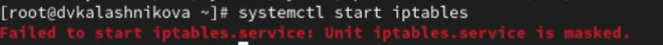{#fig:019 width=70%}

Добавляем iptables в автозапуск и наш сервис будет неактивен, а статус загрузки отобразится как замаскированный (рис. [-@fig:020]).

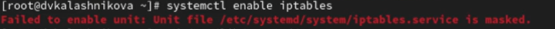{#fig:020 width=70%}

Переходим в суперпользователя и переходим в каталог systemd и найдим список всех целей, которые можно изолировать (рис. [-@fig:021]).

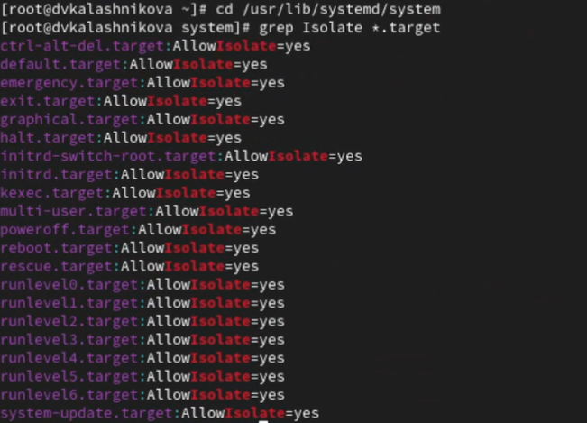{#fig:021 width=70%}

Переключаем операционную систему в режим восстановления и вводим пароль root на консоли сервера для входа в систему (рис. [-@fig:022]).

{#fig:022 width=70%}

Перезапускаем операционную систему следующим образом (рис. [-@fig:023]).

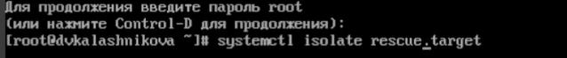{#fig:023 width=70%}

Получаем полномочия администратора. Выводим на экран цель, установленную по
умолчанию (рис. [-@fig:024]).

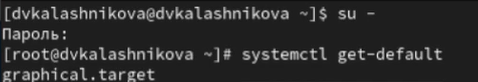{#fig:024 width=70%}

Далее для установки цели по умолчанию используем команду. Перезагружаем систему командой reboot. После запуска графического режима вводим systemctl set-default graphical.target и перезагружаем (рис. [-@fig:025]).

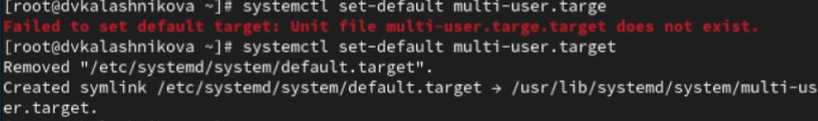{#fig:025 width=70%}

# Контрольные вопросы

1. Что такое юнит (unit)? Приведите примеры.

Ответ: это объект systemd описывающий службу, устройство точку монтирования и т.д Пример - service, target, mount

2. Какая команда позволяет вам убедиться, что цель больше не входит в список
автоматического запуска при загрузке системы?

Ответ: чтобы проверить что цель больше не включина в автозапуск надо ввеси
команду systemctl is-enabled

3. Какую команду вы должны использовать для отображения всех сервисных
юнитов,которые в настоящее время загружены?

Ответ: чтобы показать все загруженные сервисные юниты надо ввести команду
systemctl list-units –type=service

4. Как создать отребность (wants) в сервисе?

Ответ: что создать отребность (wants) в сервисе нужна команда systemctl add-
wants .target .service

5. Как переключить текущее состояние на цель восстановления (rescue target)?

Ответ: чтобы переключить текущее нужно переключиться в режим восстанов-
ления благодаря команде systemctl isolate rescue.target

6. Поясните причину получения сообщения о том, что цель не может быть
изолирована.

Ответ: Цель не может быть изолирована если она не установлена как
AllowIsolate=yes в unit-файле

7. Вы хотите отключить службу systemd, но, прежде чем сделать это, вы хотите
узнать, какие другие юниты зависят от этой службы. Какую команду вы бы
использовали?

Ответ: Показать зависимоть от службы командой systemctl list-dependecies

# Выводы

В результате выполнения лабораторной работы я получила нывыки работы
управления системными службами операционной системы посредством systemd

