---
## Front matter
lang: ru-RU
title: Презентация
subtitle: Лабораторна работа № 6
author:
  - Калашникова Д. В.
institute:
  - Российский университет дружбы народов, Москва, Россия
date: 06 октября 2025

## i18n babel
babel-lang: russian
babel-otherlangs: english

## Formatting pdf
toc: false
toc-title: Содержание
slide_level: 2
aspectratio: 169
section-titles: true
theme: metropolis
header-includes:
 - \metroset{progressbar=frametitle,sectionpage=progressbar,numbering=fraction}
---

# Информация

## Докладчик

:::::::::::::: {.columns align=center}
::: {.column width="70%"}

  * Кадашникова Дарья Викторовна
  * Российский университет дружбы народов
  * [1132243108@pfur.ru](mailto:1132243108@pfur.ru)

:::
::: {.column width="30%"}

:::
::::::::::::::

## Цель работы

Получить навыки управления процессами операционной системы

## Задание

Продемонстрировать навыки управления заданиями операционной системы, навыки управления процессами операционной системы, а также выполнить задания для самостоятельной работы

## Выполнение лабораторной работы

Получаем полномочия администратора и вводим следующие команды. Мы запустили последнюю команду без & после неё, у нас есть 2 часа, прежде чем мы снова получим контроль над оболочкой. Введим Ctrl + z , чтобы остановить процесс

{height=60%}

## Ввод

Вводим команду jobs и видим три задания, запущенные ранее

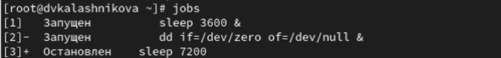{height=70%}

## Проверка

Для продолжения выполнения задания 3 в фоновом режиме вводим команду bg 3 и проверяем снова все при помощи команды jobs

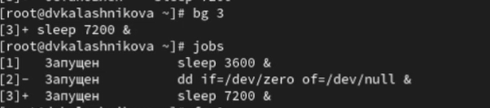{height=70%}

## Перемещение задания

Для перемещения задания 1 на передний план вводим команду fg 1 

{height=70%}

## Проверка

Вводим Ctrl + c, чтобы отменить задание 1. С помощью команды jobs посмотрим
изменения в статусе заданий 

{height=70%}

## Задания 2 и 3

Делаем тоже самое для отмены заданий 2 и 3 

{height=60%}

## Ввод

Открываем второй терминал и под учётной записью своего пользователя введите в нём команду dd if=/dev/zero of=/dev/null & 

{height=70%}

## Закрытие

Вводим  exit, чтобы закрыть второй терминал

{height=70%}

## Выход

На другом терминале под учётной записью своего пользователя запустим
top. Мы видим, что задание dd всё ещё запущено. Для выхода из top используем q 

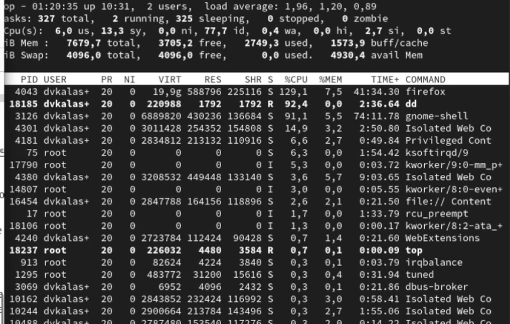{height=50%}

## Убитие заданий

Вновь запускаем top и в нём используем k, чтобы убить задание dd. После этого выходим из top

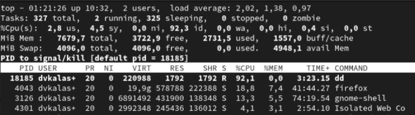{height=70%}

## Ввод команд

Получаем полномочия администратор и вводим следующие команды 

{height=70%}

## Запущенные процессы

Вводим ps aux | grep dd. Это команда показывает все строки, в которых есть буквы dd. Запущенные процессы dd идут последними 

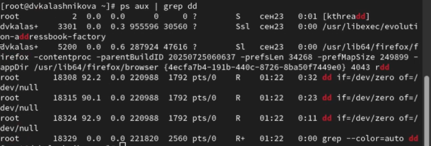{height=60%}

## Использование PID

Используем PID одного из процессов dd, чтобы изменить приоритет

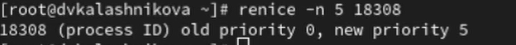{height=70%}

## Иерархия процессов

Введем команду ps fax | grep -B5 dd. Параметр -B5 показывает соответствующие запросу строки, включая пять строк до этого. Поскольку ps fax показывает иерархию отношений между процессами, мы также увидим оболочку, из которой были запущены все процессы dd, и её PID 

{height=50%}

## Закрытие оболочки

Найдем PID корневой оболочки, из которой были запущены процессы dd, и введем kill -9 <PID>. Мы увидим, что наша корневая оболочка
закрылась, а вместе с ней и все процессы dd 

{height=70%}

## Запуск

Запустим команду dd if=/dev/zero of=/dev/null трижды как фоновое задание 

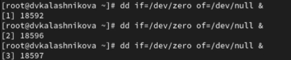{height=70%}

## Изменение приоритета

Увеличим приоритет одной из этих команд, используя значение приоритета −5

{height=70%}

## Изменение приоритета

Изменим приоритет того же процесса ещё раз, но используем на этот раз значение −15 

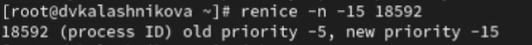{height=70%}

## Завершение процессов

Завершим все процессы dd, которые мы запустили

{height=50%}

## Запуск

Запустим программу yes в фоновом режиме с подавлением потока вывода 

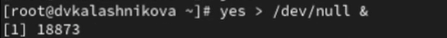{height=70%}

## Запуск

Затем запустим программу yes на переднем плане с подавлением потока вывода. Приостановим выполнение программы. Заново запустим программу yes с теми же параметрами, затем завершим её выполнение 

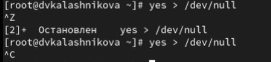{height=70%}

## Запуск

Запустим программу yes на переднем плане без подавления потока вывода. Приостановим выполнение программы. Заново запустим программу yes с теми же
параметрами, затем завершим её выполнение 

{height=70%}

## Проверка

Проверим состояния заданий, воспользовавшись командой jobs 

{height=70%}

## Перевод и остановка

Далее переведем процесс, который у нас выполняется в фоновом режиме, на передний план, затем остановим его 

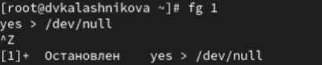{height=70%}

## Перевод и остановка

Переведите любой ваш процесс с подавлением потока вывода в фоновый режим

{height=70%}

## Проверка

Проверим состояния заданий, воспользовавшись командой jobs. Обратим внимание, что процесс стал выполняющимся в фоновом режиме

{height=70%}

## Запуск

Запустим процесс в фоновом режиме таким образом, чтобы он продолжил свою
работу даже после отключения от терминала

{height=70%}

## Проверка

Закроем окно и заново запустим консоль. Убедимся, что процесс продолжил свою работу

{height=70%}

## Получение информации

Далее получим информацию о запущенных в операционной системе процессах с помощью утилиты top

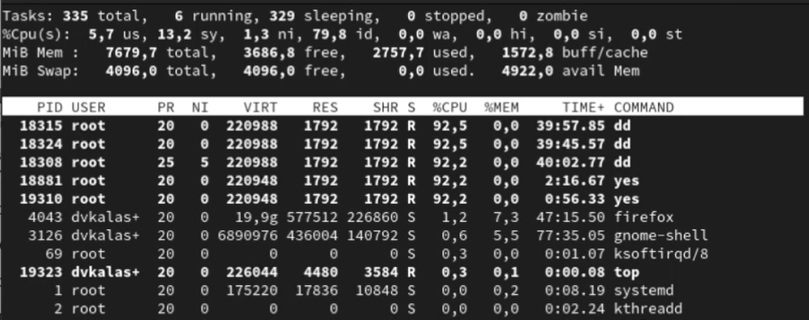{height=60%}

## Запуск

Запустим ещё три программы yes в фоновом режиме с подавлением потока вывода

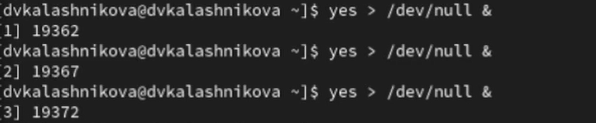{height=70%}

## Убитие процессов

Убьем два процесса: для одного используем его PID, а для другого — его идентификатор конкретного задания

{#width=60%}

## Посыл сигнала

Далее посылаем сигнал 1 процессу, запущенному с помощью nohup, и обычному процессу 

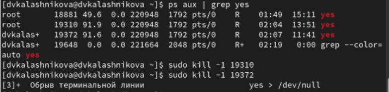{height=70%}

## Запуск

Запускаем ещё три программы yes в фоновом режиме с подавлением потока
вывода

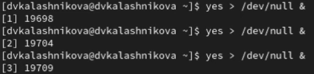{height=70%}

## Завершение работы

Завершим их работу одновременно, используя команду killall

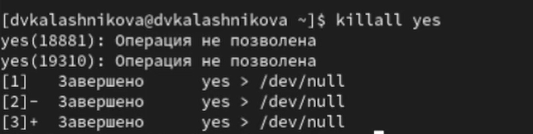{height=70%}

## Запуск

Запустим программу yes в фоновом режиме с подавлением потока вывода. Используя утилиту nice, запустим программу yes с теми же параметрами и с приоритетом, большим на 5. Второй процесс имеет nice = 5 (меньший приоритет), поэтому его абсолютный приоритет (PRI) будет на 5 единиц меньше, чем у первого процесса с nice = 0

{height=50%}

## Изменение

Используя утилиту renice, изменим приоритет у одного из потоков yes таким образом, чтобы у обоих потоков приоритеты были равны 

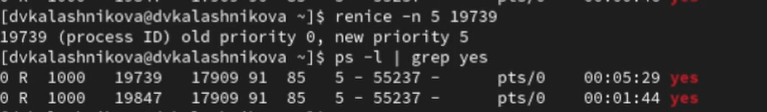{height=70%}

## Выводы

В результате выполнения лабораторной работы я получила нывыки работы управления заданиями и процессами операционной системы
