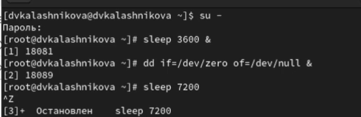
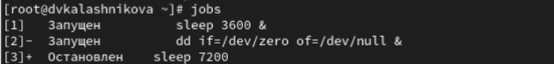
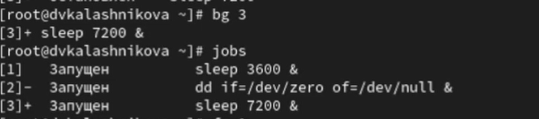
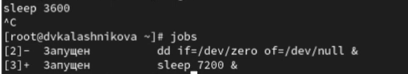
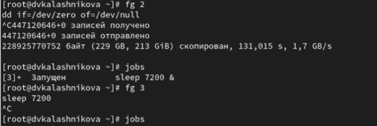
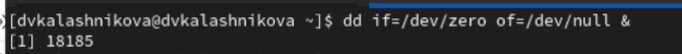
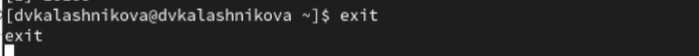
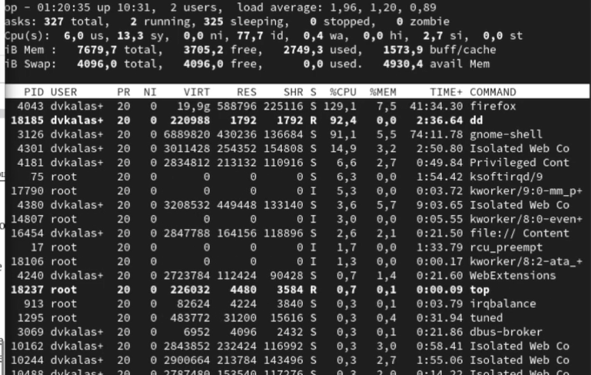
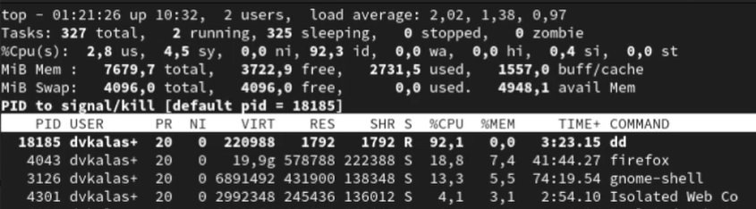
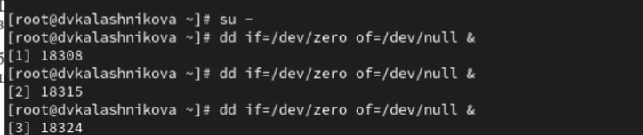

---
## Front matter
lang: ru-RU
title: Мандатное разграничение прав в Linux
subtitle: Лабораторная работа №6 
author:
  - Калашникова Д. В.
institute:
  - Российский университет дружбы народов, Москва, Россия
date: 29 апреля 2026

## i18n babel
babel-lang: russian
babel-otherlangs: english

## Formatting pdf
toc: false
toc-title: Содержание
slide_level: 2
aspectratio: 169
section-titles: true
theme: metropolis
header-includes:
 - \metroset{progressbar=frametitle,sectionpage=progressbar,numbering=fraction}
---

# Информация

## Докладчик

:::::::::::::: {.columns align=center}
::: {.column width="70%"}

  * Калашникова Дарья Викторовна
  * Студент
  * Российский университет дружбы народов
  * [1132243108@pfur.ru](mailto:1132243108@pfur.ru)

:::
::: {.column width="30%"}

:::
::::::::::::::

## Цель работы 

Развить навыки администрирования ОС Linux. Получить первое практическое знакомство с технологией SELinux1.
Проверить работу SELinx на практике совместно с веб-сервером Apache.

## Выполнение лабораторной работы

После того как открыли терминал, перешли в супер пользователя, проверили статус SELinux,затем статус Apache

{#fig:001 width=40%}

## Просмотр

Далее просмотрим контекста безопасноти процессов Apache

{#fig:002 width=70%}

## Просмотр

Затем просмотрим переключатель SELinux для Apache

{#fig:003 width=40%}

## Просмотр

Далее просмотрим статистику по политике SELinux, типы файлов /var/www, типы файлов /var/www/html,

{#fig:004 width=40%}

## Создание

После чего создадим текстовый файл HTML-формата, проверим контекст созданного файла, круг пользователей, также изменим  контекст файла и проверим ошибки доступа 

{#fig:005 width=70%}

## Обращение

Далее обратимся к файлу через веб-сервер и изучим справку 

{#fig:006 width=70%}

## Просмотр

После чего просмотрим логи для анализа ошибки 

{#fig:007 width=70%}

## Изменение

Затем изменим порта Apache на 81 

{#fig:008 width=70%}

## Просмотр

После чего просмотрим файлы error_log, access_log и audit.log и увидим что в файле audit появились записи 

{#fig:009 width=70%}

## Добавление

Затем добавим порт 81, затем проверим появился ли он или нет и пробуем запустить apache или нет, после чего вернем контекст httpd_sys_cоntent__t, затем  возвращаем обратно  конфигурацию файлу apache 80 и удаляем порт 81 

{#fig:010 width=40%}

## Удаление

Затем удаляем файл 

{#fig:0011 width=70%}

## Выводы

В ходе выполнения данной работы были успешно достигнуты поставленные цели: развитие навыков администрирования ОС Linux и получение первичного практического знакомства с мандатной системой контроля доступа SELinux.

