---
## Front matter
title: "Отчёт по лабораторной работе № 6"
subtitle: "Управление процессами"
author: "Калашникова Дарья Викторовна"

## Generic otions
lang: ru-RU
toc-title: "Содержание"

## Bibliography
bibliography: bib/cite.bib
csl: pandoc/csl/gost-r-7-0-5-2008-numeric.csl

## Pdf output format
toc: true # Table of contents
toc-depth: 2
lof: true # List of figures
lot: true # List of tables
fontsize: 12pt
linestretch: 1.5
papersize: a4
documentclass: scrreprt
## I18n polyglossia
polyglossia-lang:
  name: russian
  options:
	- spelling=modern
	- babelshorthands=true
polyglossia-otherlangs:
  name: english
## I18n babel
babel-lang: russian
babel-otherlangs: english
## Fonts
mainfont: IBM Plex Serif
romanfont: IBM Plex Serif
sansfont: IBM Plex Sans
monofont: IBM Plex Mono
mathfont: STIX Two Math
mainfontoptions: Ligatures=Common,Ligatures=TeX,Scale=0.94
romanfontoptions: Ligatures=Common,Ligatures=TeX,Scale=0.94
sansfontoptions: Ligatures=Common,Ligatures=TeX,Scale=MatchLowercase,Scale=0.94
monofontoptions: Scale=MatchLowercase,Scale=0.94,FakeStretch=0.9
mathfontoptions:
## Biblatex
biblatex: true
biblio-style: "gost-numeric"
biblatexoptions:
  - parentracker=true
  - backend=biber
  - hyperref=auto
  - language=auto
  - autolang=other*
  - citestyle=gost-numeric
## Pandoc-crossref LaTeX customization
figureTitle: "Рис."
tableTitle: "Таблица"
listingTitle: "Листинг"
lofTitle: "Список иллюстраций"
lotTitle: "Список таблиц"
lolTitle: "Листинги"
## Misc options
indent: true
header-includes:
  - \usepackage{indentfirst}
  - \usepackage{float} # keep figures where there are in the text
  - \floatplacement{figure}{H} # keep figures where there are in the text
---

# Цель работы

Получить навыки управления процессами операционной системы

# Задание

Продемонстрировать навыки управления заданиями операционной системы, навыки управления процессами операционной системы, а также выполнить задания для самостоятельной работы

# Выполнение лабораторной работы

Получаем полномочия администратора и вводим следующие команды. Мы запустили последнюю команду без & после неё, у нас есть 2 часа, прежде чем мы снова получим контроль над оболочкой. Введeм Ctrl + z , чтобы остановить процесс(рис. [-@fig:001]).

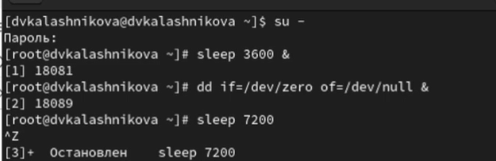{#fig:001 width=70%}

Вводим команду jobs и видим три задания, запущенные ранее(рис. [-@fig:002]).

{#fig:002 width=70%}

Для продолжения выполнения задания 3 в фоновом режиме вводим команду bg 3 и проверяем снова все при помощи команды jobs (рис. [-@fig:003]).

{#fig:003 width=70%}

Для перемещения задания 1 на передний план вводим команду fg 1 (рис. [-@fig:004]).

{#fig:004 width=70%}

Вводим Ctrl + c, чтобы отменить задание 1. С помощью команды jobs посмотрим
изменения в статусе заданий (рис. [-@fig:005]).

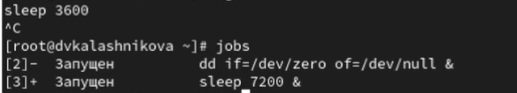{#fig:005 width=70%}

Делаем тоже самое для отмены заданий 2 и 3 (рис. [-@fig:006]).

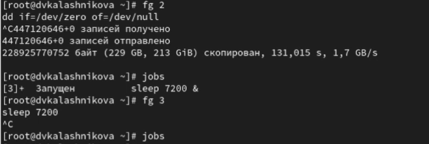{#fig:006 width=70%}

Открываем второй терминал и под учётной записью своего пользователя введите в нём команду dd if=/dev/zero of=/dev/null & (рис. [-@fig:007]).

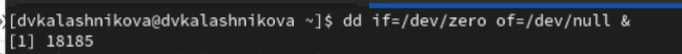{#fig:007 width=70%}

Вводим  exit, чтобы закрыть второй терминал (рис. [-@fig:008]).

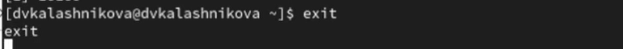{#fig:008 width=70%}

На другом терминале под учётной записью своего пользователя запустим
top. Мы видим, что задание dd всё ещё запущено. Для выхода из top используем q (рис. [-@fig:009]).

{#fig:009 width=70%}

Вновь запускаем top и в нём используем k, чтобы убить задание dd. После этого выходим из top (рис. [-@fig:010]).

{#fig:010 width=70%}

Получаем полномочия администратор и вводим следующие команды (рис. [-@fig:011]).

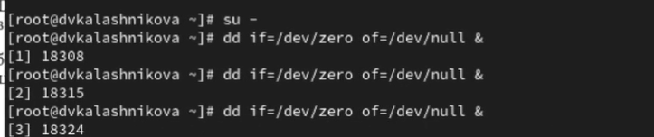{#fig:011 width=70%}

Вводим ps aux | grep dd. Это команда показывает все строки, в которых есть буквы dd. Запущенные процессы dd идут последними (рис. [-@fig:012]).

{#fig:012 width=70%}

Используем PID одного из процессов dd, чтобы изменить приоритет (рис. [-@fig:013]).

{#fig:013 width=70%}

Введем команду ps fax | grep -B5 dd. Параметр -B5 показывает соответствующие запросу строки, включая пять строк до этого. Поскольку ps fax показывает иерархию отношений между процессами, мы также увидим оболочку, из которой были запущены все процессы dd, и её PID (рис. [-@fig:014]).

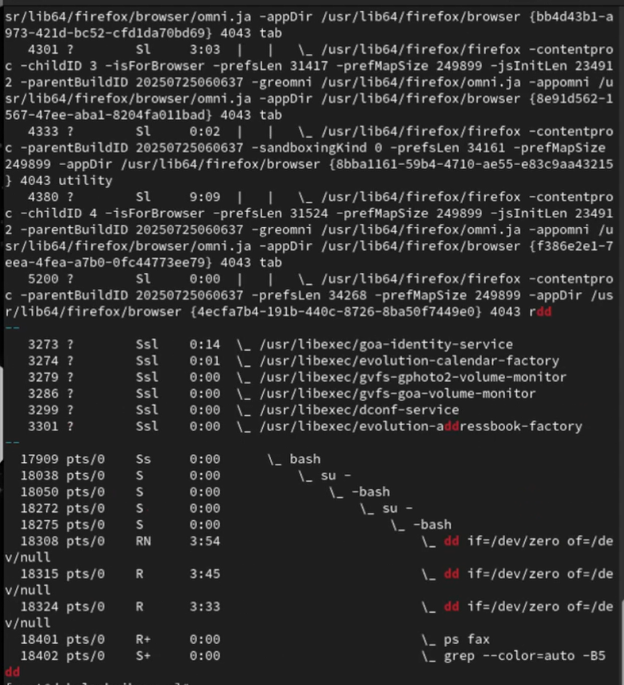{#fig:014 width=70%}

Найдем PID корневой оболочки, из которой были запущены процессы dd, и введем kill -9 <PID>. Мы увидим, что наша корневая оболочка
закрылась, а вместе с ней и все процессы dd (рис. [-@fig:015]).

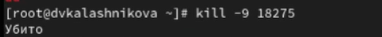{#fig:015 width=70%}

Запустим команду dd if=/dev/zero of=/dev/null трижды как фоновое задание (рис. [-@fig:016]).

{#fig:016 width=70%}

Увеличим приоритет одной из этих команд, используя значение приоритета −5
(рис. [-@fig:017]).

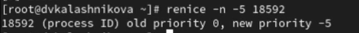{#fig:017 width=70%}

Изменим приоритет того же процесса ещё раз, но используем на этот раз значение −15 (рис. [-@fig:018]).

{#fig:018 width=70%}

Завершим все процессы dd, которые мы запустили (рис. [-@fig:019]).

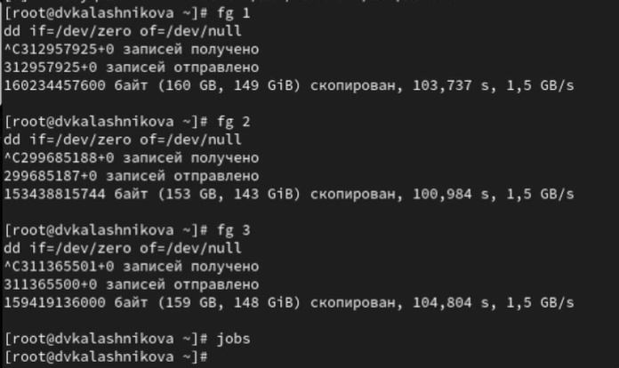{#fig:019 width=70%}

Запустим программу yes в фоновом режиме с подавлением потока вывода (рис. [-@fig:020]).

{#fig:020 width=70%}

Затем запустим программу yes на переднем плане с подавлением потока вывода. Приостановим выполнение программы. Заново запустим программу yes с теми же параметрами, затем завершим её выполнение (рис. [-@fig:021]).

{#fig:021 width=70%}

Запустим программу yes на переднем плане без подавления потока вывода. Приостановим выполнение программы. Заново запустим программу yes с теми же
параметрами, затем завершим её выполнение (рис. [-@fig:022]).

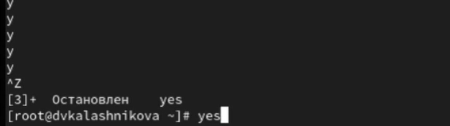{#fig:022 width=70%}

Проверим состояния заданий, воспользовавшись командой jobs (рис. [-@fig:023]).

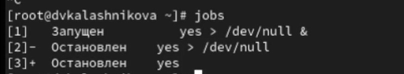{#fig:023 width=70%}

Далее переведем процесс, который у нас выполняется в фоновом режиме, на передний план, затем остановим его (рис. [-@fig:024]).

{#fig:024 width=70%}

Переведите любой ваш процесс с подавлением потока вывода в фоновый режим. (рис. [-@fig:025]).

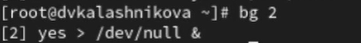{#fig:025 width=70%}

Проверим состояния заданий, воспользовавшись командой jobs. Обратим внимание, что процесс стал выполняющимся в фоновом режиме (рис. [-@fig:026]).

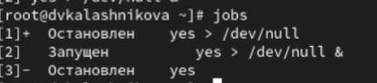{#fig:026 width=70%}

Запустим процесс в фоновом режиме таким образом, чтобы он продолжил свою
работу даже после отключения от терминала (рис. [-@fig:027]).

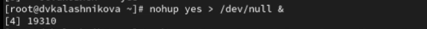{#fig:027 width=70%}

Закроем окно и заново запустим консоль. Убедимся, что процесс продолжил свою работу (рис. [-@fig:028]).

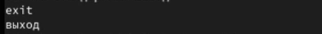{#fig:028 width=70%}

Далее получим информацию о запущенных в операционной системе процессах с помощью утилиты top (рис. [-@fig:029]).

{#fig:029 width=70%}

Запустим ещё три программы yes в фоновом режиме с подавлением потока вывода(рис. [-@fig:030]).

{#fig:030 width=70%}

Убьем два процесса: для одного используем его PID, а для другого — его идентификатор конкретного задания (рис. [-@fig:031]).

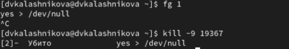{#fig:031 width=70%}

Далее посылаем сигнал 1 процессу, запущенному с помощью nohup, и обычному процессу (рис. [-@fig:032]).

{#fig:032 width=70%}

Запускаем ещё три программы yes в фоновом режиме с подавлением потока
вывода (рис. [-@fig:033]).

{#fig:033 width=70%}

Завершим их работу одновременно, используя команду killall (рис. [-@fig:034]).

{#fig:034 width=70%}

Запустим программу yes в фоновом режиме с подавлением потока вывода. Используя утилиту nice, запустим программу yes с теми же параметрами и с приоритетом, большим на 5. Второй процесс имеет nice = 5 (меньший приоритет), поэтому его абсолютный приоритет (PRI) будет на 5 единиц меньше, чем у первого процесса с nice = 0 (рис. [-@fig:035]).

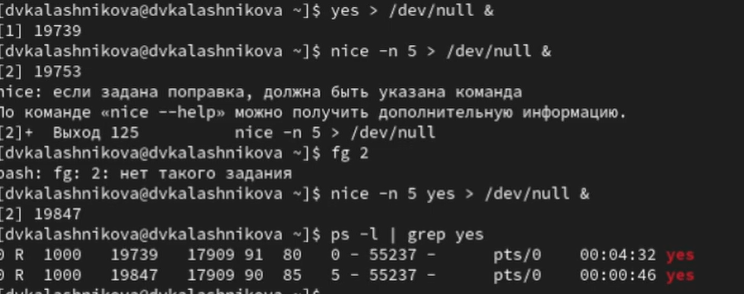{#fig:035 width=70%}

Используя утилиту renice, изменим приоритет у одного из потоков yes таким образом, чтобы у обоих потоков приоритеты были равны (рис. [-@fig:036]).

{#fig:036 width=70%}

# Контрольные вопросы 
1. Какая команда даёт обзор всех текущих заданий оболочки?

Ответ: jobs

2. Как остановить текущее задание оболочки, чтобы продолжить его выполнение в фоновом режиме?

Ответ: Ctrl+Z (остановить), затем bg (продолжить в фоне)

3. Какую комбинацию клавиш можно использовать для отмены текущего задания оболочки?

Ответ: Ctrl+C

4. Необходимо отменить одно из начатых заданий. Доступ к оболочке, в которой в данный момент работает пользователь, невозможен. Что можно сделать, чтобы отменить задание?

Ответ: Использовать команду kill с идентификатором процесса (PID)

5. Какая команда используется для отображения отношений между родительскими и дочерними процессами?

Ответ: pstree

6. Какая команда позволит изменить приоритет процесса с идентификатором 1234 на более высокий?

Ответ: renice -n -10 1234 (уменьшить значение nice для повышения приоритета)

7. В системе в настоящее время запущено 20 процессов dd. Как проще всего остановить их все сразу?

Ответ: killall dd

8. Какая команда позволяет остановить команду с именем mycommand?

Ответ: pkill mycommand

9. Какая команда используется в top, чтобы убить процесс?

Ответ: k (затем ввести PID процесса)

10. Как запустить команду с достаточно высоким приоритетом, не рискуя, что не хватит ресурсов для других процессов?

Ответ: nice -n -10 команда (запуск с высоким приоритетом, но не экстренным)

# Выводы

В результате выполнения лабораторной работы я получила нывыки работы управления заданиями и процессами операционной системы

# Список литературы{.unnumbered}

::: {#refs}
:::
