---
## Front matter
lang: ru-RU
title: Презентация
subtitle: Лабораторная работа № 7
author:
  - Калашникова Д. В.
institute:
  - Российский университет дружбы народов, Москва, Россия
date: 13 октября 2025

## i18n babel
babel-lang: russian
babel-otherlangs: english

## Formatting pdf
toc: false
toc-title: Содержание
slide_level: 2
aspectratio: 169
section-titles: true
theme: metropolis
header-includes:
 - \metroset{progressbar=frametitle,sectionpage=progressbar,numbering=fraction}
---

# Информация

## Докладчик

:::::::::::::: {.columns align=center}
::: {.column width="70%"}

  * Калашникова Дарья Викторовна
  * Российский университет дружбы народов
  * [1132243108@pfur.ru](mailto:1132243108@pfur.ru)

:::
::: {.column width="30%"}

:::
::::::::::::::

## Цель работы

Получить навыки работы с журналами мониторинга различных событий в системе.

## Задание

Продемонстрировать навыки работы с журналом мониторинга событий в реальном
времени, а также навыки оздания и настройки отдельного файла конфигурации и навыки работы с journalctl и journald.

## Запуск

Запустим три вкладки терминала и в каждом из них получите полномочия администратора

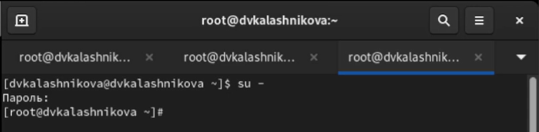{width=70%}

## Мониторинг

На второй вкладке терминала запустим мониторинг системных событий в реальном времени, используя команду tail -f /var/log/messages 

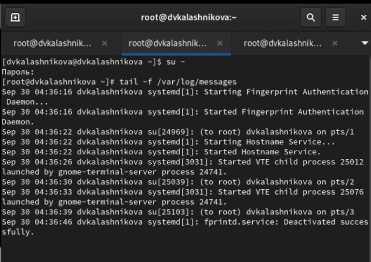{width=50%}

## Запуск

В третьей вкладке терминала вернемся к учётной записи своего пользователя и пробуем  получить полномочия администратора, но введите неправильный пароль. В терминале с мониторингом событий увидим соообщение «FAILED
SU (to root) username ...» 

{width=40%}

## Ввод

В третьей вкладке терминала из оболочки пользователя введем команду
logger hello 

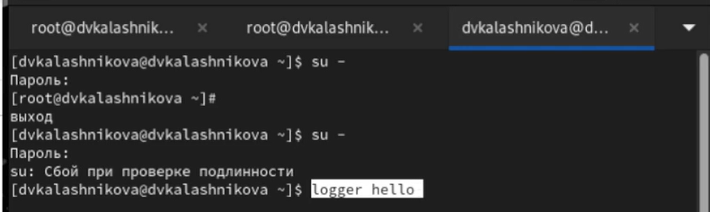{width=70%}

## Вывод

Во второй вкладке терминала с мониторингом событий мы увидим сообщение, которое также будет зафиксировано в файле /var/log/messages 

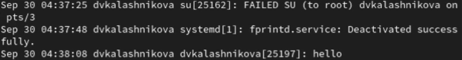{width=70%}

## Вывод

Во второй вкладке терминала с мониторингом остановим трассировку файла сообщений мониторинга реального времени, используя Ctrl + c . Затем запустим мониторинг сообщений безопасности при помощи команды tail -n 20 /var/log/secure, которая вернет последние 20 строк 

{width=70%}

## Загрузка

В первой вкладке терминала установим Apache

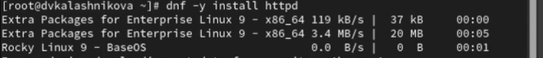{width=70%}

## Установка

После окончания процесса установки запустим веб-службу

{width=70%}

## Закрытие

Во второй вкладке терминала посмотрим журнал сообщений об ошибках веб-службы и закроем при помощи Ctrl + c 

{width=70%}

## Добавление

В третьей вкладке терминала получим полномочия администратора и в файле конфигурации /etc/httpd/conf/httpd.conf в конце добавим следующую строку: ErrorLog syslog:local1

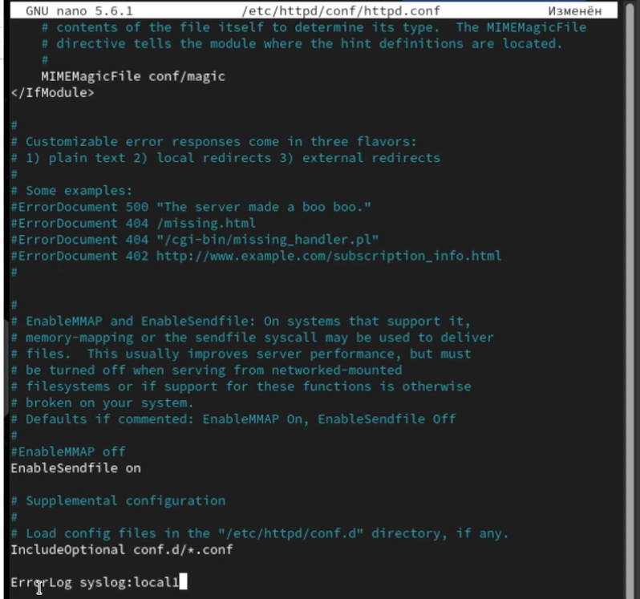{width=40%}

## Создание

Далее в каталоге /etc/rsyslog.d создайте файл мониторинга событий веб-службы 

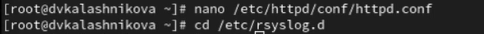{width=70%}

## Редактирование

Откроем его на редактирование и пропишим в нём строчку local1.* -/var/log/httpd-error.log, которая позволит отправлять все сообщения, получаемые для объекта local1 

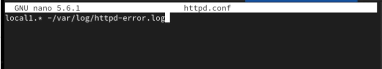{width=70%}

## Перезагрузка

Теперь перейдием в первую вкладку терминала и перезагрузим конфигурацию rsyslogd и веб-службу 

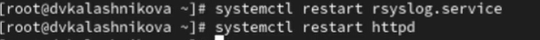{width=70%}

## Создание

В третьей вкладке терминала создадим отдельный файл конфигурации для мониторинга отладочной информации 

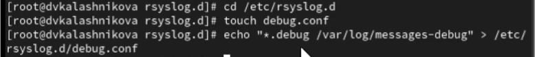{width=70%}

## Перезапуск

В первой вкладке терминала снова перезапустим rsyslogd 

{width=70%}

## Запуск
 
Во второй вкладке терминала запустим мониторинг отладочной информации 

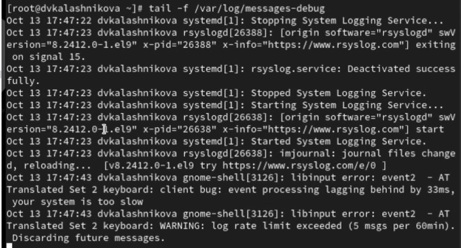{width=70%}

## Ввод

В третьей вкладке терминала введием следующую команду ogger -p daemon.debug "Daemon Debug Message"

{width=70%}

## Закрытие

В терминале с мониторингом посмотрите сообщение отладки. Чтобы закрыть трассировку файла журнала, используйте Ctrl + c 

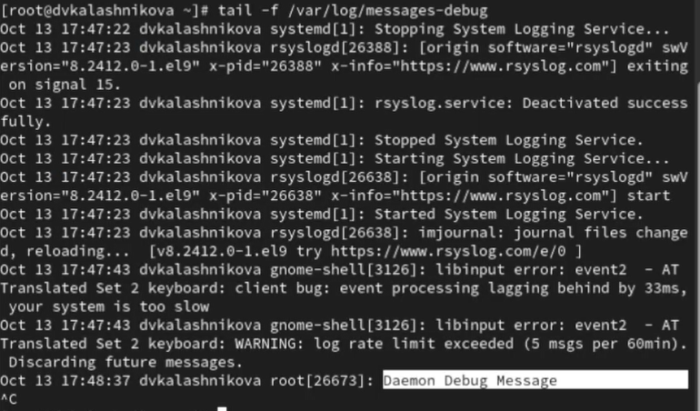{width=60%}

## Закрытие

Во второй вкладке терминала посмотрим содержимое журнала с событиями с момента последнего запуска системы и закроем, используя клавишу q 

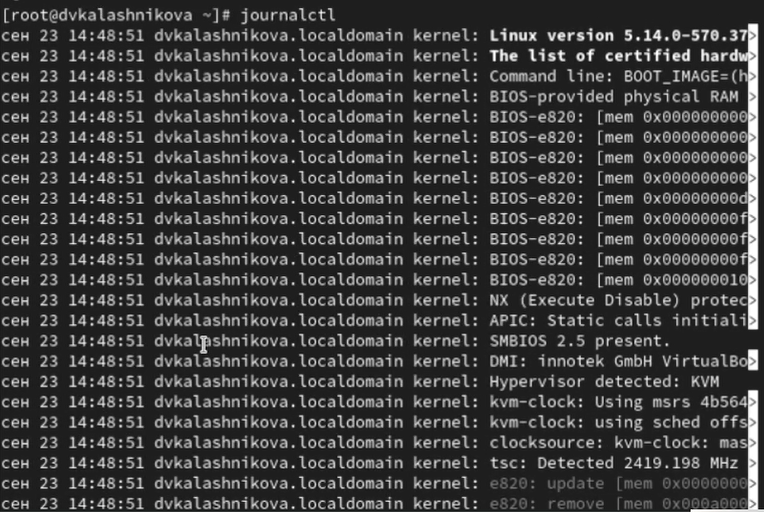{width=40%}

## Просмотр

Просмотрим содержимое журнала без использования пейджера 

{width=40%}

## Просмотр

Далее введем команду для режима просмотра журнала в реальном времени и испульзуем Ctrl + c для прерывания просмотра 

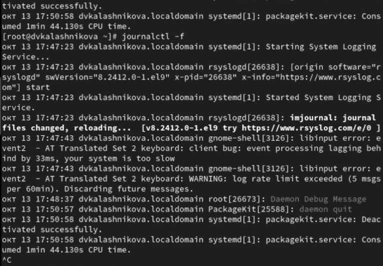{width=40%}

## Просмотр

Для использования фильтрации просмотра конкретных параметров журнала введием команду journalctl и дважды нажмем клавишу Tab 

{width=30%}

## Просмотр

Просмотрим также события для UID0 

{width=70%}

## Просмотр
 
Для отображения последних 20 строк журнала введем команду journalctl -n 20 

{width=70%}

## Просмотр

А для просмотра только сообщений об ошибках введием эту команду journalctl -p err 

{width=70%}

## Просмотр

Также мы можем использовать следующую команду для просмотра всех сообщений со вчерашнего дня 

{width=70%}

## Команда

Если мы хотим показать все сообщения с ошибкой приоритета, которые были зафиксированы со вчерашнего дня, то используем команду journalctl --since yesterday -p err 

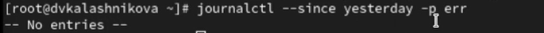{width=70%}

## Просмотр

Если нам нужна детальная информация, то используем команду journalctl -o verbose

{width=70%}

## Просмотр
 
А для просмотра дополнительной информации о модуле sshd введем команду journalctl _SYSTEMD_UNIT=sshd.service 

{width=70%}

## Запуск

Запустим терминал и получите полномочия администратора

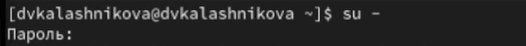{width=70%}

## Создание

Создадим каталог для хранения записей журнала 

{width=70%}

## Корректировка

Скорректируем права доступа для каталога /var/log/journal, чтобы journald смог записывать в него информацию 

{width=70%}

## Перезагрузка

Далее для принятия изменений необходимо использовать следующую команду 

{width=70%}

## Команда
 
Журнал systemd теперь постоянный. Мы хотим видеть сообщения журнала с момента последней перезагрузки, поэтому используем следующую команду

{width=70%}

## Выводы

В ходе выполнения лабораторной работы я получила навыки работы с журналами мониторинга различных событий в системе 

