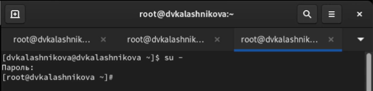
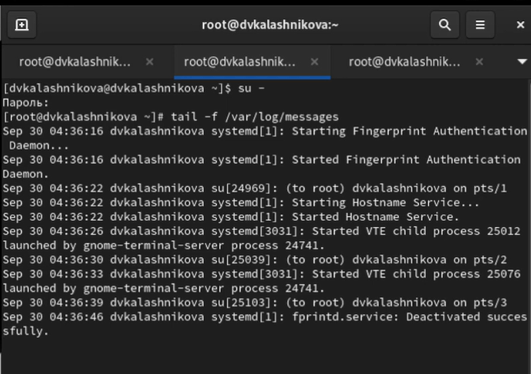
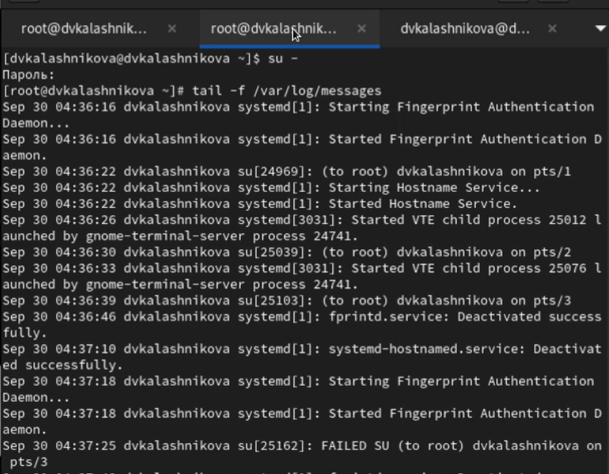

---
## Front matter
lang: ru-RU
title: Элементы криптографии. Однократное гаммирование
subtitle: Лабораторная работа №7 
author:
  - Калашникова Д. В.
institute:
  - Российский университет дружбы народов, Москва, Россия
date: 10 мая 2026

## i18n babel
babel-lang: russian
babel-otherlangs: english

## Formatting pdf
toc: false
toc-title: Содержание
slide_level: 2
aspectratio: 169
section-titles: true
theme: metropolis
header-includes:
 - \metroset{progressbar=frametitle,sectionpage=progressbar,numbering=fraction}
---

# Информация

## Докладчик

:::::::::::::: {.columns align=center}
::: {.column width="70%"}

  * Калашникова Дарья Викторовна
  * Студент
  * Российский университет дружбы народов
  * [1132243108@pfur.ru](mailto:1132243108@pfur.ru)

:::
::: {.column width="30%"}

:::
::::::::::::::

## Цель работы 

Освоить на практике применение режима однократного гаммирования.

## Выполнение лабораторной работы

Для начала откроем  терминал, и перейдем в суперпользователя, и откроем питон 

{#fig:001 width=70%}

## Нахождение ключа

После чего пропишем команду для нахождения ключа, данная команда загружает заданный шифротекст, преобразует целевую фразу в байты и  с помощью операции XOR вычисляет ключ, который превращает данный шифротекст в фразу С Новым Годом 

{#fig:002 width=70%}

## Шифротекст

Затем пропишем команду которая загружает шифротекст и полученный ключ, выполняет XOR между ними и выводит расшифрованный открытый  текст, Подтверждает, что при использовании найденного ключа расшифровывается именно нужная фраза 

{#fig:003 width=70%}

## Выводы

В результате выполнения лабораторной работы я освоила на практике применение режима однократного гаммирования 

