---
## Front matter
title: "Лабораторная работа № 7"
subtitle: "Управление журналами событий в системе"
author: "Калашникова Дарья Викторовна"

## Generic otions
lang: ru-RU
toc-title: "Содержание"

## Bibliography
bibliography: bib/cite.bib
csl: pandoc/csl/gost-r-7-0-5-2008-numeric.csl

## Pdf output format
toc: true # Table of contents
toc-depth: 2
lof: true # List of figures
lot: true # List of tables
fontsize: 12pt
linestretch: 1.5
papersize: a4
documentclass: scrreprt
## I18n polyglossia
polyglossia-lang:
  name: russian
  options:
	- spelling=modern
	- babelshorthands=true
polyglossia-otherlangs:
  name: english
## I18n babel
babel-lang: russian
babel-otherlangs: english
## Fonts
mainfont: IBM Plex Serif
romanfont: IBM Plex Serif
sansfont: IBM Plex Sans
monofont: IBM Plex Mono
mathfont: STIX Two Math
mainfontoptions: Ligatures=Common,Ligatures=TeX,Scale=0.94
romanfontoptions: Ligatures=Common,Ligatures=TeX,Scale=0.94
sansfontoptions: Ligatures=Common,Ligatures=TeX,Scale=MatchLowercase,Scale=0.94
monofontoptions: Scale=MatchLowercase,Scale=0.94,FakeStretch=0.9
mathfontoptions:
## Biblatex
biblatex: true
biblio-style: "gost-numeric"
biblatexoptions:
  - parentracker=true
  - backend=biber
  - hyperref=auto
  - language=auto
  - autolang=other*
  - citestyle=gost-numeric
## Pandoc-crossref LaTeX customization
figureTitle: "Рис."
tableTitle: "Таблица"
listingTitle: "Листинг"
lofTitle: "Список иллюстраций"
lotTitle: "Список таблиц"
lolTitle: "Листинги"
## Misc options
indent: true
header-includes:
  - \usepackage{indentfirst}
  - \usepackage{float} # keep figures where there are in the text
  - \floatplacement{figure}{H} # keep figures where there are in the text
---

# Цель работы

Получить навыки работы с журналами мониторинга различных событий в системе.

# Задание

Продемонстрировать навыки работы с журналом мониторинга событий в реальном
времени, а также навыки оздания и настройки отдельного файла конфигурации и навыки работы с journalctl и journald.

# Выполнение лабораторной работы

Запустим три вкладки терминала и в каждом из них получите полномочия администратора (рис. [-@fig:001]).

{#fig:001 width=70%}

На второй вкладке терминала запустим мониторинг системных событий в реальном времени, используя команду tail -f /var/log/messages (рис. [-@fig:002]).

{#fig:002 width=70%}

В третьей вкладке терминала вернемся к учётной записи своего пользователя и пробуем  получить полномочия администратора, но введите неправильный пароль. В терминале с мониторингом событий увидим соообщение «FAILED
SU (to root) username ...» (рис. [-@fig:003]).

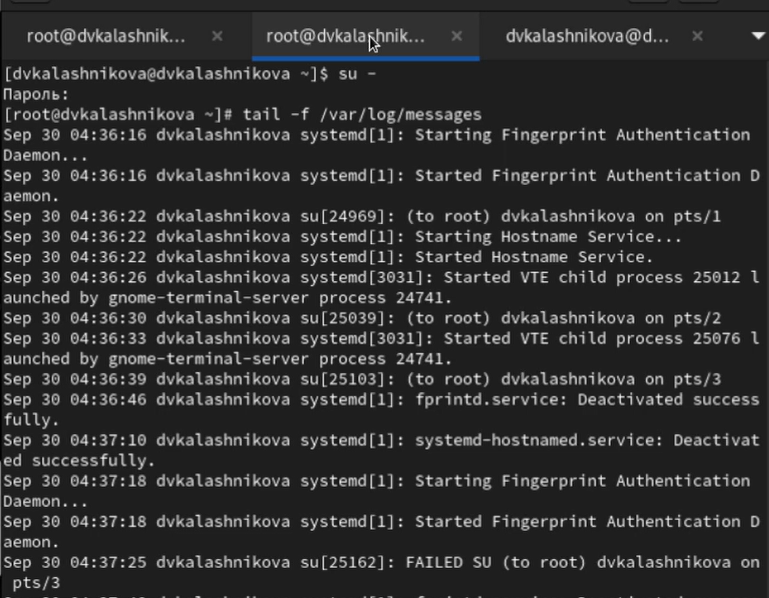{#fig:003 width=70%}

В третьей вкладке терминала из оболочки пользователя введем команду
logger hello (рис. [-@fig:004]).

{#fig:004 width=70%}

Во второй вкладке терминала с мониторингом событий мы увидим сообщение, которое также будет зафиксировано в файле /var/log/messages (рис. [-@fig:005]).

{#fig:005 width=70%}

Во второй вкладке терминала с мониторингом остановим трассировку файла сообщений мониторинга реального времени, используя Ctrl + c . Затем запустим мониторинг сообщений безопасности при помощи команды tail -n 20 /var/log/secure, которая вернет последние 20 строк (рис. [-@fig:006]).

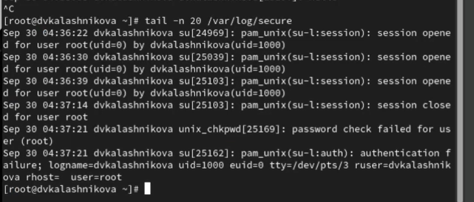{#fig:006 width=70%}

В первой вкладке терминала установим Apache(рис. [-@fig:007]).

{#fig:007 width=70%}

После окончания процесса установки запустим веб-службу(рис. [-@fig:008]).

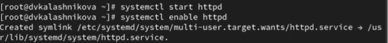{#fig:008 width=70%}

Во второй вкладке терминала посмотрим журнал сообщений об ошибках веб-службы и закроем при помощи Ctrl + c (рис. [-@fig:009]).

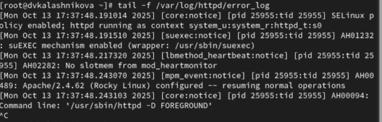{#fig:009 width=70%}

В третьей вкладке терминала получим полномочия администратора и в файле конфигурации /etc/httpd/conf/httpd.conf в конце добавим следующую строку:ErrorLog syslog:local1 (рис. [-@fig:010]).

{#fig:010 width=70%}

Далее в каталоге /etc/rsyslog.d создайте файл мониторинга событий веб-службы (рис. [-@fig:011]).

{#fig:011 width=70%}

Откроем его на редактирование и пропишим в нём строчку local1.* -/var/log/httpd-error.log, которая позволит отправлять все сообщения, получаемые для объекта local1 (рис. [-@fig:012]).

{#fig:012 width=70%}

Теперь перейдием в первую вкладку терминала и перезагрузим конфигурацию rsyslogd и веб-службу (рис. [-@fig:013]).

{#fig:013 width=70%}

В третьей вкладке терминала создадим отдельный файл конфигурации для мониторинга отладочной информации (рис. [-@fig:014]).

{#fig:014 width=70%}

В первой вкладке терминала снова перезапустим rsyslogd (рис. [-@fig:015]).

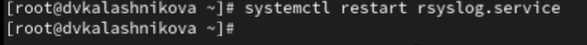{#fig:015 width=70%}

Во второй вкладке терминала запустим мониторинг отладочной информации (рис. [-@fig:016]).

{#fig:016 width=70%}

В третьей вкладке терминала введием следующую команду ogger -p daemon.debug "Daemon Debug Message"(рис. [-@fig:017]).

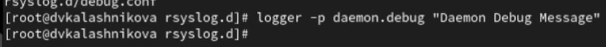{#fig:017 width=70%}

В терминале с мониторингом посмотрите сообщение отладки. Чтобы закрыть трассировку файла журнала, используйте Ctrl + c (рис. [-@fig:018]).

{#fig:018 width=70%}

Во второй вкладке терминала посмотрим содержимое журнала с событиями с момента последнего запуска системы и закроем, используя клавишу q (рис. [-@fig:019]).

{#fig:019 width=70%}

Просмотрим содержимое журнала без использования пейджера (рис. [-@fig:020]).

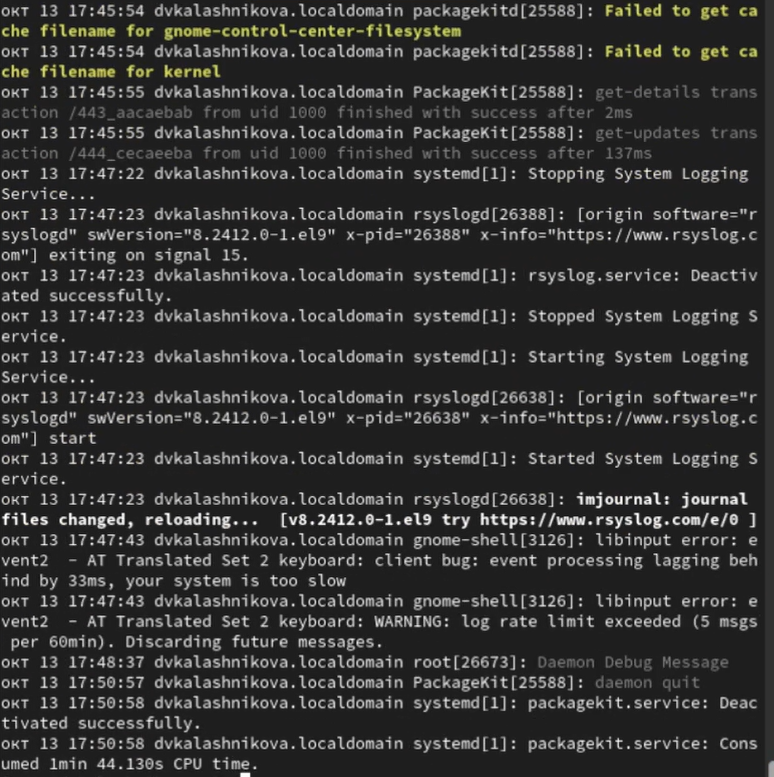{#fig:020 width=70%}

Далее введем команду для режима просмотра журнала в реальном времени и испульзуем Ctrl + c для прерывания просмотра (рис. [-@fig:021]).

{#fig:021 width=70%}

Для использования фильтрации просмотра конкретных параметров журнала введием команду journalctl и дважды нажмем клавишу Tab (рис. [-@fig:022]).

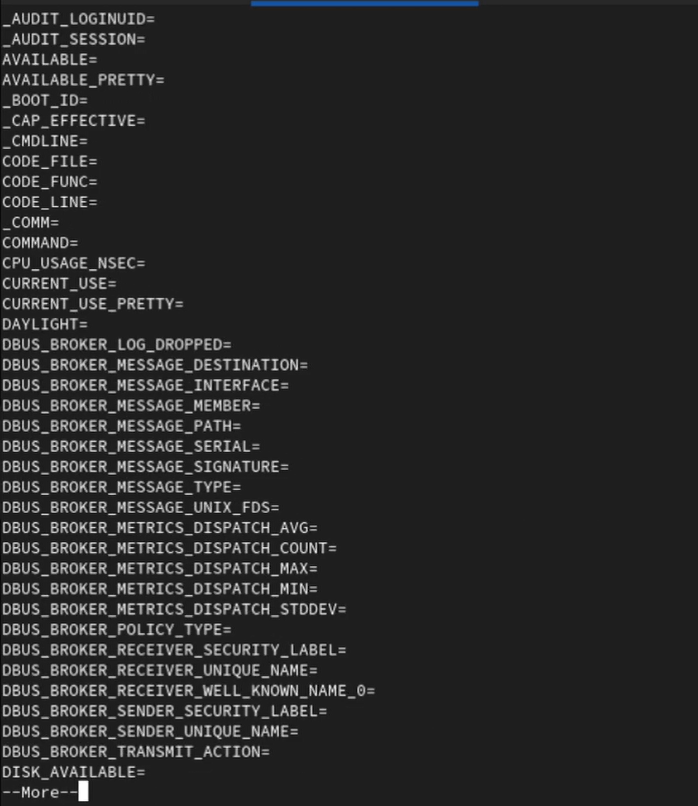{#fig:022 width=70%}

Просмотрим также события для UID0 (рис. [-@fig:023]).

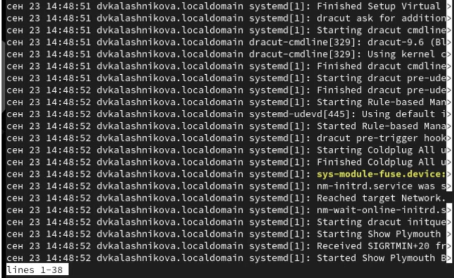{#fig:023 width=70%}

Для отображения последних 20 строк журнала введем команду journalctl -n 20 (рис. [-@fig:024]).

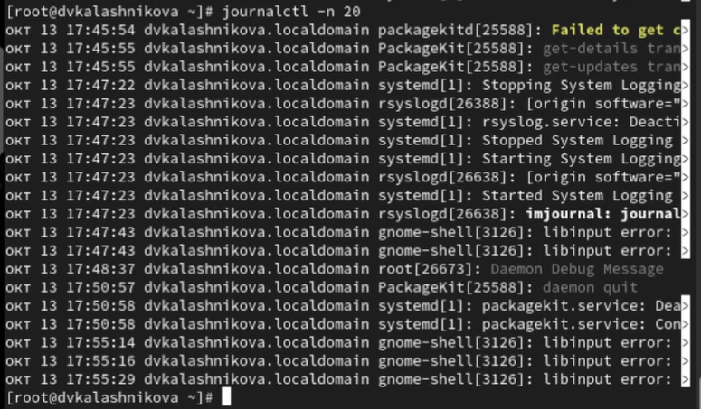{#fig:024 width=70%}

А для просмотра только сообщений об ошибках введием эту команду journalctl -p err (рис. [-@fig:025]).

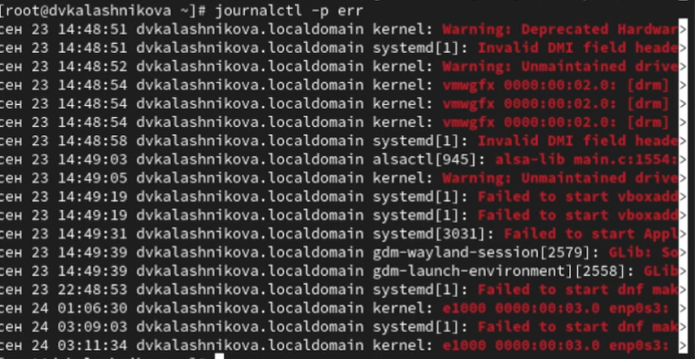{#fig:025 width=70%}

Также мы можем использовать следующую команду для просмотра всех сообщений со вчерашнего дня (рис. [-@fig:026]).

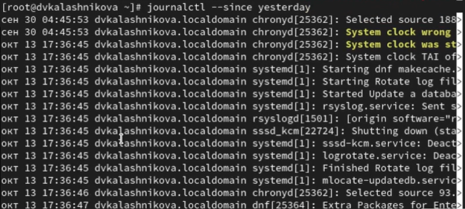{#fig:026 width=70%}

Если мы хотим показать все сообщения с ошибкой приоритета, которые были зафиксированы со вчерашнего дня, то используем команду journalctl --since yesterday -p err (рис. [-@fig:027]).

{#fig:027 width=70%}

Если нам нужна детальная информация, то используем команду journalctl -o verbose (рис. [-@fig:028]).

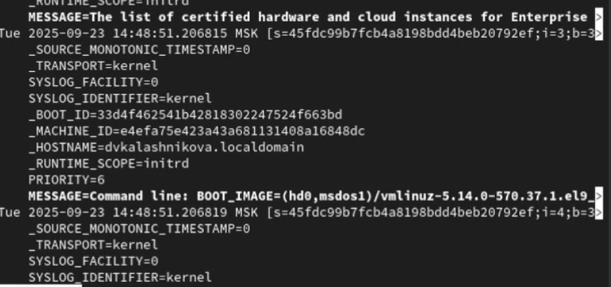{#fig:028 width=70%}

А для просмотра дополнительной информации о модуле sshd введем команду journalctl _SYSTEMD_UNIT=sshd.service (рис. [-@fig:029]).

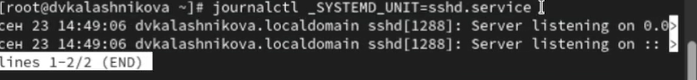{#fig:029 width=70%}

Запустим терминал и получите полномочия администратора (рис. [-@fig:030]).

{#fig:030 width=70%}

Создадим каталог для хранения записей журнала (рис. [-@fig:031]).

{#fig:031 width=70%}

Скорректируем права доступа для каталога /var/log/journal, чтобы journald смог записывать в него информацию (рис. [-@fig:032]).

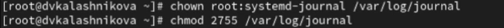{#fig:032 width=70%}

Далее для принятия изменений необходимо использовать следующую команду (рис. [-@fig:033]).

{#fig:033 width=70%}

Журнал systemd теперь постоянный. Мы хотим видеть сообщения журнала с момента последней перезагрузки, поэтому используем следующую команду (рис. [-@fig:034]).

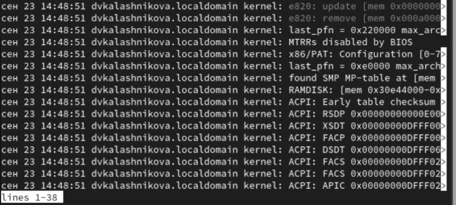{#fig:034 width=70%}

# Контрольные вопросы

1. Какой файл используется для настройки rsyslogd?

Ответ: файл /etc/rsyslog.conf

2. В каком файле журнала rsyslogd содержатся сообщения, связанные с аутентификацией?

Ответ: файл журнала айнтефекации /var/log/auth.log

3. Если вы ничего не настроите, то сколько времени потребуется для ротации файлов журналов?

Ответ: период ротации журналов по умолчанию раз в неделю

4. Какую строку следует добавить в конфигурацию для записи всех сообщений с приоритетом info в файл /var/log/messages.info?

Ответ: строку /var/log/message.info

5. Какая команда позволяет вам видеть сообщения журнала в режиме реального времени?

Ответ: команда tail -f /var/log/syslog

6. Какая команда позволяет вам видеть все сообщения журнала, которые были написаны для PID 1 между 9:00 и 15:00?

Ответ: команада journalctl _PID=1 –since “9:00” –until “15:00” 15

7. Какая команда позволяет вам видеть сообщения journald после последней перезагрузки системы?

Ответ: команда journalctl -b

8. Какая процедура позволяет сделать журнал journald постоянным?

Ответ: команда создать каталог и перезапустить службу mkdir -p /var/log/journal systemctl restart systemd-journald

# Выводы

В ходе выполнения лабораторной работы я получила навыки работы с журналами мониторинга различных событий в системе 

# Список литературы{.unnumbered}

::: {#refs}
:::
