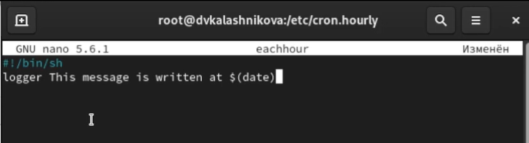
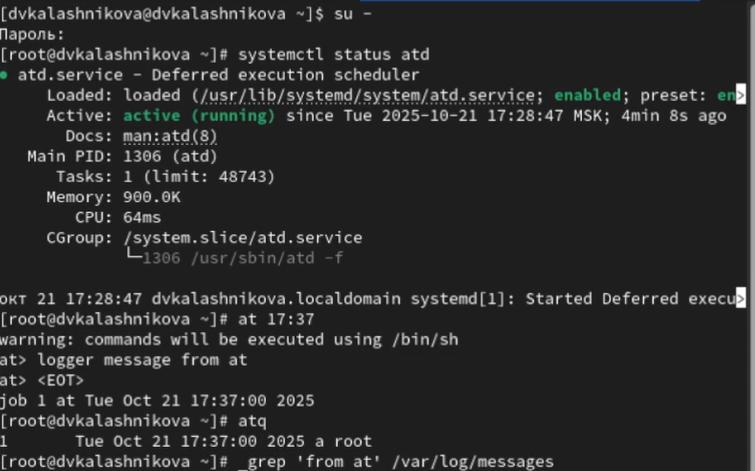

---
## Front matter
lang: ru-RU
title: Презентация
subtitle: Лабораторная работа № 8
author:
  - Калашникова Д. В.
institute:
  - Российский университет дружбы народов, Москва, Россия
date: 21 октября 2025

## i18n babel
babel-lang: russian
babel-otherlangs: english

## Formatting pdf
toc: false
toc-title: Содержание
slide_level: 2
aspectratio: 169
section-titles: true
theme: metropolis
header-includes:
 - \metroset{progressbar=frametitle,sectionpage=progressbar,numbering=fraction}
---

# Информация

## Докладчик

:::::::::::::: {.columns align=center}
::: {.column width="70%"}

  * Калашникова Дарья Викторовна
  * Российский университет дружбы народов
  * [1132243108@rpfur.ru](mailto:1132243108@rpfur.ru)

:::
::: {.column width="30%"}

:::
::::::::::::::

## Цель работы

Получение навыков работы с планировщиками событий cron и at

## Задание

Нужно выполнить задания по планированию задач с помощью crond и задания по планированию задач с помощью atd

## Выполнение лабораторной работы

Запустим терминал и получим полномочия администратора при помощи команды
su -, а также посмотрим статус демона crond при помощи команды systemctl status crond -l, посмотрим содержимое файла конфигурации /etc/crontab: cat /etc/crontab и список заданий в расписании: crontab -l.Ничего не отобразится, так как расписание ещё не задано

## Просмотр

{width=40%}

## Добавление

Откроем файл расписания на редактирование: при помощи команды crontab -e. Добавим следующую строку в файл расписания: */1 * * * * logger This message is written from root cron. Далее закроем сеанс редактирования vi и сохраним изменения 

{width=70%}

## Просмотр

Посмотрим список заданий в расписании: crontab -l. В расписании появилась запись о запланированном событии 

{width=70%}

## Просмотр

Не выключая систему, через 2–3 минуты просмотрим журнал
системных событий при помощи команды grep written /var/log/messages 

{width=70%}

## Редактирование

Изменим запись в расписании crontab на следующую: 0 */1 * * 1-5 logger This message is written from root cron 

{width=70%}

## Создание

Посмотрим список заданий в расписании: crontab -l. Далее перейдем в каталог /etc/cron.hourly и создадим в нём файл сценария с именем eachhour: cd /etc/cron.hourly, touch eachhour 

{width=70%}

## Редактирование

Откроем файл eachhour для редактирования и пропишим в нём следующий скрипт 

{width=70%}

## Создание

Далее сделаем файл сценария eachhour исполняемым: chmod +x eachhour.Теперь перейдемм в каталог /etc/crond.d и создадим в нём файл с расписанием
eachhour: cd /etc/cron.d, touch eachhour 

{width=70%}

## Редактирование

Откроем этот файл для редактирования и поместите в него следующее содержимое: 11 * * * * root logger This message is written from /etc/cron.d, данный скрипт каждую 11 минуту каждого часа, любого дня и
месяца, cron запускает команду logger от имени пользователя root

{width=70%}

## Редактирование

Не выключая систему, через 2 часа просмотрим журнал системных событий:
grep written /var/log/messages

{width=70%}

## Запуск

Запустим терминал и получим полномочия администратора.Далее проверим, что служба atd загружена и включена: systemctl status atd. Зададим выполнение команды logger message from at в свое время. Для этого введем: at 9:30 и затем введем logger message from at. Убедимся также, что задание действительно запланировано при помощи команды atq

{width=50%}

## Выводы

В результате выполнения лабораторной работы я получила навыки работы с
планировщиками событий cron и at
