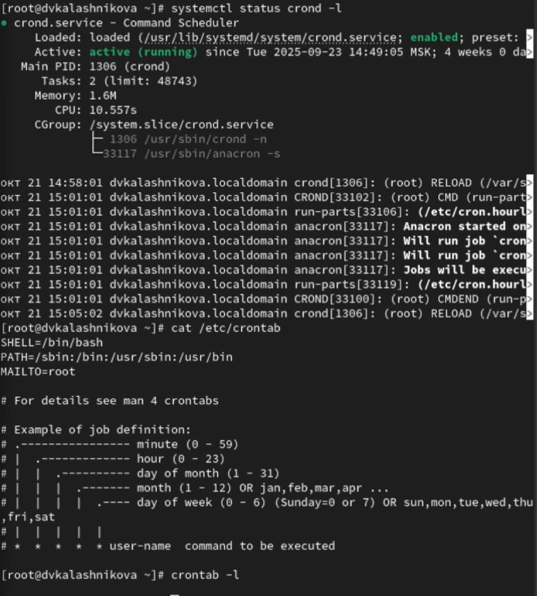
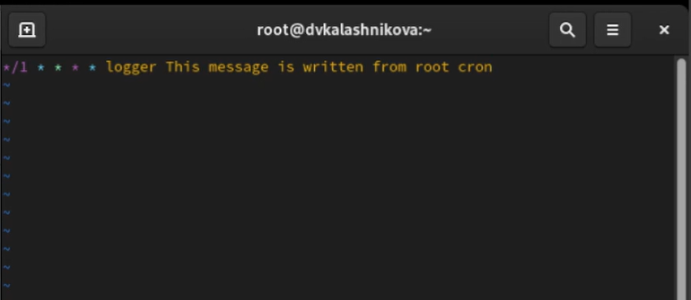
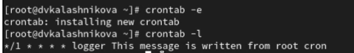
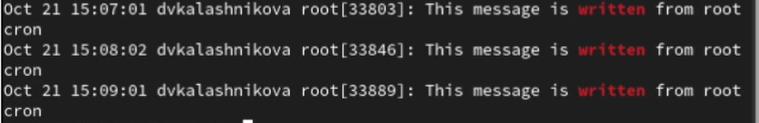
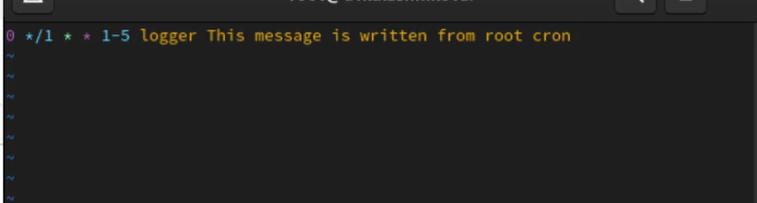
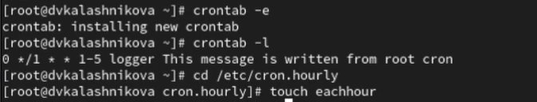
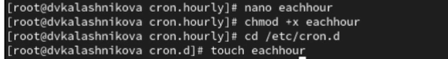
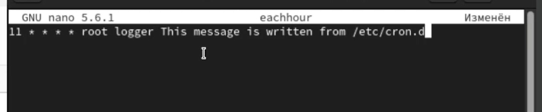
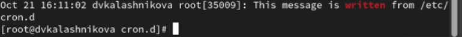

---
## Front matter
title: "Лабораторная работа № 8"
subtitle: "Планировщики событий"
author: "Калашникова Дарья Викторовна"

## Generic otions
lang: ru-RU
toc-title: "Содержание"

## Bibliography
bibliography: bib/cite.bib
csl: pandoc/csl/gost-r-7-0-5-2008-numeric.csl

## Pdf output format
toc: true # Table of contents
toc-depth: 2
lof: true # List of figures
lot: true # List of tables
fontsize: 12pt
linestretch: 1.5
papersize: a4
documentclass: scrreprt
## I18n polyglossia
polyglossia-lang:
  name: russian
  options:
	- spelling=modern
	- babelshorthands=true
polyglossia-otherlangs:
  name: english
## I18n babel
babel-lang: russian
babel-otherlangs: english
## Fonts
mainfont: IBM Plex Serif
romanfont: IBM Plex Serif
sansfont: IBM Plex Sans
monofont: IBM Plex Mono
mathfont: STIX Two Math
mainfontoptions: Ligatures=Common,Ligatures=TeX,Scale=0.94
romanfontoptions: Ligatures=Common,Ligatures=TeX,Scale=0.94
sansfontoptions: Ligatures=Common,Ligatures=TeX,Scale=MatchLowercase,Scale=0.94
monofontoptions: Scale=MatchLowercase,Scale=0.94,FakeStretch=0.9
mathfontoptions:
## Biblatex
biblatex: true
biblio-style: "gost-numeric"
biblatexoptions:
  - parentracker=true
  - backend=biber
  - hyperref=auto
  - language=auto
  - autolang=other*
  - citestyle=gost-numeric
## Pandoc-crossref LaTeX customization
figureTitle: "Рис."
tableTitle: "Таблица"
listingTitle: "Листинг"
lofTitle: "Список иллюстраций"
lotTitle: "Список таблиц"
lolTitle: "Листинги"
## Misc options
indent: true
header-includes:
  - \usepackage{indentfirst}
  - \usepackage{float} # keep figures where there are in the text
  - \floatplacement{figure}{H} # keep figures where there are in the text
---

# Цель работы

Получение навыков работы с планировщиками событий cron и at

# Задание

Нужно выполнить задания по планированию задач с помощью crond и задания по планированию задач с помощью atd

# Выполнение лабораторной работы

Запустим терминал и получим полномочия администратора при помощи команды
su -, а также посмотрим статус демона crond при помощи команды systemctl status crond -l, посмотрим содержимое файла конфигурации /etc/crontab: cat /etc/crontab и список заданий в расписании: crontab -l.Ничего не отобразится, так как расписание ещё не задано(рис. [-@fig:001]).

{#fig:001 width=70%}

Откроем файл расписания на редактирование: при помощи команды crontab -e. Добавим следующую строку в файл расписания: */1 * * * * logger This message is written from root cron. Далее закроем сеанс редактирования vi и сохраним изменения (рис. [-@fig:002]).

{#fig:002 width=70%}

Посмотрим список заданий в расписании: crontab -l. В расписании появилась запись о запланированном событии (рис. [-@fig:003]).

{#fig:003 width=70%}

Не выключая систему, через 2–3 минуты просмотрим журнал
системных событий при помощи команды grep written /var/log/messages (рис. [-@fig:004]).

{#fig:004 width=70%}

Изменим запись в расписании crontab на следующую: 0 */1 * * 1-5 logger This message is written from root cron (рис. [-@fig:005]).

{#fig:005 width=70%}

Посмотрим список заданий в расписании: crontab -l. Далее перейдем в каталог /etc/cron.hourly и создадим в нём файл сценария с именем eachhour: cd /etc/cron.hourly, touch eachhour (рис. [-@fig:006]).

{#fig:006 width=70%}

Откроем файл eachhour для редактирования и пропишим в нём следующий скрипт (рис. [-@fig:007]).

{#fig:007 width=70%}

Далее сделаем файл сценария eachhour исполняемым: chmod +x eachhour.Теперь перейдемм в каталог /etc/crond.d и создадим в нём файл с расписанием
eachhour: cd /etc/cron.d, touch eachhour (рис. [-@fig:008]).

{#fig:008 width=70%}

Откроем этот файл для редактирования и поместите в него следующее содержимое: 11 * * * * root logger This message is written from /etc/cron.d, данный скрипт каждую 11 минуту каждого часа, любого дня и
месяца, cron запускает команду logger от имени пользователя root(рис. [-@fig:009]).

{#fig:009 width=70%}

Не выключая систему, через 2 часа просмотрим журнал системных событий:
grep written /var/log/messages (рис. [-@fig:010]).

{#fig:010 width=70%}

Запустим терминал и получим полномочия администратора.Далее проверим, что служба atd загружена и включена: systemctl status atd. Зададим выполнение команды logger message from at в свое время. Для этого введем: at 9:30 и затем введем logger message from at. Убедимся также, что задание действительно запланировано при помощи команды atq (рис. [-@fig:011]).

{#fig:011 width=70%}

# Контрольные вопросы

1. Как настроить задание cron, чтобы оно выполнялось раз в 2 недели?

Ответ: настройка 0 2 * * 1 test $(( $(date +%V) % 2 )) -eq 0 && cmd

2. Как настроить задание cron, чтобы оно выполнялось 1-го и 15-го числа каждого месяца в 2 часа ночи?

Ответ: настройка 0 2 1,15 * * /path/to/script.sh

3. Как настроить задание cron, чтобы оно выполнялось каждые 2 минуты каждый день?

Ответ: настройка /2 * * * /path/to/script.sh

4. Как настроить задание cron, чтобы оно выполнялось 19 сентября ежегодно?

Ответ: настройка 0 0 19 9 * /path/to/script.sh

5. Как настроить задание cron, чтобы оно выполнялось каждый четверг сентября ежегодно?

Ответ: настройка 0 0 * 9 4 /path/to/script.sh

6. Какая команда позволяет вам назначить задание cron для пользователя alice? Приведите подтверждающий пример.

Ответ: команда sudo crontab -u alice -e Пример 0 3 * * * /path/to script.sh 10

7. Какая команда позволяет вам видеть сообщения journald после последней перезагрузки системы?

Ответ: нужно указать echo bob | sudo tee -a /etc/cron.deny

8. Вам нужно убедиться, что задание выполняется каждый день, даже если сервер во время выполнения временно недоступен. Как это сделать?

Ответ: это можно сделать прописав persistent=true

9. Какая команда позволяет узнать, запланированы ли какие-либо задания на выполнение планировщиком atd?

Ответ: команда atq

# Выводы

В результате выполнения лабораторной работы я получила навыки работы с
планировщиками событий cron и at

# Список литературы{.unnumbered}

::: {#refs}
:::
