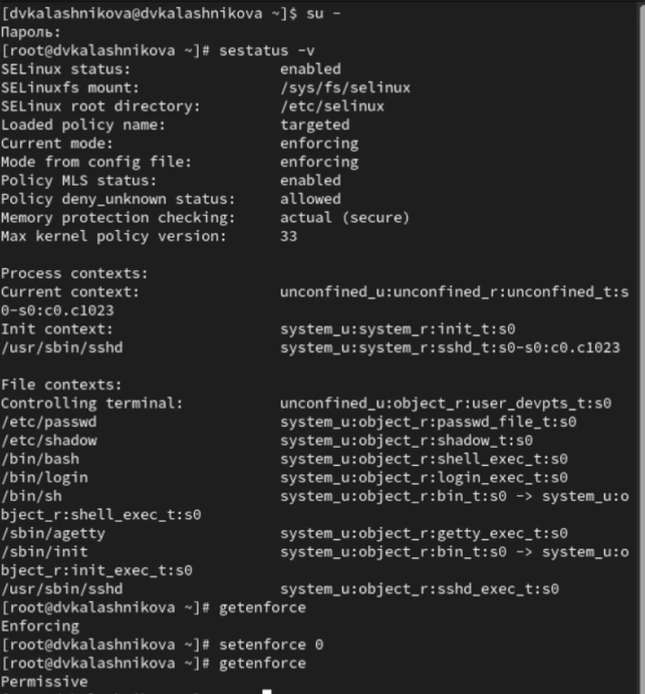
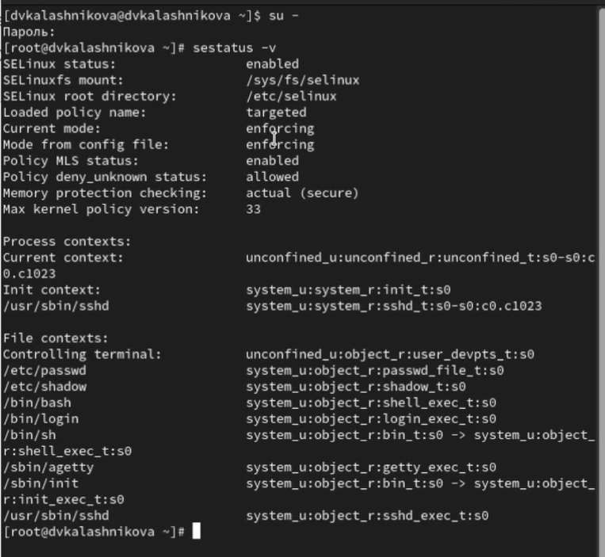
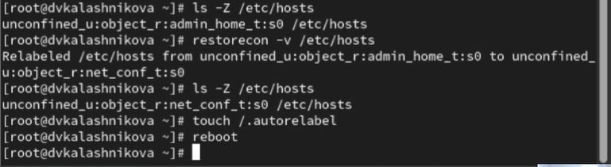
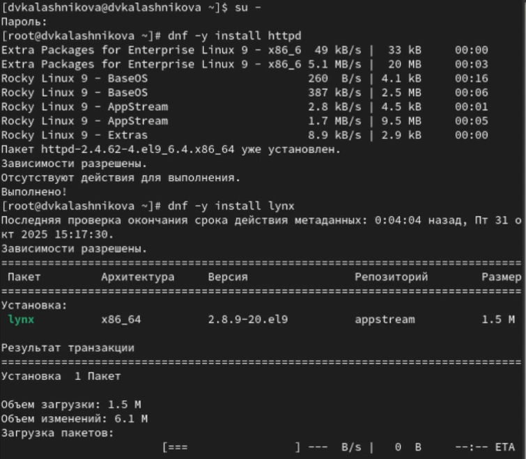
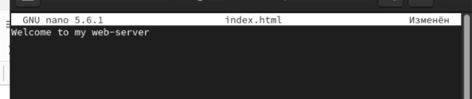
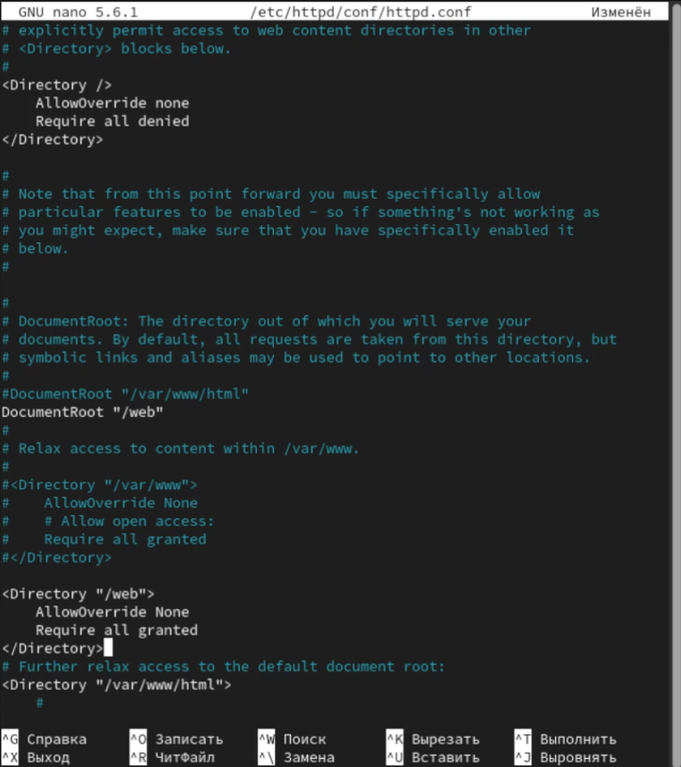
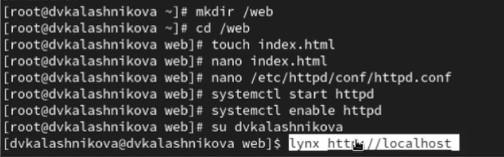
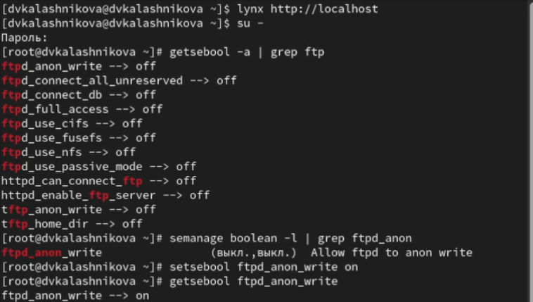
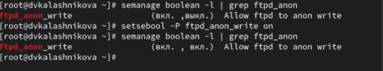

---
## Front matter
lang: ru-RU
title: Презентация
subtitle: Управление SELinux
author:
  - Калашникова Д. В.
institute:
  - Российский университет дружбы народов, Москва, Россия
date: 31 октября 2025

## i18n babel
babel-lang: russian
babel-otherlangs: english

## Formatting pdf
toc: false
toc-title: Содержание
slide_level: 2
aspectratio: 169
section-titles: true
theme: metropolis
header-includes:
 - \metroset{progressbar=frametitle,sectionpage=progressbar,numbering=fraction}
---

# Информация

## Докладчик

:::::::::::::: {.columns align=center}
::: {.column width="70%"}

  * Калашникова Дарья Викторовна
  * Российский университет дружбы народов
  * [1132243108@pfur.ru](mailto:1132243108@pfur.ru)

:::
::: {.column width="30%"}

:::
::::::::::::::

## Цель работы

Получить навыки работы с контекстом безопасности и политиками SELinu

## Задание

Продемонстрировать навыки по управлению режимами SELinux, по восстановлению контекста безопасности SELinux. Настроить контекст безопасности для нестандартного расположения файлов веб-
службы и продемонстрировать навыки работы с переключателями SELinux 

## Изменения

Запустим терминал и получите полномочия администратора.Просмотрим текущую информацию о состоянии SELinux: sestatus -v. Посмотрим, в каком режиме работает SELinux при помощи команды getenforce, а также изменим режим работы SELinux на разрешающий (Permissive): setenforce 0

## Изменения

{width=50%}

## Перезагрузка

В файле /etc/sysconfig/selinux с помощью редактора установим SELINUX=disabled и перезагрузим систему 

{width=40%}

## Переключение

После перезагрузки запустим терминал и получите полномочия администратора. Далее посмотрим статус SELinux: getenforce и увидим, что SELinux теперь отключён. Попробуем переключить режим работы SELinux: setenforce 1

{width=70%}

## Перезагрузка

Откроем файл /etc/sysconfig/selinux с помощью редактора и установим:
SELINUX=enforcing и перезагрузим систему 

{width=40%}

## Просмотр

После перезагрузки в терминале с полномочиями администратора посмотрим текущую информацию о состоянии SELinux: sestatus -v. Мы видим, что система работает в принудительном режиме (enforcing) использования SELinux. 

## Просмотр

{width=50%}

## Перезапись

Запустим терминал и получим полномочия администратора.Посмотрим контекст безопасности файла /etc/hosts: ls -Z /etc/hosts. Далее скопируем файл /etc/hosts в домашний каталог: cp /etc/hosts ~/ и проверим контекст файла ~/hosts: ls -Z ~/hosts. Далее перезапишем существующий файл hosts из домашнего каталога в каталог /etc: mv ~/hosts /etc

{width=70%}

## Исправления

Затем убедимся, что тип контекста по-прежнему установлен на admin_home_t: ls -Z /etc/hosts и исправьим контекст безопасности: restorecon -v /etc/hosts. Убедитмся, что тип контекста изменился: ls -Z /etc/hosts. И для массового исправления контекста безопасности на файловой системе введем команду touch /.autorelabel 

{width=70%}

## Скачивание

Запустим терминал и получите полномочия администратора. Далее Установим необходимое программное обеспечение: dnf -y install httpd и dnf -y install lynx 

{width=40%}

## Редактирование

Создаем новое хранилище для файлов web-сервера: mkdir /web. Затем создаем файл index.html в каталоге с контентом веб-сервера: cd /web, touch index.html и поместим в этот файл следующий текст: Welcome to my web-server

{width=70%}

## Редактирование

В файле /etc/httpd/conf/httpd.conf закомментируем строку DocumentRoot "/var/www/html" и ниже добавим строкуDocumentRoot "/web". Затем в этом же файле ниже закомментируем раздел
<Directory "/var/www">
AllowOverride None
Require all granted
</Directory>
и добавим следующий раздел, определяющий правила доступа:
<Directory "/web">
AllowOverride None
Require all granted
</Directory>

## Редактирование

{width=40%}

## Запуск

Запустим веб-сервер и службу httpd: systemctl start httpd и systemctl enable httpd 

{width=70%}

## Запуск

Далее в терминале под учётной записью своего пользователя при обращении к веб-серверу в текстовом браузере lynx:lynx http://localhost мы увидим веб-страницу Red Hat 

{width=50%}

## Сервер

Далее в терминале с полномочиями администратора применим новую метку контекста к /web: semanage fcontext -a -t httpd_sys_content_t "/web(/.*)?" Восстановим контекст безопасности: restorecon -R -v /web и снова обратитимся к веб-серверу: lynx http://localhost 

{width=70%}

## Сервер

Теперь мы увидим нашу запись

{width=70%}

## Просмотр

Далее посмотрим список переключателей SELinux для службы ftp: getsebool -a | grep ftp. Далее для службы ftpd_anon посмотрим список переключателей с пояснением: semanage boolean -l | grep ftpd_anon. Изменим текущее значение переключателя для службы ftpd_anon_write с off на on: setsebool ftpd_anon_write on и повторно посмотрим список переключателей SELinux для службы ftpd_anon_write 

{width=50%}

## Просмотр

Также Посмотрим список переключателей с пояснением: semanage boolean -l | grep ftpd_anon. Изменим постоянное значение переключателя для службы ftpd_anon_write с off на on: setsebool -P ftpd_anon_write on. И посмотрим список переключателей: semanage boolean -l | grep ftpd_anon 

{width=70%}

## Выводы

После выполнения лабораторной работы я получила навыки работы с контекстом безопасности и политиками SELinux

