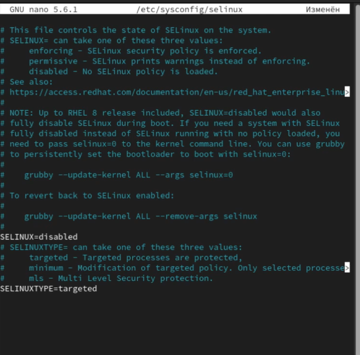
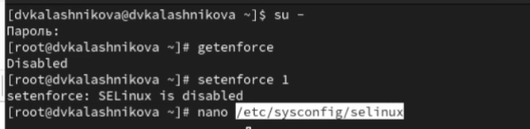
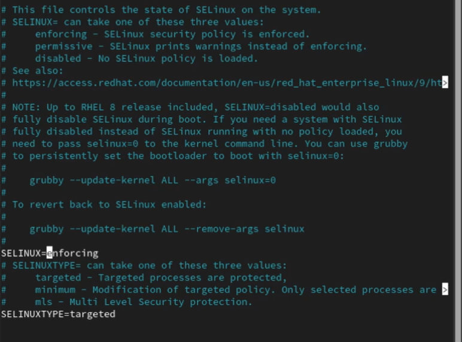
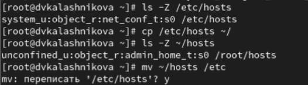
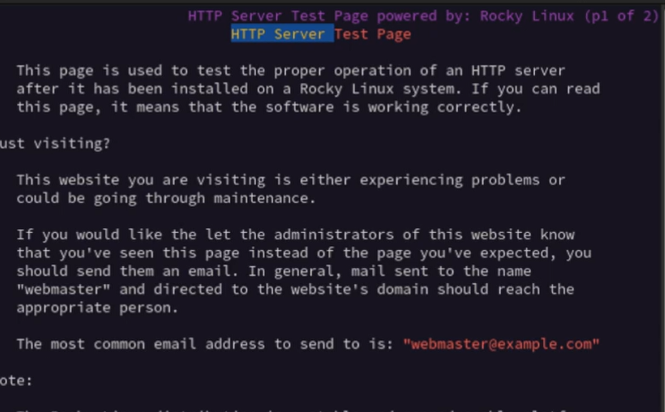
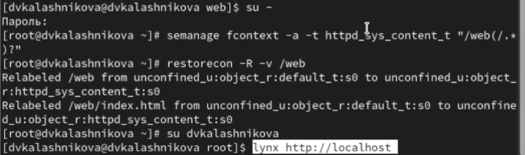
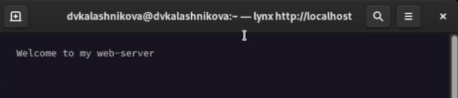

---
## Front matter
title: "Лабораторная работа № 9"
subtitle: "Управление SELinux"
author: "Калашникова Дарья Викторовна"

## Generic otions
lang: ru-RU
toc-title: "Содержание"

## Bibliography
bibliography: bib/cite.bib
csl: pandoc/csl/gost-r-7-0-5-2008-numeric.csl

## Pdf output format
toc: true # Table of contents
toc-depth: 2
lof: true # List of figures
lot: true # List of tables
fontsize: 12pt
linestretch: 1.5
papersize: a4
documentclass: scrreprt
## I18n polyglossia
polyglossia-lang:
  name: russian
  options:
	- spelling=modern
	- babelshorthands=true
polyglossia-otherlangs:
  name: english
## I18n babel
babel-lang: russian
babel-otherlangs: english
## Fonts
mainfont: IBM Plex Serif
romanfont: IBM Plex Serif
sansfont: IBM Plex Sans
monofont: IBM Plex Mono
mathfont: STIX Two Math
mainfontoptions: Ligatures=Common,Ligatures=TeX,Scale=0.94
romanfontoptions: Ligatures=Common,Ligatures=TeX,Scale=0.94
sansfontoptions: Ligatures=Common,Ligatures=TeX,Scale=MatchLowercase,Scale=0.94
monofontoptions: Scale=MatchLowercase,Scale=0.94,FakeStretch=0.9
mathfontoptions:
## Biblatex
biblatex: true
biblio-style: "gost-numeric"
biblatexoptions:
  - parentracker=true
  - backend=biber
  - hyperref=auto
  - language=auto
  - autolang=other*
  - citestyle=gost-numeric
## Pandoc-crossref LaTeX customization
figureTitle: "Рис."
tableTitle: "Таблица"
listingTitle: "Листинг"
lofTitle: "Список иллюстраций"
lotTitle: "Список таблиц"
lolTitle: "Листинги"
## Misc options
indent: true
header-includes:
  - \usepackage{indentfirst}
  - \usepackage{float} # keep figures where there are in the text
  - \floatplacement{figure}{H} # keep figures where there are in the text
---

# Цель работы

Получить навыки работы с контекстом безопасности и политиками SELinu

# Задание

Продемонстрировать навыки по управлению режимами SELinux, по восстановлению контекста безопасности SELinux. Настроить контекст безопасности для нестандартного расположения файлов веб-
службы и продемонстрировать навыки работы с переключателями SELinux 

# Выполнение лабораторной работы

Запустим терминал и получите полномочия администратора.Просмотрим текущую информацию о состоянии SELinux: sestatus -v. Посмотрим, в каком режиме работает SELinux при помощи команды getenforce, а также изменим режим работы SELinux на разрешающий (Permissive): setenforce 0
(рис. [-@fig:001]).

{#fig:001 width=70%}

Пояснение:
Строка 1 - пользователь то есть я на хосте localhost выполнил команду sestatus -v с правами суперпользователя. Строка 2 - запрос пароля sudo система запросила пароль пользователя для предоставления прав суперпользователя. Строка 3 - Общий статус SELinux был активирован в системе и функционирует. Строка 4 - Виртуальная файловая система SELinux смонтирована в директории через эту файловую систему ядро предоставляет информацию о SELinux. Строка 5 - основные конфигурациионные файлы и политики SELinux расположены в директории /etc/selinux. Строка 6 - Загружена политика безопасноти типа targeted - защищаются только определенные системные службы остальные процессы рабо-тают без ограниченний. Строка 7 - SELinux работает в режиме принудительного применения политики - все нарушения блокируются. Строка 8 - Режим enforcing установлен в концигурационном фалйе и будет сохраняться после перезагрузки. Строка 9 - поддержка Multi-level Security включена в политику. Строка 10 - Политика разрешает доступ к объектам с неизвестными классами или разрешениями. Строка 11 = SELinux проверяет защиту памяти на основе фактических безопасности. Строка 12 - Ядро поддерживает политики SELinux до версии 33 включительно. Строка 14 - начало раздела с контекстами безопасности текущих процессов Строка 15 - Текущая сессия пользователя работает в неограниченном домене сам домен. Строка 16 - Основной системный процесс init работает в домене init_t. Строка 17 - Домен ssh работает в ограниченном домене sshd_t с дополнительными уровнями безопасности. Строка 19 - начало раздела с контекстами безопасности системных файлов. Строка 20 - Управляющий терминал имеет тип user_devpts_t для псевдо терминалов. Строка 21 - Файл с учетными записями пользователей имеет тип passwd_file_t. Строка 22 - файл с хешами паролей имеет защищенный тип shadow_t. Строка 23 - Исполняемый файл bash имеет тип shell_exec_t. Строка 24 - Исполняемый файл login bvttn nbg login_exect_t. Строка 25 - Символичная ссылка /bin/sh указывает на файл с типом shell_exec_t. Строка 26 - Исполяемый файл agetty имеет тип getty_exec_t. Строка 27 - исполняемый файл init имеет типinit_exec_t. Строка 28 - Исполняемый файл ssh домена имеет тип ssh_exec_t

В файле /etc/sysconfig/selinux с помощью редактора установим SELINUX=disabled и перезагрузим систему (рис. [-@fig:002]).

{#fig:002 width=70%}

После перезагрузки запустим терминал и получите полномочия администратора. Далее посмотрим статус SELinux: getenforce и увидим, что SELinux теперь отключён. Попробуем переключить режим работы SELinux: setenforce 1 (рис. [-@fig:003]).

{#fig:003 width=70%}

Откроем файл /etc/sysconfig/selinux с помощью редактора и установим:
SELINUX=enforcing и перезагрузим систему (рис. [-@fig:004]).

{#fig:004 width=70%}

После перезагрузки в терминале с полномочиями администратора посмотрим текущую информацию о состоянии SELinux: sestatus -v. Мы видим, что система работает в принудительном режиме (enforcing) использования SELinux (рис. [-@fig:005]).

{#fig:005 width=70%}

Запустим терминал и получим полномочия администратора.Посмотрим контекст безопасности файла /etc/hosts: ls -Z /etc/hosts. Далее скопируем файл /etc/hosts в домашний каталог: cp /etc/hosts ~/ и проверим контекст файла ~/hosts: ls -Z ~/hosts. Далее перезапишем существующий файл hosts из домашнего каталога в каталог /etc: mv ~/hosts /etc (рис. [-@fig:006]).

{#fig:006 width=70%}

Затем убедимся, что тип контекста по-прежнему установлен на admin_home_t: ls -Z /etc/hosts и исправьим контекст безопасности: restorecon -v /etc/hosts. Убедитмся, что тип контекста изменился: ls -Z /etc/hosts. И для массового исправления контекста безопасности на файловой системе введем команду touch /.autorelabel (рис. [-@fig:007]).

{#fig:007 width=70%}

Запустим терминал и получите полномочия администратора. Далее Установим необходимое программное обеспечение: dnf -y install httpd и dnf -y install lynx (рис. [-@fig:008]).

{#fig:008 width=70%}

Создаем новое хранилище для файлов web-сервера: mkdir /web. Затем создаем файл index.html в каталоге с контентом веб-сервера: cd /web, touch index.html и поместим в этот файл следующий текст: Welcome to my web-server(рис. [-@fig:009]).

{#fig:009 width=70%}

В файле /etc/httpd/conf/httpd.conf закомментируем строку DocumentRoot "/var/www/html" и ниже добавим строкуDocumentRoot "/web". Затем в этом же файле ниже закомментируем раздел
<Directory "/var/www">
AllowOverride None
Require all granted
</Directory>
и добавим следующий раздел, определяющий правила доступа:
<Directory "/web">
AllowOverride None
Require all granted
</Directory>(рис. [-@fig:010]).

{#fig:010 width=70%}

Запустим веб-сервер и службу httpd: systemctl start httpd и systemctl enable httpd (рис. [-@fig:011]).

{#fig:011 width=70%}

Далее в терминале под учётной записью своего пользователя при обращении к веб-серверу в текстовом браузере lynx:lynx http://localhost мы увидим веб-страницу Red Hat (рис. [-@fig:012]).

{#fig:012 width=70%}

Далее в терминале с полномочиями администратора применим новую метку контекста к /web: semanage fcontext -a -t httpd_sys_content_t "/web(/.*)?" Восстановим контекст безопасности: restorecon -R -v /web и снова обратитимся к веб-серверу: lynx http://localhost (рис. [-@fig:013]).

{#fig:013 width=70%}

Теперь мы увидим нашу запись (рис. [-@fig:014]).

{#fig:014 width=70%}

Далее посмотрим список переключателей SELinux для службы ftp: getsebool -a | grep ftp. Далее для службы ftpd_anon посмотрим список переключателей с пояснением: semanage boolean -l | grep ftpd_anon. Изменим текущее значение переключателя для службы ftpd_anon_write с off на on: setsebool ftpd_anon_write on и повторно посмотрим список переключателей SELinux для службы ftpd_anon_write (рис. [-@fig:015]).

{#fig:015 width=70%}

Также Посмотрим список переключателей с пояснением: semanage boolean -l | grep ftpd_anon. Изменим постоянное значение переключателя для службы ftpd_anon_write с off на on: setsebool -P ftpd_anon_write on. И посмотрим список переключателей: semanage boolean -l | grep ftpd_anon (рис. [-@fig:016]).

{#fig:016 width=70%}

#Контрольные вопросы 

1. Вы хотите временно поставить SELinux в разрешающем режиме. Какую команду вы используете?

Ответ: временный permissive- режим setenforce 0

2. Вам нужен список всех доступных переключателей SELinux. Какую команду вы используете?

Ответ: список переключателей getsebool -a

3. Каково имя пакета, который требуется установить для получения легко читаемых сообщений журнала SELinux в журнале аудита?

Ответ: пакет для читаемых сообщений SELinux setroubleshoot

4. Какие команды вам нужно выполнить, чтобы применить тип контекста httpd_sys_content_t к каталогу /web?

Ответ: надо применить тип httpd_sys_content_t к /web. Команды semanage fcontext -a -t httpd_sys_content_t “/web(/.*)?” и restorecon -Rv/web

5. Какой файл вам нужно изменить, если вы хотите полностью отключить SELinux?

Ответ: полное отключение SELinux -редактировать /etc/selinux/config

6. Где SELinux регистрирует все свои сообщения?

Ответ: логи SELinux /var/log/audit/audit.log

7. Вы не знаете, какие типы контекстов доступны для службы ftp. Какая команда позволяет получить более конкретную информацию?

Ответ: узнать доступные контексты для ftp semanage fcontext -l | grep ftp

8. Ваш сервис работает не так, как ожидалось, и вы хотите узнать, связано ли это с SELinux или чем-то ещё. Какой самый простой способ узнать?

Ответ: командой setenforce 0

# Выводы

После выполнения лабораторной работы я получила навыки работы с контекстом безопасности и политиками SELinux

# Список литературы{.unnumbered}

::: {#refs}
:::
