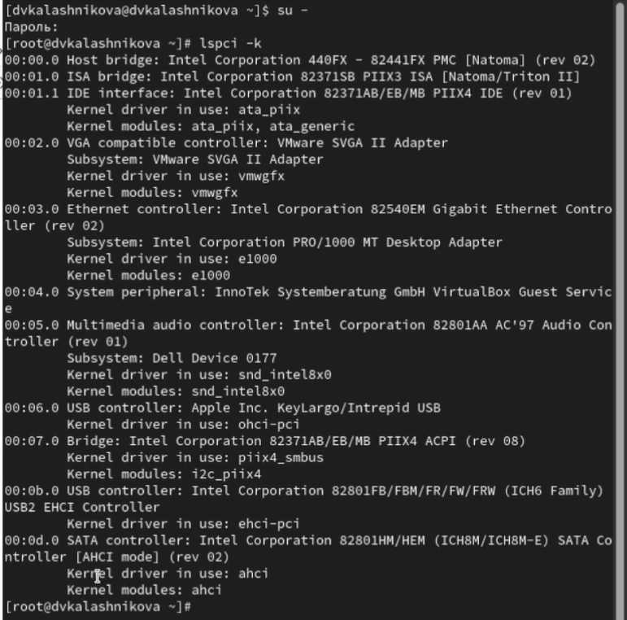
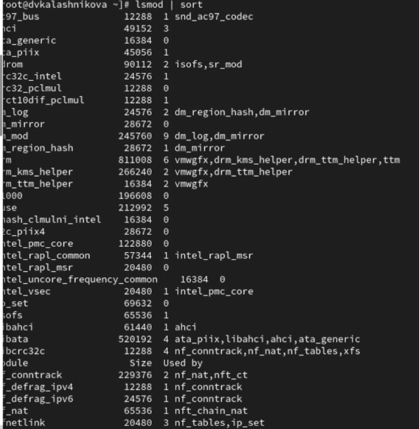
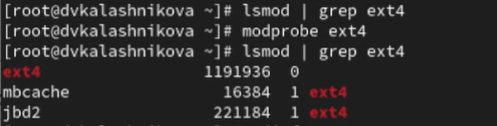
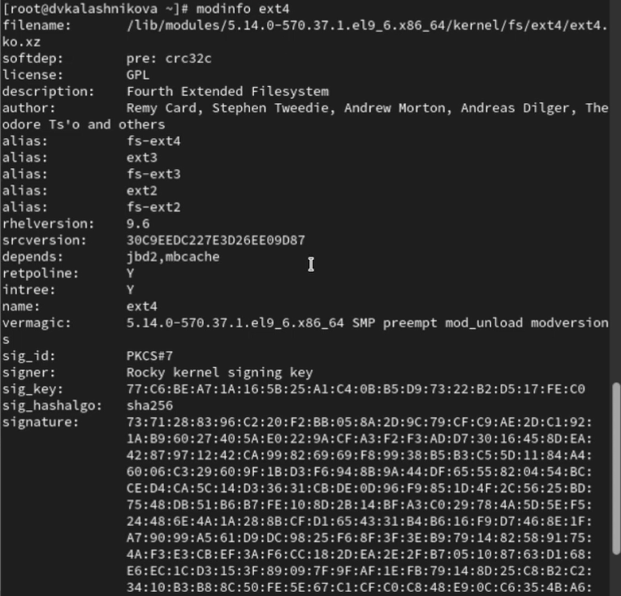
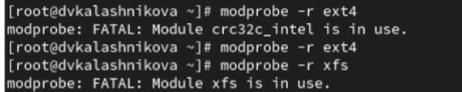
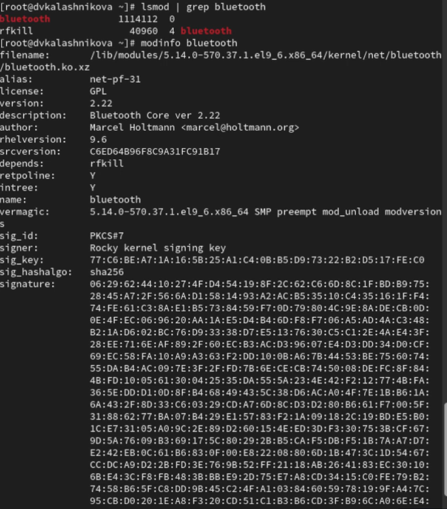
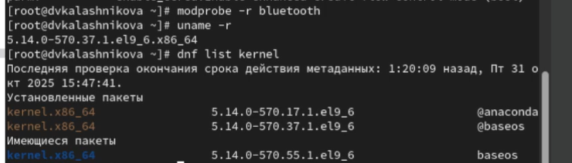
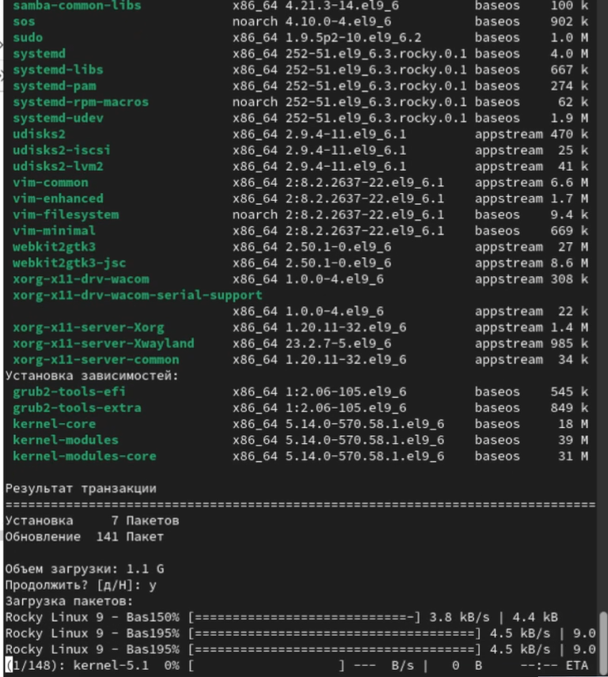
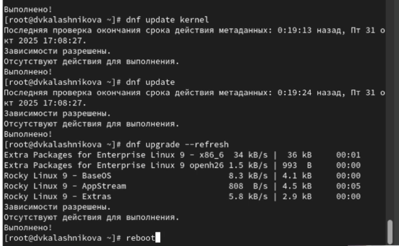
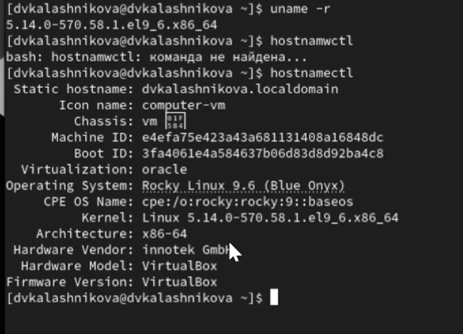

---
## Front matter
lang: ru-RU
title: Презентация
subtitle: Лабораторная работа № 10
author:
  - Калашникова Д. В.
institute:
  - Российский университет дружбы народов, Москва, Россия
date: 6 ноября 2025

## i18n babel
babel-lang: russian
babel-otherlangs: english

## Formatting pdf
toc: false
toc-title: Содержание
slide_level: 2
aspectratio: 169
section-titles: true
theme: metropolis
header-includes:
 - \metroset{progressbar=frametitle,sectionpage=progressbar,numbering=fraction}
---

# Информация

## Докладчик

:::::::::::::: {.columns align=center}
::: {.column width="70%"}

  * Калашникова Дарья 
  * Российский университет дружбы народов
  * [1132243108@pfur.ru](mailto:1132243108@pfur.ru)

:::
::: {.column width="30%"}

:::
::::::::::::::

## Цель работы

Получить навыки работы с утилитами управления модулями ядра операционной системы

## Задание

Продемонстрировать навыки работы по управлению модулями ядра, а также по загрузке модулей ядра с параметрами 

## Выполнение лабораторной работы

Запускаем полномочия администратора. Смотрим, какие устройства имеются в вашей системе и какие модули ядра с ними связаны: lspci -k 

{width=40%}

## Пояснения

Команда lspci -k отображает список всех PCI-устройств в системе, а также информацию о том, какие драйверы ядра и модули с ними связаны. Это позволяет роанализировать как операционная система взаимодействует с “железом”.

## Просмотр

Посмотрим, какие модули ядра загружены:lsmod | sort 

{width=40%}

## Просмотр

Посмотрим, загружен ли модуль ext4: lsmod | grep ext4. Загрузим модуль ядра ext4: modprobe ext4. Убедимся, что модуль загружен, посмотрев список загруженных модулей: lsmod | grep ext4 

{width=70%}

## Просмотр

Команда modinfo отображает информацию о модуле ядра Linux. В данном случае мы исследуем модуль ext4, который отвечает за поддержку одноименной файловой системы 

{width=30%}

## Выгрузка

После пробуем выгрузить модуль ядра ext4, мы увидим что нам система сообщает что не может выгрузить ext4 потому что от него зависит другой модуль cr32c_intel который в данный момент используется. Ядро Linux не позволяет выгрузить модуль от которого зависят другие активные модули,чтобы избежать сбоев.Затем пробуем выгрузить модуль ядра xfs

{width=70%}

## Выгрузка

Посмотрим, загружен ли модуль bluetooth: lsmod | grep bluetooth. Загрузим модуль ядра bluetooth: modprobe bluetooth. Также посмотрим список модулей ядра, отвечающих за работу Bluetooth:lsmod | grep bluetooth. И посмотрите информацию о модуле bluetooth: modinfo bluetooth, а также выгрузим модуль ядра bluetooth: modprobe -r bluetooth 

## Выгрузка

{width=30%}

## Пояснения

Команда отображает информацию о модуле ядра,отвечающем за работу
Bluetooth-стека в системе. В выводе команды содержатся параметры, которые могут быть установлены для настройки работы этого модуля

## Просмотр

Посмотрим версию ядра, используемую в операционной системе:uname -r. Выведем на экран список пакетов, относящихся к ядру операционной системы: dnf list kernel 

{width=70%}

## Обновление

Обновиим систему, чтобы убедиться, что все существующие пакеты обновлены, так как это важно при установке/обновлении ядер Linux и избежания конфликтов:dnf upgrade --refresh 

{width=30%}

## Обновление

Обновите ядро операционной системы, а затем саму операционную систему: dnf update kernel, dnf update, dnf upgrade --refresh 

{width=60%}

## Версия

Перегрузите систему и посмотрим версию ядра, используемую в операционной системы: uname -r, hostnamectl

{width=50%}

## Выводы

После выполнения лабораторной работы я получила навыки работы с утилитами управления модулями ядра операционной системы

