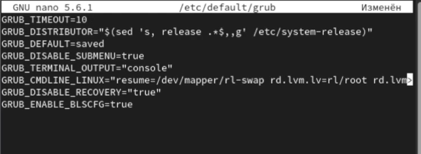
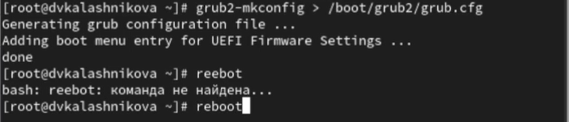
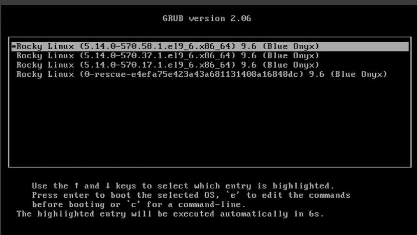
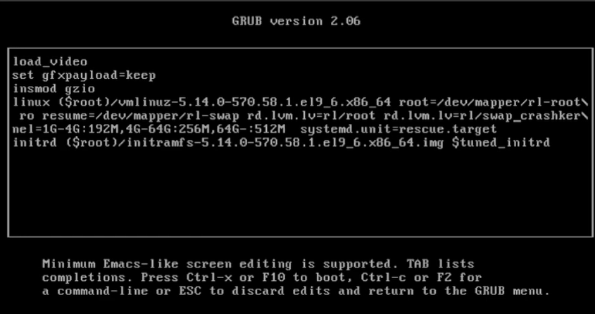
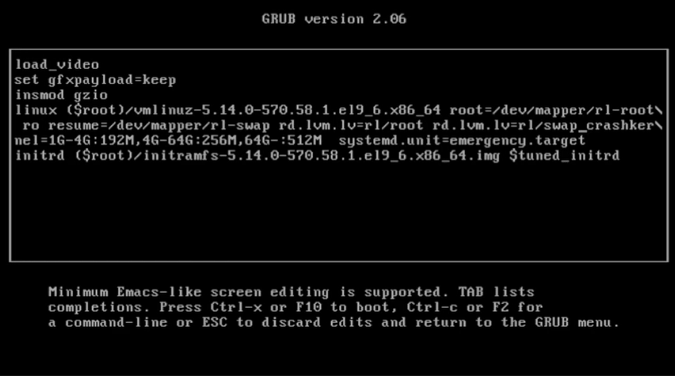
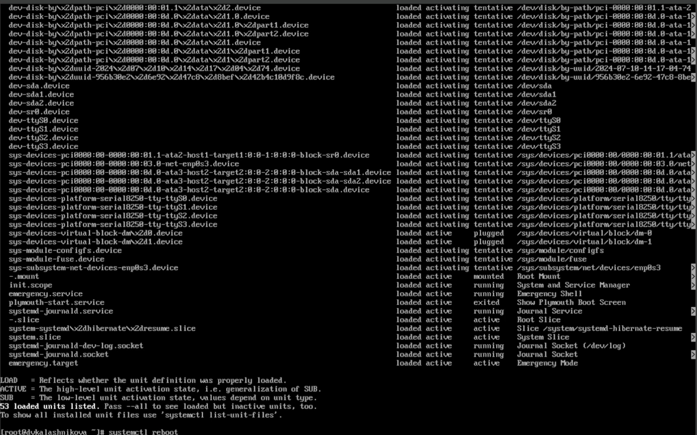
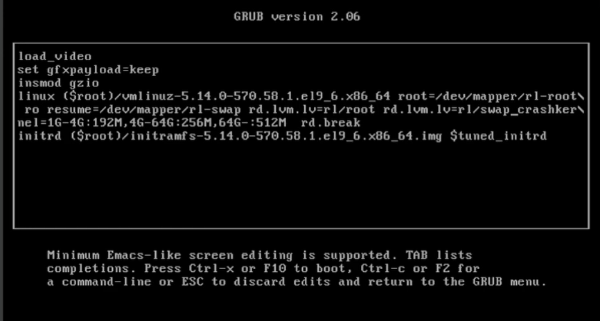
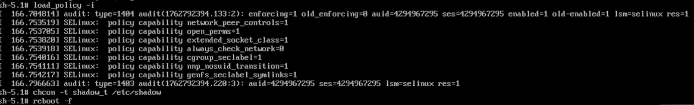

---
## Front matter
lang: ru-RU
title: Презентация
subtitle: Лабораторная работа № 11
author:
  - Калашникова Д. В.
institute:
  - Российский университет дружбы народов, Москва, Россия
date: 10 ноября 2025

## i18n babel
babel-lang: russian
babel-otherlangs: english

## Formatting pdf
toc: false
toc-title: Содержание
slide_level: 2
aspectratio: 169
section-titles: true
theme: metropolis
header-includes:
 - \metroset{progressbar=frametitle,sectionpage=progressbar,numbering=fraction}
---

# Информация

## Докладчик

:::::::::::::: {.columns align=center}
::: {.column width="70%"}

  * Калашникова Дарья Викторовна
  * Российский университет дружбы народов
  * [1132243108@pfur.ru](mailto:1132243108@pfur.ru)

:::
::: {.column width="30%"}

:::
::::::::::::::

## Цель работы

Получить навыки работы с загрузчиком системы GRUB2.

## Задание

Нужно продемонстрировать навыки по изменению параметров GRUB и записи изменений в файл конфигурации, навыки устранения неполадок при работе с GRUB, навыки работы с GRUB без использования root 

## Выполнение лабораторной работы

Запускаем терминал и получите полномочия администратора. В файле /etc/default/grub установите параметр отображения меню загрузки в те-
чение 10 секунд: GRUB_TIMEOUT=10 и сохранимм изменения в файле, закроем редактор 

{width=70%}

## Изменение

{width=70%}

## Перезагрузка

Запишим изменения в GRUB2, введя в командной строке grub2-mkconfig > /boot/grub2/grub.cfg и перезагрузим систему 

{width=70%}

## Выбор

Запускаем систему и как только появится меню GRUB, выбераем строку
с текущей версией ядра в меню и нажмите e для редактирования 

{width=70%}

## Загрузка

Прокручиваем вниз до строки, начинающейся с linux ($root)/vmlinuz- и в конце этой строки вводим systemd.unit=rescue.target и удаляем опции rhgb и quit из этой строки и нажмимаем Ctrl + x для продолжения процесса загрузки 

{width=60%}

## Перезагрузка

Введим пароль пользователя root при появлении запроса, посмотрим также список всех файлов модулей, которые загружены в настоящее время: systemctl list-units и посмотрим задействованные переменные среды оболочки: systemctl show-environment. Далее перегрузим систему, используя команду systemctl reboot 

{width=40%}

## Загрузка

Как только отобразится меню GRUB, ещё раз нажмимаем e на строке с текущей версией ядра, чтобы мы могли войти в режим редактора. В конце строки, загружающей ядро, вводим systemd.unit=emergency.target и удаляем опции rhgb и quit из этой строки. Нажмимаем Ctrl + x для продолжения процесса загрузки 

## Загрузка

{width=50%}

## Перезагрузка

Вводим пароль пользователя root при появлении запроса. После успешного входа в систему посмотрим список всех загруженных файлов модулей: systemctl list-units. В этот раз количество загружаемых файлов модулей уменьшилось до минимума и после этого можем перегрузить систему, используя команду: systemctl reboot

## Перезагрузка

{width=50%}

## Перезагрузка

Запустим компьютер. Когда отобразится меню GRUB, выберем в меню
строку с текущей версией ядра системы и нажмем e , чтобы войти в режим редактора. В конце строки, загружающей ядро, введем rd.break
и удалите опции rhgb и quit из этой строки и нажмем Ctrl + x для продолжения процесса загрузки 

{width=50%}

## Установка

Далее этап загрузки системы остановится в момент загрузки initramfs, непосредственно перед монтированием корневой файловой системы в каталоге /. И чтобы нам получить доступ к системному образу для чтения и записи, наберем mount -o remount,rw /sysroot, а также сделаем содержимое каталога /sysimage новым корневым каталогом, набрав chroot /sysroot. Теперь вы можете ввести команду задания пароля: passwd и установить новый пароль для пользователя root 

## Установка

{width=40%}

## Перезагрузка

И теперь нам надо ввести еще одну команду, чтобы все корректно сработало load_policy -i. Теперь мы можем вручную установить правильный тип контекста для /etc/shadow. Для этого введем chcon -t shadow_t /etc/shadow
 и перезагрузим систему с помощью команды reboot -f 

{width=70%}
 
## Вход
 
Войдем в систему с изменённым паролем для пользователя root 

{width=70%}

## Выводы

В ходе данной лабораторной работы я научилась изменять параметры GRUB и записи изменений в файл конфигурации, устранять неполадки при работе с GRUB и использовать GRUB без использования root 
