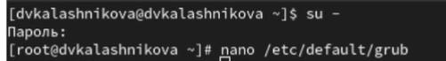
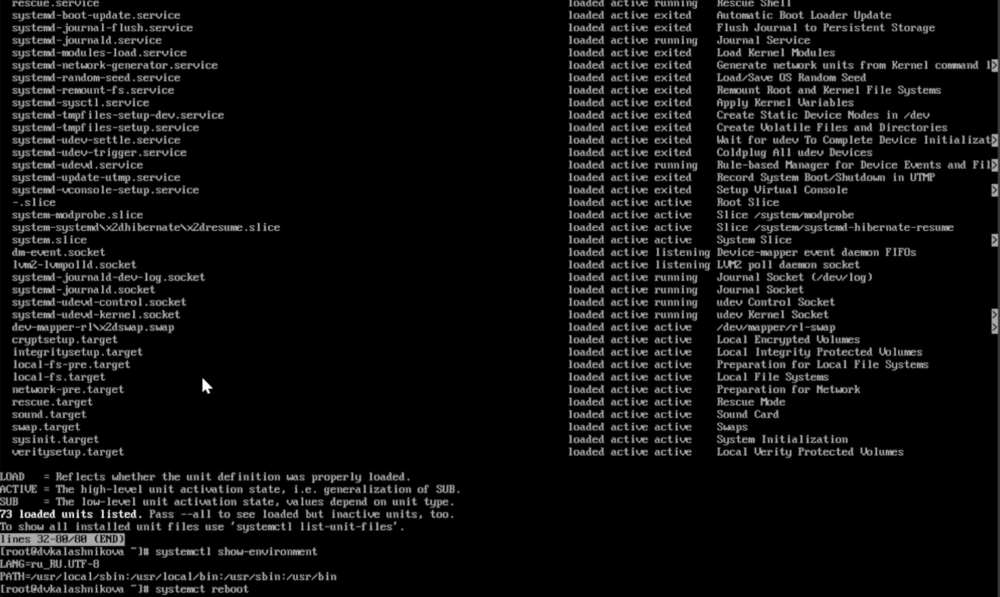
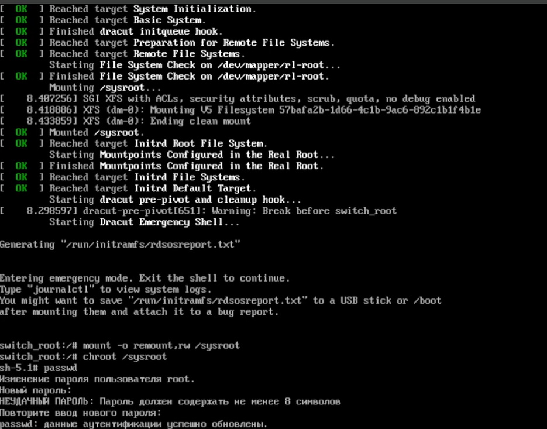
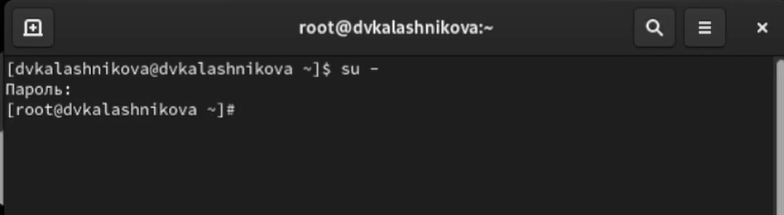

---
## Front matter
title: "Лабораторная работа № 11"
subtitle: "Управление загрузкой системы"
author: "Калашникова Дарья Викторовна"

## Generic otions
lang: ru-RU
toc-title: "Содержание"

## Bibliography
bibliography: bib/cite.bib
csl: pandoc/csl/gost-r-7-0-5-2008-numeric.csl

## Pdf output format
toc: true # Table of contents
toc-depth: 2
lof: true # List of figures
lot: true # List of tables
fontsize: 12pt
linestretch: 1.5
papersize: a4
documentclass: scrreprt
## I18n polyglossia
polyglossia-lang:
  name: russian
  options:
	- spelling=modern
	- babelshorthands=true
polyglossia-otherlangs:
  name: english
## I18n babel
babel-lang: russian
babel-otherlangs: english
## Fonts
mainfont: IBM Plex Serif
romanfont: IBM Plex Serif
sansfont: IBM Plex Sans
monofont: IBM Plex Mono
mathfont: STIX Two Math
mainfontoptions: Ligatures=Common,Ligatures=TeX,Scale=0.94
romanfontoptions: Ligatures=Common,Ligatures=TeX,Scale=0.94
sansfontoptions: Ligatures=Common,Ligatures=TeX,Scale=MatchLowercase,Scale=0.94
monofontoptions: Scale=MatchLowercase,Scale=0.94,FakeStretch=0.9
mathfontoptions:
## Biblatex
biblatex: true
biblio-style: "gost-numeric"
biblatexoptions:
  - parentracker=true
  - backend=biber
  - hyperref=auto
  - language=auto
  - autolang=other*
  - citestyle=gost-numeric
## Pandoc-crossref LaTeX customization
figureTitle: "Рис."
tableTitle: "Таблица"
listingTitle: "Листинг"
lofTitle: "Список иллюстраций"
lotTitle: "Список таблиц"
lolTitle: "Листинги"
## Misc options
indent: true
header-includes:
  - \usepackage{indentfirst}
  - \usepackage{float} # keep figures where there are in the text
  - \floatplacement{figure}{H} # keep figures where there are in the text
---
Платформа plvideo все также не работает, все видео выложены на две другие платформы (рис. [-@fig:001]).

{#fig:013 width=70%}

# Цель работы

Получить навыки работы с загрузчиком системы GRUB2.

# Задание

Нужно продемонстрировать навыки по изменению параметров GRUB и записи изменений в файл конфигурации, навыки устранения неполадок при работе с GRUB, навыки работы с GRUB без использования root 

# Выполнение лабораторной работы

Запускаем терминал и получите полномочия администратора. В файле /etc/default/grub установите параметр отображения меню загрузки в те-
чение 10 секунд: GRUB_TIMEOUT=10 и сохранимм изменения в файле, закроем редактор (рис. [-@fig:001]).

{#fig:001 width=70%}

{#fig:002 width=70%}

Запишим изменения в GRUB2, введя в командной строке grub2-mkconfig > /boot/grub2/grub.cfg и перезагрузим систему (рис. [-@fig:003]).

{#fig:003 width=70%}

Запускаем систему и как только появится меню GRUB, выбераем строку
с текущей версией ядра в меню и нажмите e для редактирования (рис. [-@fig:004]).

{#fig:004 width=70%}

Прокручиваем вниз до строки, начинающейся с linux ($root)/vmlinuz- и в конце этой строки вводим systemd.unit=rescue.target и удаляем опции rhgb и quit из этой строки и нажмимаем Ctrl + x для продолжения процесса загрузки (рис. [-@fig:005]).

{#fig:005 width=70%}

Введим пароль пользователя root при появлении запроса, посмотрим также список всех файлов модулей, которые загружены в настоящее время: systemctl list-units и посмотрим задействованные переменные среды оболочки: systemctl show-environment. Далее перегрузим систему, используя команду systemctl reboot (рис. [-@fig:006]).

{#fig:006 width=70%}

Как только отобразится меню GRUB, ещё раз нажмимаем e на строке с текущей версией ядра, чтобы мы могли войти в режим редактора. В конце строки, загружающей ядро, вводим systemd.unit=emergency.target и удаляем опции rhgb и quit из этой строки. Нажмимаем Ctrl + x для продолжения процесса загрузки (рис. [-@fig:007]).

{#fig:007 width=70%}

Вводим пароль пользователя root при появлении запроса. После успешного входа в систему посмотрим список всех загруженных файлов модулей: systemctl list-units. В этот раз количество загружаемых файлов модулей уменьшилось до минимума и после этого можем перегрузить систему, используя команду: systemctl reboot (рис. [-@fig:008]).

{#fig:008 width=70%}

Запустим компьютер. Когда отобразится меню GRUB, выберем в меню
строку с текущей версией ядра системы и нажмем e , чтобы войти в режим редактора. В конце строки, загружающей ядро, введем rd.break
и удалите опции rhgb и quit из этой строки и нажмем Ctrl + x для продолжения процесса загрузки (рис. [-@fig:009]).

{#fig:009 width=70%}

Далее этап загрузки системы остановится в момент загрузки initramfs, непосредственно перед монтированием корневой файловой системы в каталоге /. И чтобы нам получить доступ к системному образу для чтения и записи, наберем mount -o remount,rw /sysroot, а также сделаем содержимое каталога /sysimage новым корневым каталогом, набрав chroot /sysroot. Теперь вы можете ввести команду задания пароля: passwd и установить новый пароль для пользователя root (рис. [-@fig:010]).

{#fig:010 width=70%}

И теперь нам надо ввести еще одну команду, чтобы все корректно сработало load_policy -i. Теперь мы можем вручную установить правильный тип контекста для /etc/shadow. Для этого введем chcon -t shadow_t /etc/shadow
 и перезагрузим систему с помощью команды reboot -f  (рис. [-@fig:011]).

{#fig:011 width=70%}
 
Войдем в систему с изменённым паролем для пользователя root (рис. [-@fig:012]).

{#fig:012 width=70%}

# Контрольные вопросы и ответы

1. Какой файл конфигурации следует изменить для применения общих изменений в GRUB2?

Ответ: Для применения общих изменений в GRUB2 следует изменить файл: /etc/default/grub

2. Как называется конфигурационный файл GRUB2, в котором вы применяете изменения для GRUB2?

Ответ: Основной конфигурационный файл GRUB2, в который записываются изменения, называется: /boot/grub2/grub.cfg

3. После внесения изменений в конфигурацию GRUB2, какую команду вы должны выполнить, чтобы изменения сохранились и воспринялись при загрузке системы?

Ответ: После внесения изменений в файл /etc/default/grub необходимо выполнить команду: grub2-mkconfig -o /boot/grub2/grub.cfg или grub2-mkconfig > /boot/grub2/grub.cfg

# Выводы

В ходе данной лабораторной работы я научилась изменять параметры GRUB и записи изменений в файл конфигурации, устранять неполадки при работе с GRUB и использовать GRUB без использования root 

# Список литературы{.unnumbered}

::: {#refs}
:::
