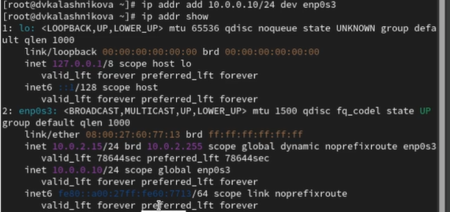
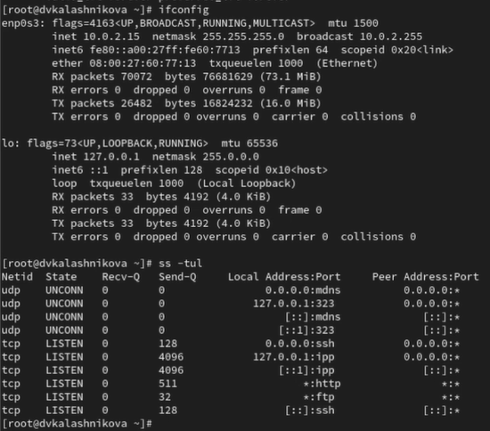
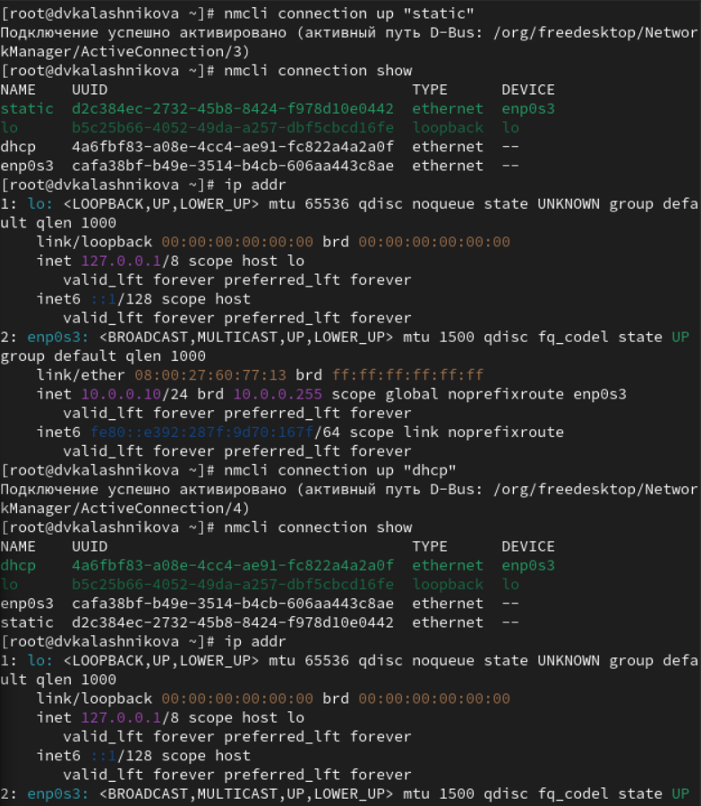
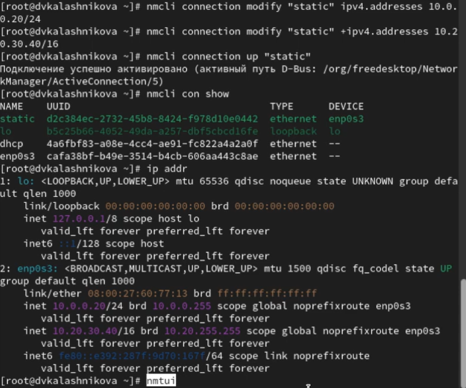

---
## Front matter
lang: ru-RU
title: Презентация
subtitle: Лабораторная работа № 12
author:
  - Калашникова Дарья Викторовна
institute:
  - Российский университет дружбы народов, Москва, Россия
date: 10 ноября 2025

## i18n babel
babel-lang: russian
babel-otherlangs: english

## Formatting pdf
toc: false
toc-title: Содержание
slide_level: 2
aspectratio: 169
section-titles: true
theme: metropolis
header-includes:
 - \metroset{progressbar=frametitle,sectionpage=progressbar,numbering=fraction}
---

# Информация

## Докладчик

:::::::::::::: {.columns align=center}
::: {.column width="70%"}

  * Калашникова Дарья Викторовна
  * Российский университет дружбы народов
  * [1132243108@pfur.ru](mailto:1132243108@pfur.ru)

:::
::: {.column width="30%"}

:::
::::::::::::::

## Цель работы

Получить навыки настройки сетевых параметров системы

## Задание

Продемонстрировать навыки использования утилиты ip и навыки использования утилиты nmcli

## Сетевые подключения

Выводим на экран информацию о существующих сетевых подключениях и статистику о количестве отправленных пакетов 

{width=40%}

## Проверка подключения

Выведим на экран информацию о текущих назначениях адресов для сетевых интерфейсов на устройстве и также восспользуемся командой ping 

{width=40%}

## Добавление

Добавим дополнительный адрес к нашему интерфейсу и проверимдобавление 

{width=70%}

## Выводы
 
Сравним вывод информации от утилит и выведим на экран список  системой портов UDP и TCP 

{width=40%}

## Соединения

Выведим на экран информацию о текущих соединениях, добавим Ethernet-соединение с именем dhcp к интерфейсу и выведим информацию о текущих соединениях 

{width=70%}

## Проверка

Переключимся на статическое соединение, проверим успешность переключения при помощи и далее вернемся к соединению dhcp

## Проверка

{width=40%}

## Добавление

Отключим автоподключение статического соединенияи добавим DNS-сервер в статическое соединение и добавим второй DNS-сервер

{width=70%}

## Проверка

Теперь изменим IP-адрес статического соединения и добавим другой IP-адрес для статического соединения и  активируем его

{width=40%}

## Настройки

{width=40%}

## Настройки

{width=40%}

## Проверка

Посмотрим настройки сетевых соединений в графическом интерфейсе операционной системы 

{width=40%}

## Проверка

Переключимся на первоначальное сетевое соединение

{width=70%}

## Выводы

В ходе лабораторной работы я научилась работать с утилитами ip и nmcli

