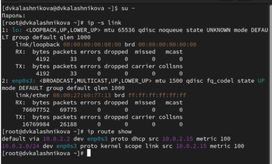
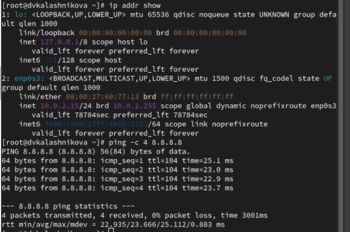
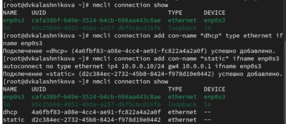
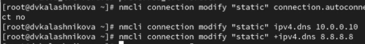
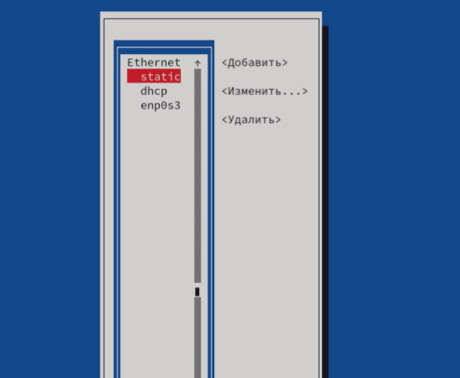
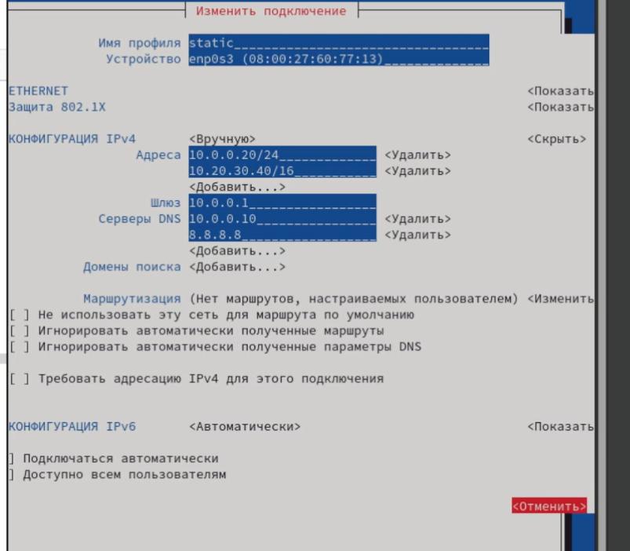
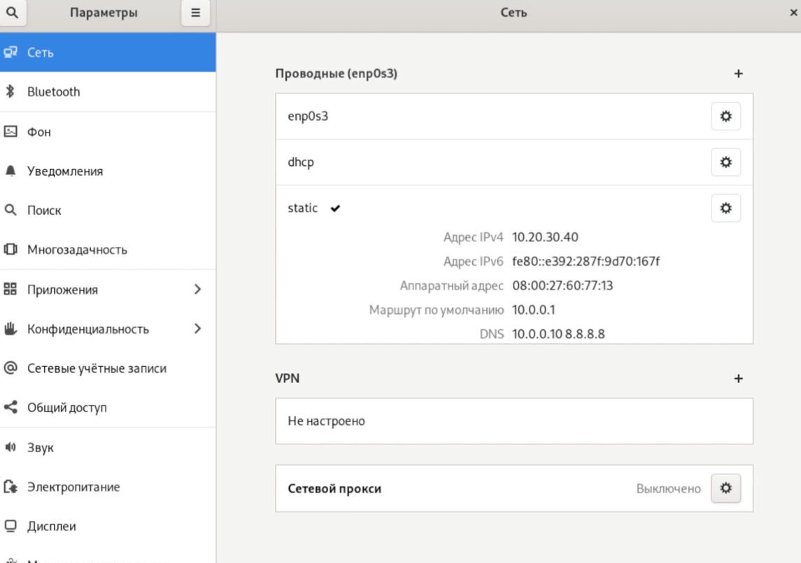
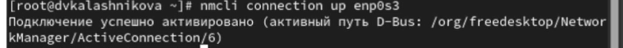

---
## Front matter
title: "Лабораторная работа № 12"
subtitle: "Настройки сети в Linux"
author: "Калашникова Дарья Викторовна"

## Generic otions
lang: ru-RU
toc-title: "Содержание"

## Bibliography
bibliography: bib/cite.bib
csl: pandoc/csl/gost-r-7-0-5-2008-numeric.csl

## Pdf output format
toc: true # Table of contents
toc-depth: 2
lof: true # List of figures
lot: true # List of tables
fontsize: 12pt
linestretch: 1.5
papersize: a4
documentclass: scrreprt
## I18n polyglossia
polyglossia-lang:
  name: russian
  options:
	- spelling=modern
	- babelshorthands=true
polyglossia-otherlangs:
  name: english
## I18n babel
babel-lang: russian
babel-otherlangs: english
## Fonts
mainfont: IBM Plex Serif
romanfont: IBM Plex Serif
sansfont: IBM Plex Sans
monofont: IBM Plex Mono
mathfont: STIX Two Math
mainfontoptions: Ligatures=Common,Ligatures=TeX,Scale=0.94
romanfontoptions: Ligatures=Common,Ligatures=TeX,Scale=0.94
sansfontoptions: Ligatures=Common,Ligatures=TeX,Scale=MatchLowercase,Scale=0.94
monofontoptions: Scale=MatchLowercase,Scale=0.94,FakeStretch=0.9
mathfontoptions:
## Biblatex
biblatex: true
biblio-style: "gost-numeric"
biblatexoptions:
  - parentracker=true
  - backend=biber
  - hyperref=auto
  - language=auto
  - autolang=other*
  - citestyle=gost-numeric
## Pandoc-crossref LaTeX customization
figureTitle: "Рис."
tableTitle: "Таблица"
listingTitle: "Листинг"
lofTitle: "Список иллюстраций"
lotTitle: "Список таблиц"
lolTitle: "Листинги"
## Misc options
indent: true
header-includes:
  - \usepackage{indentfirst}
  - \usepackage{float} # keep figures where there are in the text
  - \floatplacement{figure}{H} # keep figures where there are in the text
---

# Цель работы

Получить навыки настройки сетевых параметров системы

# Задание

Продемонстрировать навыки использования утилиты ip и навыки использования утилиты nmcli

# Выполнение лабораторной работы

Получаем полномочия администратора, выводим на экран информацию о существующих сетевых подключениях, а также статистику о количестве отправленных пакетов и связанных с ними сообщениях об ошибках: ip -s link. Далее выводим на экран информацию о текущих маршрутах: ip route show (рис. [-@fig:001]).

{#fig:001 width=70%}

Интерфейс emp083 активен, работает без ошибок. Больший объём принятых данных (RX) по сравнению с переданными (TX) может указывать на то, что система чаще получает данные, чем отправляет (например, загрузка файлов или работа в качестве клиента).

Первый маршрут:
Маршрут по умолчанию (default) через шлюз 10.0.2.2 на интерфейсе emp083. Это означает, что весь трафик, не предназначенный для локальной сети, будет отправлен через этот шлюз.

Второй маршрут:
Указывает, что сеть 10.0.2.0/24 доступна непосредственно через интерфейс emp083. Адрес 10.0.2.15 — это IP-адрес текущей системы в этой сети.

Выведим на экран информацию о текущих назначениях адресов для сетевых интерфейсов на устройстве: ip addr show. И также восспользуемся командой ping для проверки правильности подключения к Интернету.Например, для отправки четырёх пакетов на IP-адрес 8.8.8.8 введем команду ping -c 4 8.8.8.8 (рис. [-@fig:002]).

{#fig:002 width=70%}

Интерфейс emp0s3 имеет IPv4-адрес 10.0.2.1/24, что указывает на принадлежность к локальной сети 10.0.2.0/24. Адаптер активен (state UP) и работает в штатном режиме, получая адрес динамически через DHCP, что типично для клиентских устройств в локальной сети. Успешный ping до публичного DNS-сервера  подтверждает корректную настройку сетевого подключения. Нулевые потери пакетов и стабильное время отклика около 24 мс свидетельствуют о надежном соединении с интернетом через шлюз 10.0.2.2.

Добавим дополнительный адрес к нашему интерфейсу: ip addr add 10.0.0.10/24 dev enp0s3 и проверим, что адрес добавился: ip addr show (рис. [-@fig:003]).

{#fig:003 width=70%}

Сравним вывод информации от утилиты ip и от команды ifconfig: ifconfig и выведим на экран список всех прослушиваемых системой портов UDP и TCP: ss -tul (рис. [-@fig:004]).

{#fig:004 width=70%}

Выведим на экран информацию о текущих соединениях: nmcli connection show и добавим Ethernet-соединение с именем dhcp к интерфейсу: nmcli connection add con-name "dhcp" type ethernet ifname enp0s3. Также добавим к этому же интерфейсу Ethernet-соединение с именем static, статическим IPv4-адресом адаптера и статическим адресом шлюза: nmcli connection add con-name "static" ifname enp0s3 autoconnect no type ethernet ip4 10.0.0.10/24 gw4 10.0.0.1 ifname enp0s3 и выведим информацию о текущих соединениях: nmcli connection show (рис. [-@fig:005]).

{#fig:005 width=70%}

Переключимся на статическое соединение: nmcli connection up "static", проверьим успешность переключения при помощи nmcli connection show и ip addr. Далее вернемся к соединению dhcp: nmcli connection up "dhcp" и проверим успешность переключения при помощи nmcli connection show и ip addr (рис. [-@fig:006]).

{#fig:006 width=70%}

Отключим автоподключение статического соединения: nmcli connection modify "static" connection.autoconnect no. Далее добавьим DNS-сервер в статическое соединение: nmcli connection modify "static" ipv4.dns 10.0.0.10. Также добавим второй DNS-сервер: nmcli connection modify "static" +ipv4.dns 8.8.8.8 (рис. [-@fig:007]).

{#fig:007 width=70%}

Теперь изменим IP-адрес статического соединения: nmcli connection modify "static" ipv4.addresses 10.0.0.20/24 и добавим другой IP-адрес для статического соединения: nmcli connection modify "static" +ipv4.addresses 10.20.30.40/16. После изменения свойств соединения активируем его: nmcli connection up "static" и проверим успешность переключения при помощи nmcli con show и ip addr. Используем nmtui и посмотрии настройки сети на устройстве (рис. [-@fig:008]).

{#fig:008 width=70%}

{#fig:009 width=70%}

{#fig:010 width=70%}

Данная система настроена со статическими IP-адресами через утилиту nmtui. Основной сетевой интерфейс — emp0s3. Для IPv4 задано два адреса вручную: 10.0.0.20/24 и 10.20.30.40/16. Шлюзом по умолчанию указан 10.0.0.1. Конфигурация использует два DNS-сервера: локальный 10.0.0.10 и публичный 8.8.8.8. Настройки подключения установлены как автоматические, и профиль доступен всем пользователям. IPv6-конфигурация получается автоматически.

Посмотрим настройки сетевых соединений в графическом интерфейсе операционной системы (рис. [-@fig:011]).

{#fig:011 width=70%}

Переключимся на первоначальное сетевое соединение: nmcli connection up enp0s3 (рис. [-@fig:012]).

{#fig:012 width=70%}

# Контрольные вопросы
Вопрос 1: Какая команда отображает только статус соединения, но не IP-адрес?

Ответ: ip link

Вопрос 2: Какая служба управляет сетью в ОС типа RHEL?

Ответ: NetworkManager

Вопрос 3: Какой файл содержит имя узла (устройства) в ОС типа RHEL?

Ответ: /etc/hosts

Вопрос 4: Какая команда позволяет вам задать имя узла (устройства)?

Ответ: hostnamectl

Вопрос 5: Какой конфигурационный файл можно изменить для включения разрешения имён для конкретного IP-адреса?

Ответ: /etc/resolv.conf

Вопрос 6: Какая команда показывает текущую конфигурацию маршрутизации?

Ответ: ip route show

Вопрос 7: Как проверить текущий статус службы NetworkManager?

Ответ: systemctl status NetworkManager

Вопрос 8: Какая команда позволяет вам изменить текущий IP-адрес и шлюз по умолчанию для вашего сетевого соединения?

Ответ: nmcli connection modify

# Выводы

В ходе лабораторной работы я научилась работать с утилитами ip и nmcli

# Список литературы{.unnumbered}

::: {#refs}
:::
