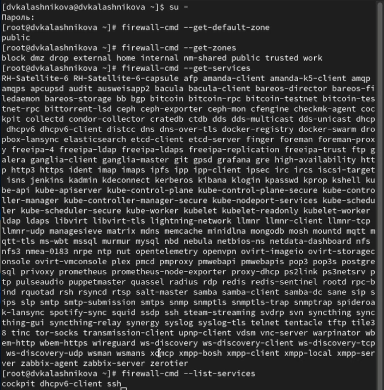
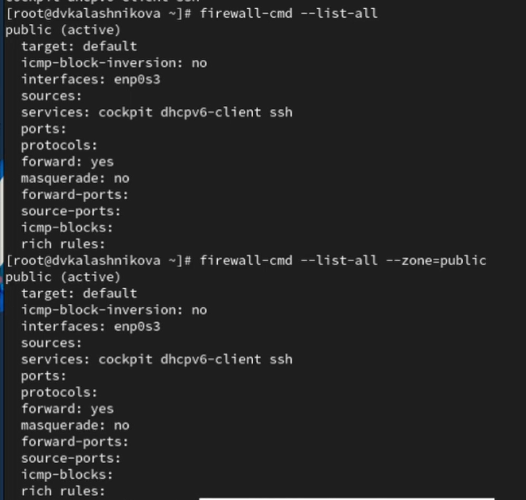
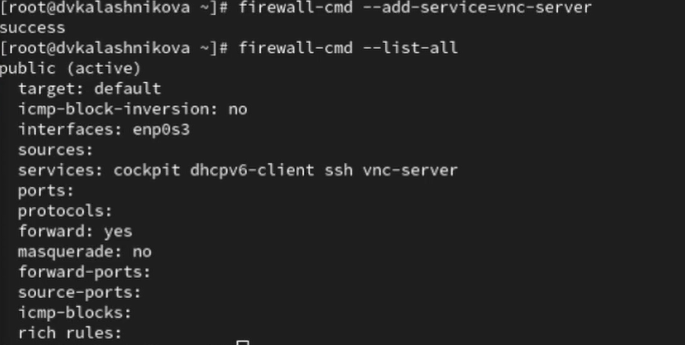
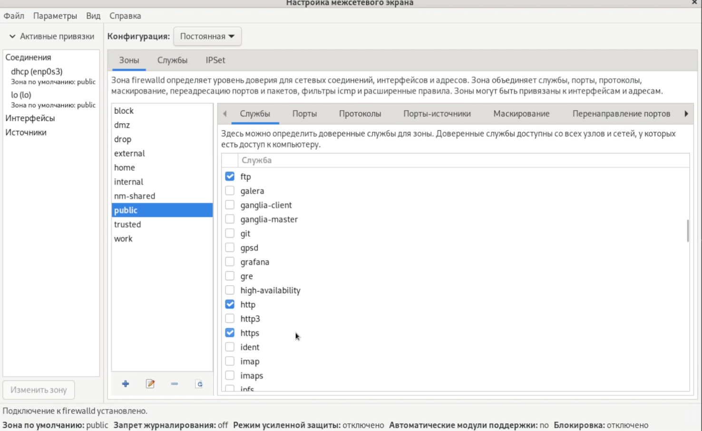
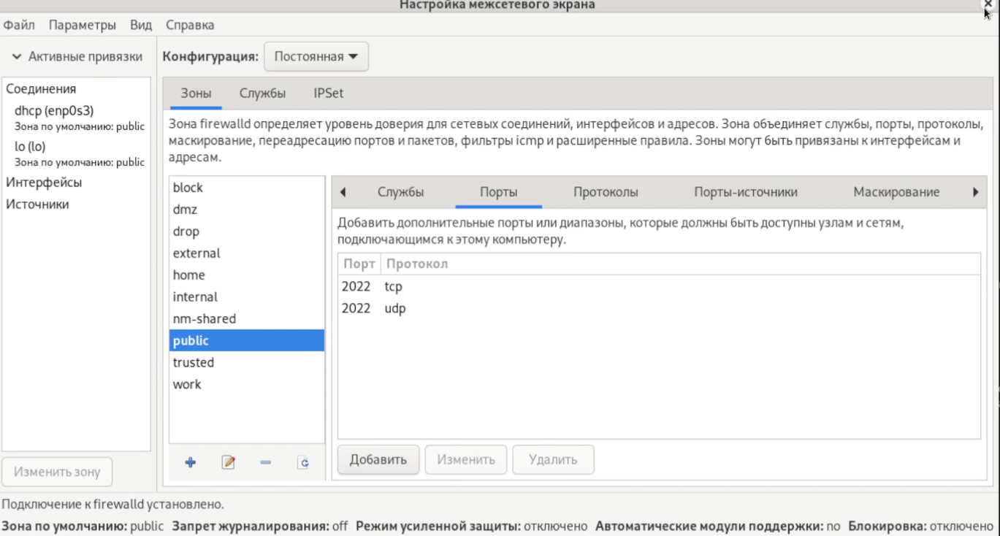
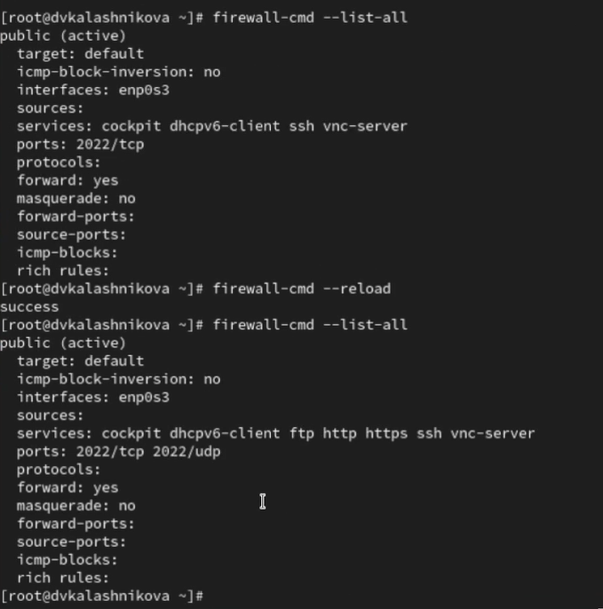

---
## Front matter
lang: ru-RU
title: Презентация
subtitle: Лабораторная работа № 13
author:
  - Калашникова Д. В.
institute:
  - Российский университет дружбы народов, Москва, Россия
date: 25 ноября 2025

## i18n babel
babel-lang: russian
babel-otherlangs: english

## Formatting pdf
toc: false
toc-title: Содержание
slide_level: 2
aspectratio: 169
section-titles: true
theme: metropolis
header-includes:
 - \metroset{progressbar=frametitle,sectionpage=progressbar,numbering=fraction}
---

# Информация

## Докладчик

:::::::::::::: {.columns align=center}
::: {.column width="70%"}

  * Калашникова Дарья Викторовна
  * Российский университет дружбы народов
  * [1132243108@pfur.ru](mailto:1132243108@pfur.ru)

:::
::: {.column width="30%"}

:::
::::::::::::::

## Цель работы

Получить навыки настройки пакетного фильтра в Linux

## Задание

1. Используя firewall-cmd:

– определить текущую зону по умолчанию;

– определить доступные для настройки зоны;

– определить службы, включённые в текущую зону;

– добавить сервер VNC в конфигурацию брандмауэра.

## Задание

2. Используя firewall-config:

– добавьте службы http и ssh в зону public;

– добавьте порт 2022 протокола UDP в зону public;

– добавьте службу ftp.

3. Выполните задание для самостоятельной работы

## Определение служб

Для начала определим текущую зону по умолчанию, также определим доступные зоны и посмотрим службы, доступные на компьютере.

{height=60%}

## Сравнение вывода

Сравним результаты вывода двух команд 

{height=60%}

## Добавление и проверка

Далее добавим сервер VNC в конфигурацию брандмауэра и проверим, добавился ли vnc-server в конфигурацию

{width=70%}

## Добавление и проверка

Перезапустим службу firewalld и проверим, есть ли vnc-server в конфигурации, добавим службу vnc-server ещё раз, но на этот раз сделаем её постоянной

## Добавление и проверка

{width=50%}

## Добавление и проверка

Перезагрузим конфигурацию firewalld и просмотрим конфигурацию времени
выполнения, добавим в конфигурацию межсетевого экрана порт 2022 протокола TCP

{height=60%}

## Работа с графическим интерфейсом

Дальше запускаем интерфейс GUI firewall-config: firewall-config, выбираем зону public и отмечаем службы http, https и ftp и добавим порт 2022 и выберем  протокол udp

{height=60%}

## Работа с графическим интерфейсом

{width=70%}

## Проверка

Теперь перегрузим конфигурацию и список доступных сервисов

{height=60%}

## Добавление

Приступим теперь к заданию для самостоятельной работы

{width=70%}

## Проверка

{width=70%}

## Выводы

В ходе лабораторной работы я научилась пользоваться firewall-cmd и firewall-config
