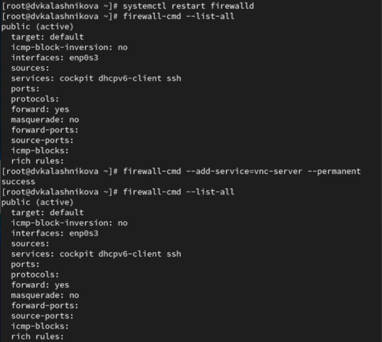
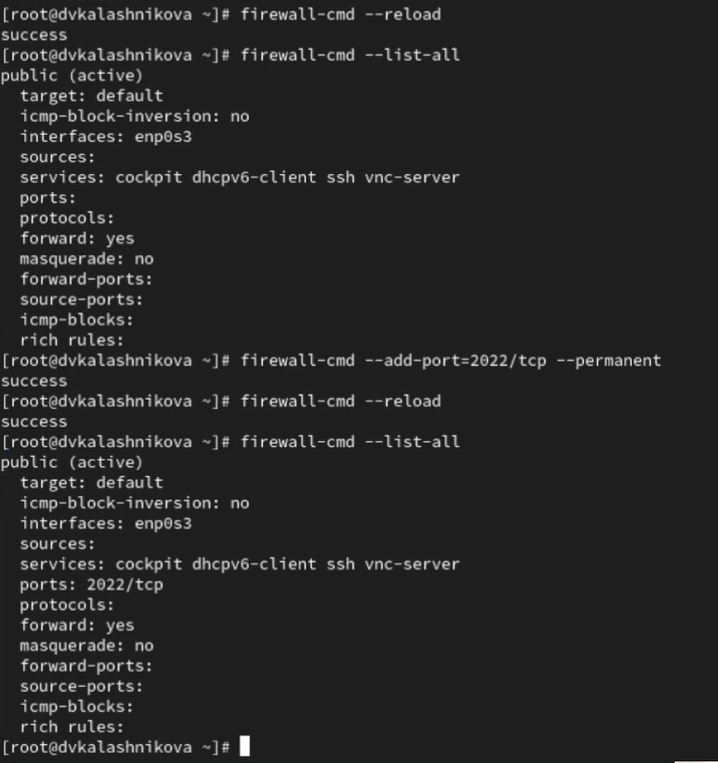
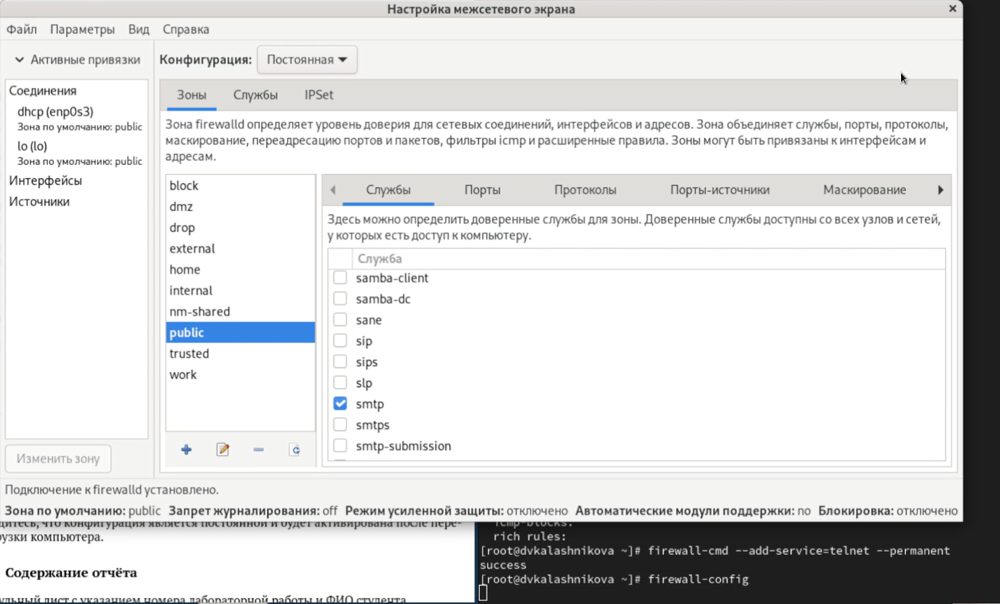
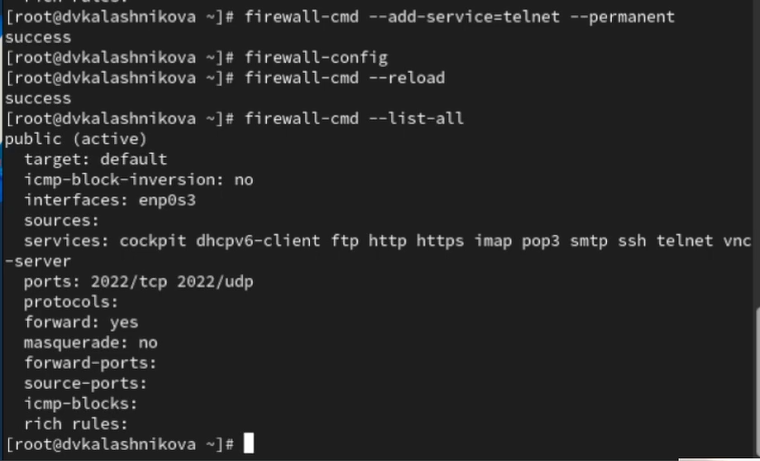

---
## Front matter
title: "Лабораторная работа № 13"
subtitle: "Фильтр пакетов"
author: "Калашникова Д. В."

## Generic otions
lang: ru-RU
toc-title: "Содержание"

## Bibliography
bibliography: bib/cite.bib
csl: pandoc/csl/gost-r-7-0-5-2008-numeric.csl

## Pdf output format
toc: true # Table of contents
toc-depth: 2
lof: true # List of figures
lot: true # List of tables
fontsize: 12pt
linestretch: 1.5
papersize: a4
documentclass: scrreprt
## I18n polyglossia
polyglossia-lang:
  name: russian
  options:
	- spelling=modern
	- babelshorthands=true
polyglossia-otherlangs:
  name: english
## I18n babel
babel-lang: russian
babel-otherlangs: english
## Fonts
mainfont: IBM Plex Serif
romanfont: IBM Plex Serif
sansfont: IBM Plex Sans
monofont: IBM Plex Mono
mathfont: STIX Two Math
mainfontoptions: Ligatures=Common,Ligatures=TeX,Scale=0.94
romanfontoptions: Ligatures=Common,Ligatures=TeX,Scale=0.94
sansfontoptions: Ligatures=Common,Ligatures=TeX,Scale=MatchLowercase,Scale=0.94
monofontoptions: Scale=MatchLowercase,Scale=0.94,FakeStretch=0.9
mathfontoptions:
## Biblatex
biblatex: true
biblio-style: "gost-numeric"
biblatexoptions:
  - parentracker=true
  - backend=biber
  - hyperref=auto
  - language=auto
  - autolang=other*
  - citestyle=gost-numeric
## Pandoc-crossref LaTeX customization
figureTitle: "Рис."
tableTitle: "Таблица"
listingTitle: "Листинг"
lofTitle: "Список иллюстраций"
lotTitle: "Список таблиц"
lolTitle: "Листинги"
## Misc options
indent: true
header-includes:
  - \usepackage{indentfirst}
  - \usepackage{float} # keep figures where there are in the text
  - \floatplacement{figure}{H} # keep figures where there are in the text
---

# Цель работы

Получить навыки настройки пакетного фильтра в Linux

# Задание

1. Используя firewall-cmd:

– определить текущую зону по умолчанию;

– определить доступные для настройки зоны;

– определить службы, включённые в текущую зону;

– добавить сервер VNC в конфигурацию брандмауэра.

2. Используя firewall-config:

– добавьте службы http и ssh в зону public;

– добавьте порт 2022 протокола UDP в зону public;

– добавьте службу ftp.

3. Выполните задание для самостоятельной работы

# Выполнение лабораторной работы

Для начала получим полномочия администратора. Далле определим текущую зону по умолчанию, введя: firewall-cmd --get-default-zone, также определим доступные зоны, введя: firewall-cmd --get-zones. Посмотрим службы, доступные на компьютере, используя firewall-cmd --get-services и определим доступные службы в текущей зоне: firewall-cmd --list-services (рис. [-@fig:001]).

{#fig:001 width=70%}

Сравним результаты вывода информации при использовании команды firewall-cmd --list-all и команды firewall-cmd --list-all --zone=public (рис. [-@fig:002]).

{#fig:002 width=70%}

Далее добавим сервер VNC в конфигурацию брандмауэра: firewall-cmd --add-service=vnc-server и проверим, добавился ли vnc-server в конфигурацию:
firewall-cmd --list-all (рис. [-@fig:003]).

{#fig:003 width=70%}

Перезапустим службу firewalld: systemctl restart firewalld и проверим, есть ли vnc-server в конфигурации: firewall-cmd --list-all. Далее добавим службу vnc-server ещё раз, но на этот раз сделаем её постоянной, используя команду firewall-cmd --add-service=vnc-server --permanent и проверим наличие vnc-server в конфигурации: firewall-cmd --list-all (рис. [-@fig:004]).

{#fig:004 width=70%}

Перезагрузим конфигурацию firewalld и просмотрим конфигурацию времени
выполнения: firewall-cmd --reload и firewall-cmd --list-all. Далее добавим в конфигурацию межсетевого экрана порт 2022 протокола TCP: firewall-cmd --add-port=2022/tcp --permanent и затем перезагрузим конфигурацию firewalld: firewall-cmd --reload. Также проверим, что порт добавился в конфигурацию: firewall-cmd --list-all (рис. [-@fig:005]).

{#fig:005 width=70%}

Дальше запускаем интерфейс GUI firewall-config: firewall-config. Нажимаем выпадающее меню рядом с параметром Конфигурация. Откроем раскрывающийся список и выберем параметр Постоянный.Далее выбираем зону public и отмечаем службы http, https и ftp, чтобы включить их. Также выберем вкладку Ports и на этой вкладке нажмем Добавить и введем порт 2022 и протокол udp, нажмем ОК , чтобы добавить их в список и закроем утилиту firewall-config (рис. [-@fig:006]).

{#fig:006 width=70%}

{#fig:007 width=70%}

Теперь в окне терминала введем firewall-cmd --list-all и перегрузим конфигурацию firewall-cmd: firewall-cmd --reload и список доступных сервисов: firewall-cmd --list-all (рис. [-@fig:008]).

{#fig:008 width=70%}

Приступим теперь к заданию для самостоятельной работы. Создадим конфигурацию межсетевого экрана, которая позволяет получить доступ к следующим службам: telnet, imap, pop3, smtp. Через командную строку добавим сервис telnet: firewall-cmd --add-service=telnet --permanent, а остальные добавим через графический интерфейс. Сделаем проверку добавления конфигураций (рис. [-@fig:008]).

{#fig:009 width=70%}

{#fig:010 width=70%}

# Контрольные вопросы

1. Какая служба должна быть запущена перед началом работы с менеджером конфигурации брандмауэра firewall-config?

Ответ: Служба firewalld.

2. Какая команда позволяет добавить UDP-порт 2355 в конфигурацию брандмауэра в зоне по умолчанию?

Ответ: firewall-cmd --add-port=2355/udp --permanent

3. Какая команда позволяет показать всю конфигурацию брандмауэра во всех зонах?

Ответ: firewall-cmd --list-all-zones

4. Какая команда позволяет удалить службу vnc-server из текущей конфигурации брандмауэра?

Ответ: firewall-cmd --remove-service=vnc-server

5. Какая команда firewall-cmd позволяет активировать новую конфигурацию, добавленную опцией --permanent?

Ответ: firewall-cmd --reload

6. Какой параметр firewall-cmd позволяет проверить, что новая конфигурация была добавлена в текущую зону и теперь активна?

Ответ: firewall-cmd --list-all

7. Какая команда позволяет добавить интерфейс eno1 в зону public?

Ответ: firewall-cmd --zone=public --add-interface=eno1 --permanent

8. Если добавить новый интерфейс в конфигурацию брандмауэра, пока не указана зона, в какую зону он будет добавлен?

Ответ: В зону по умолчанию.

# Выводы

В ходе лабораторной работы я научилась пользоваться firewall-cmd и firewall-config

# Список литературы{.unnumbered}

::: {#refs}
:::
