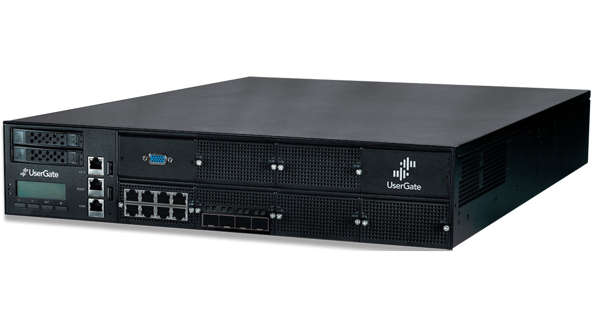

---
## Front matter
lang: ru-RU
title: Программные межсетевые экраны
subtitle: Доклад
author:
  - Калашникова Д. В.
institute:
  - Российский университет дружбы народов, Москва, Россия
date: 21 ноября 2025

## i18n babel
babel-lang: russian
babel-otherlangs: english

## Formatting pdf
toc: false
toc-title: Содержание
slide_level: 2
aspectratio: 169
section-titles: true
theme: metropolis
header-includes:
 - \metroset{progressbar=frametitle,sectionpage=progressbar,numbering=fraction}
 - '\makeatletter'
 - '\beamer@ignorenonframefalse'
 - '\makeatother'
 
## Fonts
mainfont: PT Serif
romanfont: PT Serif
sansfont: PT Sans
monofont: PT Mono
mainfontoptions: Ligatures=TeX
romanfontoptions: Ligatures=TeX
sansfontoptions: Ligatures=TeX,Scale=MatchLowercase
monofontoptions: Scale=MatchLowercase,Scale=0.9
---

# Информация

## Докладчик

:::::::::::::: {.columns align=center}
::: {.column width="70%"}

  * Калашникова Дарья Викторовна
  * Российский университет дружбы народов
  * [1132243108@pfur.ru](mailto:1132243108@pfur.ru)

:::
::: {.column width="30%"}

:::
::::::::::::::
## Введение
 
1. **Тема:** «Программные межсетевые экраны».
 
2. **Актуальность:** В условиях роста числа кибератак и увеличения сложности сетевых инфраструктур обеспечение безопасности передачи данных становится критически важным. Программные межсетевые экраны предоставляют гибкий и доступный способ защиты сетей, позволяя контролировать входящий и исходящий трафик, блокировать несанкционированный доступ и минимизировать риски утечки информации.
 
## Введение
 
3. **Объект исследования:** Системы сетевой безопасности.
 
4. **Предмет исследования:** Программные межсетевые экраны, их архитектура, функциональность и применение.
 
5. **Цель:** Изучить принципы работы, особенности и области применения программных межсетевых экранов.
 
6. **Задачи:**
   - Исследовать основные типы межсетевых экранов.
   - Определить место программных решений в системе сетевой безопасности.
   - Проанализировать архитектуру и компоненты программных фаерволов.
   - Провести сравнение с аппаратными аналогами.
   - Рассмотреть примеры популярных программных решений.
 
## Межсетевые экраны: основные понятия
 
- **Межсетевой экран (файрвол)** — это система, предназначенная для контроля и фильтрации сетевого трафика на основе заданных правил.
 
- **Программный файрвол** — это приложение или служба, работающая на уровне операционной системы и управляющая сетевыми соединениями.
 
- **Основные функции:**
  - Блокировка нежелательного трафика.
  - Контроль доступа к сетевым ресурсам.
  - Логирование сетевой активности.
  - Защита от вторжений и атак.
  
## Межсетевые экраны: основные понятия

 {#fig:002 width=70%}
 
## Типы межсетевых экранов
 
- **Пакетные фильтры:** Анализируют заголовки пакетов (IP, порты, протоколы).
 
- **Шлюзы прикладного уровня:** Проверяют трафик на уровне приложений (HTTP, FTP).
 
- **Шлюзы уровня сессии:** Контролируют установление и завершение сессий.
 
- **Гибридные решения:** Комбинируют несколько методов для повышения безопасности.
 
## Программные vs аппаратные файрволы
 
- **Программные:**
  - Устанавливаются на ОС.
  - Гибкие настройки.
  - Доступны для персонального использования.
  - Примеры: iptables, Windows Firewall, UFW.
 
- **Аппаратные:**
  - Работают на выделенном оборудовании.
  - Высокая производительность.
  - Используются в корпоративных сетях.
  - Примеры: Cisco ASA, FortiGate.

## Программные vs аппаратные файрволы

 {#fig:004 width=70%}
 
## Популярные программные файрволы
 
- **iptables / nftables:** Стандартные средства управления сетевым трафиком в Linux.
 
- **Windows Firewall:** Встроенный файрвол в ОС Windows.
 
- **UFW (Uncomplicated Firewall):** Упрощённый интерфейс для iptables.
 
- **FirewallD:** Динамический фаервол для Linux.
 
- **pfSense:** Программное решение на базе FreeBSD с веб-интерфейсом.
 
## Преимущества и недостатки
 
**Преимущества:**

- Низкая стоимость внедрения.
- Гибкость и простота обновления.
- Интеграция с ОС и приложениями.
- Поддержка тонкой настройки правил.
 
**Недостатки:**

- Зависимость от производительности ОС.
- Возможность конфликта с другим ПО.
- Требуют регулярного обслуживания.
 
## Примеры использования
 
- **Защита рабочих станций:** Блокировка вредоносного трафика на ПК пользователей.
 
- **Виртуальные сети:** Изоляция трафика в облачных средах.
 
- **Серверы:** Контроль доступа к веб-серверам, базам данных.
 
- **DevOps:** Автоматизация настройки фаерволов через системы управления конфигурациями (Ansible, Chef).
 
## Современные тенденции
 
- Интеграция с системами обнаружения вторжений (IDS/IPS).
 
- Использование машинного обучения для анализа трафика.
 
- Развитие облачных фаерволов (Cloud Firewall).
 
- Упрощение управления через веб-интерфейсы и API.
 
## Заключение
 
1. Программные межсетевые экраны — это важный компонент современной сетевой безопасности.
 
2. Они обеспечивают гибкость, доступность и эффективный контроль трафика.
 
3. Широко используются как в персональных, так и в корпоративных средах.
 
4. Постоянное развитие технологий делает их ещё более адаптивными и мощными.
 
5. Правильная настройка и обслуживание файрволов позволяют значительно повысить уровень защищённости сети.

## Список литературы
 
1.  Бумажные ресурсы:
    *   Немет Э., Снайдер Г., Хейн Т., Уэйли В. UNIX и Linux: Руководство системного администратора. — 4-е изд. — СПб.: БХВ-Петербург, 2018.
    *   Робачевский А.М. Операционная система UNIX. — СПб.: БХВ-Петербург, 2017.
    *   Таненбаум Э., Уэзеролл Д. Компьютерные сети. — 5-е изд. — СПб.: Питер, 2012.
    
## Список литературы
2.  Электронные ресурсы:
    *   Официальная документация iptables: `man iptables`
    *   Официальная документация nftables: `man nft`, [Wiki nftables](https://wiki.nftables.org/)
    *   Официальная документация firewalld: `man firewalld`, [firewalld.org](https://firewalld.org/)
    *   DigitalOcean: "An Introduction to iptables": https://www.digitalocean.com/community/tutorials/iptables-essentials-common-firewall-rules-and-commands
    *   Red Hat: "Getting started with firewalld": https://www.redhat.com/sysadmin/getting-started-firewalld
    *   Kubernetes Documentation: "Network Policies": https://kubernetes.io/docs/concepts/services-networking/network-policies/
    *   Arch Linux Wiki: "iptables", "nftables": https://wiki.archlinux.org/
```
