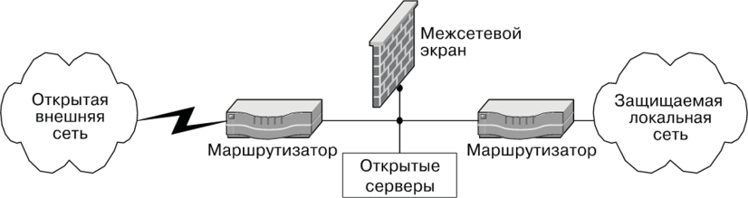
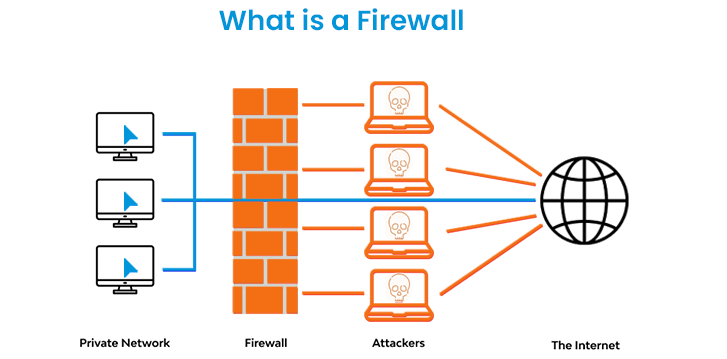

---
## Front matter
lang: ru-RU
title: Презентация
subtitle: Хеш-функции
author:
  - Калашникова Д. В.
institute:
  - Российский университет дружбы народов, Москва, Россия
date: 29 апреля 2026

## i18n babel
babel-lang: russian
babel-otherlangs: english

## Formatting pdf
toc: false
toc-title: Содержание
slide_level: 2
aspectratio: 169
section-titles: true
theme: metropolis
header-includes:
 - \metroset{progressbar=frametitle,sectionpage=progressbar,numbering=fraction}
 - '\makeatletter'
 - '\beamer@ignorenonframefalse'
 - '\makeatother'
 
## Fonts
mainfont: PT Serif
romanfont: PT Serif
sansfont: PT Sans
monofont: PT Mono
mainfontoptions: Ligatures=TeX
romanfontoptions: Ligatures=TeX
sansfontoptions: Ligatures=TeX,Scale=MatchLowercase
monofontoptions: Scale=MatchLowercase,Scale=0.9
---

# Информация

## Докладчик

:::::::::::::: {.columns align=center}
::: {.column width="70%"}

  * Калашникова Дарья Викторовна
  * Студент
  * Российский университет дружбы народов
  * [1132243108@pfur.ru](mailto:1132243108@pfur.ru)

:::
::: {.column width="30%"}

:::
::::::::::::::

# Введение

Хеш-функция — это преобразование, которое берёт данные произвольной длины и выдаёт строку фиксированного размера (хеш). Хеширование необратимо: по хешу нельзя восстановить исходные данные. Это свойство делает хеш-функции незаменимыми для хранения паролей, контроля целостности, цифровых подписей и блокчейна.

## Актуальность темы

Хеш-функции лежат в основе криптографических протоколов (TLS, цифровые подписи), используются для хранения паролей и контроля целостности файлов. Старые алгоритмы (MD5, SHA-1) уже скомпрометированы — для них найдены реальные коллизии. Понимание принципов работы хеш-функций критически важно для специалистов по информационной безопасности.

## Объект и предмет исследования

- *Объект* — класс хеш-функций как математических и алгоритмических объектов.
- *Предмет* — свойства хеш-функций, их стойкость к атакам и области применения.

## Научная новизна

Систематизация знаний о хеш-функциях применительно к современным угрозам. Анализ практических последствий компрометации MD5 и SHA-1. Формулировка рекомендаций по выбору алгоритмов.

## Практическая значимость

Материалы могут быть использованы разработчиками систем безопасности, системными администраторами и студентами IT-специальностей.

## Материалы, методы и инструменты

- *Материалы:* публикации Шнайера, стандарты NIST (FIPS 180-4, FIPS 202)
- *Методы:* формальное описание, сравнительный анализ, моделирование атак
- *Инструменты:* OpenSSL, утилиты md5sum и sha256sum

# Цели и задачи

## Цель

Систематизировать знания о хеш-функциях и сформулировать рекомендации по выбору алгоритмов.

## Гипотеза

При правильном выборе типа хеш-функции и использовании современных стандартов хеш-функции обеспечивают высокий уровень безопасности и производительности.

## Задачи исследования

1. Дать определение и сформулировать требования
2. Классифицировать хеш-функции
3. Рассмотреть эволюцию алгоритмов
4. Описать атаки на MD5 и SHA-1
5. Показать применение в реальных системах
6. Сформулировать рекомендации

# Глава 1. Формальная модель и свойства

## Определение

Хеш-функция H — это отображение H: любые данные -> строка из n бит, где n — фиксированная длина выхода (например, 256 бит). Коллизии (разные входы с одинаковым выходом) математически неизбежны, но хорошая хеш-функция делает их поиск невозможным.

{#fig:001 width=50%}

## Требования к хеш-функциям

| Свойство | Смысл |
|----------|-------|
| Односторонность | Нельзя восстановить вход по хешу |
| Коллизионная стойкость | Сложно найти два входа с одинаковым хешем |
| Лавинный эффект | 1 бит изменения входа меняет 50% битов выхода |

## Ограничения стойкости

Атака «дней рождения» находит коллизию за 2 в степени n/2 операций. Для MD5 (128 бит) это $2^{64}$ операций — достижимо. Современные стандарты требуют n ≥ 256 бит.

# Глава 2. Классификация и алгоритмы

## Классификация

**По назначению:** криптографические (SHA-256, SHA-3) — для безопасности; некриптографические (xxHash, MurmurHash) — для скорости.

**По архитектуре:** итеративные (MD5, SHA-1, SHA-2) — уязвимы к удлинению; губчатые (SHA-3) — защищены.

## Эволюция алгоритмов

| Алгоритм | Длина | Статус |
|----------|-------|--------|
| MD5 | 128 бит | Сломан (2004) |
| SHA-1 | 160 бит | Ослаблен (2017) |
| SHA-256 | 256 бит | Безопасен |
| SHA-3 | до 512 бит | Современный стандарт |

# Глава 3. Криптоанализ и атаки

## Атаки на хеш-функции

- **Поиск коллизий** — для MD5 находится мгновенно
- **Атака «дней рождения»** — 2 в степени n/2 операций
- **Атака удлинением** — работает на MD5, SHA-1, SHA-2

## Практические взломы

- **2008:** поддельные SSL-сертификаты для MD5
- **2017:** коллизия SHA-1 (Google «Shattered»)
- **2019:** коллизия SHA-1 за $110 тыс. облачных вычислений

# Глава 4. Применение в реальных системах

## Хранение паролей

**Неправильно:** хранить H(пароль) — уязвимо для радужных таблиц.

**Правильно:** соль (уникальная строка) + итеративное хеширование.

**Алгоритмы:** Argon2, bcrypt, PBKDF2.

{#fig:002 width=55%}

## Другие применения

- **Блокчейн:** двойной SHA-256 в Биткойне
- **Хеш-таблицы:** xxHash, MurmurHash
- **Контроль целостности:** SHA-256, CRC32
- **Цифровая подпись:** хеш подписывается, а не всё сообщение

# Глава 5. Рекомендации

## Что не следует использовать

| Алгоритм | Причина |
|----------|---------|
| MD5, SHA-1 | Реальные коллизии |
| Собственная хеш-функция | Почти гарантированно уязвима |

## Что рекомендуется

| Задача | Алгоритм |
|--------|----------|
| Хранение паролей | Argon2, bcrypt, PBKDF2 |
| Цифровая подпись | SHA-256, SHA-3 |
| Хеш-таблицы | xxHash, MurmurHash |
| Контроль ошибок | CRC-32, CRC-64 |

# Заключение и выводы

## Заключение и выводы

1. Хеш-функции — основа современной криптографии

2. MD5 и SHA-1 использовать нельзя

3. Стандарт де-факто — SHA-256

4. Для паролей обязательны соль и итерации

5. Для хеш-таблиц — xxHash, MurmurHash

6. Гипотеза подтвердилась

## Заключение и выводы

**Практические советы:**
- Не использовать учётную запись администратора для повседневной работы
- Регулярно проверять целостность файлов по хеш-суммам
- Для важных данных применять принцип наименьших привилегий

**Основной вывод:** Хеш-функции незаменимы, но их безопасность напрямую зависит от правильного выбора алгоритма. Использование устаревших алгоритмов (MD5, SHA-1) недопустимо.

