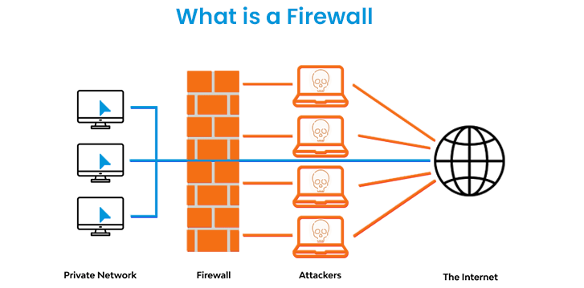

---
## Front matter
title: "Программные межсетевые экраны"
subtitle: "Доклад"
author: "Калашникова Дарья Викторовна"

## Generic otions
lang: ru-RU
toc-title: "Содержание"

## Bibliography
bibliography: bib/cite.bib
csl: pandoc/csl/gost-r-7-0-5-2008-numeric.csl

## Pdf output format
toc: true # Table of contents
toc-depth: 2
lof: true # List of figures
lot: true # List of tables
fontsize: 12pt
linestretch: 1.5
papersize: a4
documentclass: scrreprt
## I18n polyglossia
polyglossia-lang:
  name: russian
  options:
	- spelling=modern
	- babelshorthands=true
polyglossia-otherlangs:
  name: english
## I18n babel
babel-lang: russian
babel-otherlangs: english
## Fonts
mainfont: IBM Plex Serif
romanfont: IBM Plex Serif
sansfont: IBM Plex Sans
monofont: IBM Plex Mono
mathfont: STIX Two Math
mainfontoptions: Ligatures=Common,Ligatures=TeX,Scale=0.94
romanfontoptions: Ligatures=Common,Ligatures=TeX,Scale=0.94
sansfontoptions: Ligatures=Common,Ligatures=TeX,Scale=MatchLowercase,Scale=0.94
monofontoptions: Scale=MatchLowercase,Scale=0.94,FakeStretch=0.9
mathfontoptions:
## Biblatex
biblatex: true
biblio-style: "gost-numeric"
biblatexoptions:
  - parentracker=true
  - backend=biber
  - hyperref=auto
  - language=auto
  - autolang=other*
  - citestyle=gost-numeric
## Pandoc-crossref LaTeX customization
figureTitle: "Рис."
tableTitle: "Таблица"
listingTitle: "Листинг"
lofTitle: "Список иллюстраций"
lotTitle: "Список таблиц"
lolTitle: "Листинги"
## Misc options
indent: true
header-includes:
  - \usepackage{indentfirst}
  - \usepackage{float} # keep figures where there are in the text
  - \floatplacement{figure}{H} # keep figures where there are in the text
---
# Введение
 
**Актуальность:**

В современной цифровой экономике, где бизнес-процессы и критическая инфраструктура неразрывно связаны с сетью, обеспечение кибербезопасности перешло из разряда опциональных мер в категорию обязательных. Рост изощренных кибератак, таких как целевые атаки (APT), ransomware и эксплуатация уязвимостей в сетевых службах, требует многоуровневой защиты. 

**Программные межсетевые экраны** 

(ПМЭ) являются ключевым элементом стратегии "защиты в глубину" (Defense in Depth), обеспечивая контроль на уровне конечного хоста (host-based). Их актуальность обусловлена распространением удаленной работы, облачных технологий и контейнеризации, где традиционные периметровые средства защиты часто оказываются недостаточными.

**Объект и предмет исследования**

*   **Объект исследования:** Системы и методы сетевой безопасности, ориентированные на защиту конечных точек.

*   **Предмет исследования:** Программные межсетевые экраны, их архитектурные особенности, алгоритмы фильтрации, эволюция и практическая реализация в современных операционных системах и облачных средах.
 
**Научная новизна и практическая значимость**

*   **Научная новизна:** Работа заключается в систематизации знаний о современных ПМЭ, их интеграции с новыми парадигмами безопасности, такими как Zero Trust, и анализе их эффективности в условиях виртуализации и микросервисной архитектуры.

*   **Практическая значимость:** Материалы доклада могут быть использованы системными администраторами, DevOps-инженерами и специалистами по информационной безопасности для выбора, настройки и эффективного управления ПМЭ с целью минимизации сетевых угроз и снижения "атакуемой поверхности" (attack surface) серверов и рабочих станций.
 
 **Цель и задачи**
 
*   **Цель:** Комплексное исследование концепции программных межсетевых экранов, их функциональных возможностей, места в экосистеме безопасности и перспектив развития.

*   **Задачи:**
    *   Проследить эволюцию и дать классификацию межсетевых экранов.
    *   Детально изучить архитектуру и принципы работы ПМЭ.
    *   Проанализировать методы фильтрации трафика (пакетная фильтрация, stateful inspection, etc.).
    *   Провести сравнительный анализ программных и аппаратных решений.
    *   Исследовать примеры практической реализации ПМЭ в популярных ОС.
    *   Оценить роль ПМЭ в современных облачных и контейнеризованных средах.
 
# Основная часть

## Что такое программные межсетевые экраны? 

{#fig:002 width=70%}

Программный межсетевой экран (Software Firewall) — это программа или служба, устанавливаемая непосредственно на операционную систему конечного устройства (сервера, рабочей станции, виртуальной машины) для контроля и фильтрации сетевого трафика на основе заданных правил безопасности.

В отличие от аппаратных решений, которые защищают весь сетевой периметр, программный файрвол функционирует на уровне отдельного хоста, обеспечивая хостовую безопасность (Host-based Security). Его ключевая задача — предоставить последний рубеж обороны, контролируя весь входящий, исходящий и, в некоторых случаях, внутренний трафик конкретного устройства.

Базовый принцип работы можно описать следующей последовательностью:

Перехват: Сетевой пакет, поступающий на сетевой интерфейс или отправляемый приложением, перехватывается файрволом.

Анализ: Пакет анализируется по набору критериев: IP-адреса отправителя и получателя, порты, тип сетевого протокола (TCP, UDP, ICMP), состояние сетевого соединения и, в продвинутых случаях, содержимое пакета.

Сопоставление с правилами: Полученные данные сопоставляются с предустановленной базой правил (политикой безопасности).

Решение и действие: На основе правил файрвол принимает решение:

Разрешить (Allow/Accept): Пакет передается дальше по сетевому стеку приложению или в сеть.

Заблокировать (Block/Drop): Пакет уничтожается без какого-либо уведомления отправителя.

Отклонить (Reject): Пакет уничтожается, но отправителю отправляется уведомление об ошибке (например, "порт недоступен").

Логирование (опционально): Событие (успешное или нет) может быть записано в системный журнал для последующего аудита и анализа.

## Теоретические основы межсетевых экранов
 
### Эволюция межсетевых экранов
*   **Поколение 1 (1980-е): Фильтрация пакетов.** Появление первых маршрутизаторов с возможностью создания ACL (Access Control Lists). Решения принимались на основе IP-адресов и портов.
*   **Поколение 2 (1990-е): Stateful Inspection (проверка состояния).** Революция, совершенная компанией Check Point. МЭ начали отслеживать состояние соединений (TCP-сессии), что значительно повысило безопасность и удобство.
*   **Поколение 3 (2000-е): Межсетевые экраны уровня приложений (Application-Level).** Глубокий анализ трафика L7 для защиты от атак на уровне приложений (например, SQL-инъекции, веб-уязвимости).
*   **Поколение 4 (2010-е - н.в.): Next-Generation Firewall (NGFW).** Интеграция функций IDS/IPS, фильтрации URL, контроля приложений (Application Control) и защиты от угроз на основе сигнатур и поведенческого анализа.
*   **Современность: Файрволы как сервис (FWaaS) и облачные МЭ.** Логическое продолжение эволюции в эпоху облаков, предлагающее централизованное управление и масштабируемость.
 
### Классификация межсетевых экранов
1.  **По уровню работы:**
    *   Сетевой (пакетные фильтры).
    *   Сеансовый (stateful).
    *   Прикладной (прокси).
2.  **По исполнению:**
    *   **Аппаратные:** Специализированное оборудование ("железка в стойке").
    *   **Программные:** Приложение, установленное на универсальную ОС.
    *   **Виртуальные:** Программный МЭ, работающий на виртуальной машине в облаке.
3.  **По типу развертывания:**
    *   Периметровые (граничные).
    *   Хостовые (программные МЭ).
    *   Микросетевые (для сегментации сети, например, в ЦОД).
 
### Аппаратные vs. Программные межсетевые экраны

{#fig:004 width=70%}

*   **Аппаратные МЭ:** Это "коробочные" решения, представляющие собой специализированный компьютер с собственной ОС, оптимизированной для одной задачи – фильтрации трафика. Примеры: Cisco ASA, FortiGate, Palo Alto Networks.
    *   **Плюсы:** Высокая производительность, отказоустойчивость, централизованное управление сетью.
    *   **Минусы:** Высокая стоимость, ограниченная гибкость, привязка к физическому устройству.
*   **Программные МЭ:** Это приложение, которое работает на сервере под управлением общей ОС (Windows Server, Linux).
    *   **Плюсы:** Низкая стоимость (часто бесплатно), гибкость, легкое масштабирование и развертывание, идеальны для виртуальных сред.
    *   **Минусы:** Зависимость от производительности и безопасности хоста, сложность управления большим количеством экземпляров.
 
## Ключевые особенности и принципы работы программных межсетевых экранов
 
### Архитектура и интеграция в операционную систему
ПМЭ глубоко интегрируется в сетевой стек ОС. В Windows для этого используется механизм **Windows Filtering Platform (WFP)**, который позволяет перехватывать и фильтровать пакеты на различных уровнях сетевого стека. В Linux основой являются frameworks **Netfilter** и **nftables**, в которые встраиваются правила `iptables` или современного `nft`. Эта интеграция позволяет ПМЭ анализировать весь трафик "на лету", до его передачи приложениям пользователя или в сетевой интерфейс.
 
### Принципы и методы фильтрации сетевого трафика
1.  **Статическая фильтрация пакетов:** Базовый метод. Анализируются заголовки IP-пакетов (источник, назначение, протокол, порты). Решение принимается на основе статичного списка правил (ACL). Недостаток: не отслеживает состояние сессии (например, разрешит любой пакет с порта 80, даже если он не является ответом на исходящий запрос).
2.  **Dynamic (Stateful) Packet Filtering:** Современный стандарт. МЭ хранит в памяти таблицу состояний всех установленных соединений. Это позволяет:
    *   Отличать легитимный ответный трафик от несанкционированной входящей попытки соединения.
    *   Эффективно работать с протоколами вроде FTP, которые используют динамические порты.
    *   Значительно сократить количество правил, сделав политику более безопасной и простой в управлении.
3.  **Файрвол уровня приложений (Application Firewall):** Работает на 7-м уровне модели OSI. Может:
    *   Блокировать конкретные действия в протоколе (например, команду `PUT` в HTTP).
    *   Проверять содержимое пакетов на наличие сигнатур вирусов или уязвимостей.
    *   Контролировать, какое приложение имеет право открывать сетевые соединения (контроль приложений).
4.  **Глубокий анализ пакетов (Deep Packet Inspection - DPI):** Расширенная форма анализа, при которой проверяется не только заголовок, но и "тело" пакета. Позволяет выявлять сложные угрозы, шифрованный трафик (анализируя метаданные) и фильтровать контент.
 
### Типы, режимы работы и политики безопасности
*   **Типы ПМЭ:**
    *   **Персональные:** Встроены в Windows (Брандмауэр Защитника), macOS (pf). Нацелены на защиту одной рабочей станции.
    *   **Серверные:** `iptables/nftables`, `firewalld` в Linux. Защищают серверы, предоставляющие услуги.
    *   **Виртуальные:** Решения вроде VMware NSX, которые фильтруют трафик между виртуальными машинами внутри гипервизора.
*   **Режимы работы:**
    *   **Enforcing/Active:** Правила активно применяются, неразрешенный трафик блокируется.
    *   **Audit/Logging:** Трафик не блокируется, но все события, которые были бы заблокированы, логируются. Используется для отладки правил.
*   **Политики безопасности по умолчанию:**
    *   **Whitelist ("Запретить все, разрешить явно"):** Наиболее безопасная. По умолчанию весь трафик блокируется, разрешаются только те соединения, которые описаны в правилах.
    *   **Blacklist ("Разрешить все, запретить явно"):** Менее безопасная, но более простая. По умолчанию трафик разрешен, блокируются только известные угрозы.
 
## Сравнительный анализ и практическое применение
 
### Детальный анализ преимуществ и недостатков
*   **Преимущества:**
    *   **Экономическая эффективность:** Отсутствие затрат на специализированное оборудование. Многие решения (iptables, Windows Firewall) бесплатны.
    *   **Гибкость и кастомизация:** Правила можно тонко настраивать под конкретные нужды приложения. Легко интегрируются с системами автоматизации (Ansible, Chef, Puppet).
    *   **Идеальное решение для хостовой защиты:** Защищают узел даже в обход периметрового МЭ (защита от угроз "изнутри" сети).
    *   **Быстрое развертывание и обновление:** Новые правила применяются мгновенно. Образ сервера с предустановленным и настроенным ПМЭ легко клонировать.
    *   **Эффективность в сегментации:** В микросервисных архитектурах и облаках виртуальные ПМЭ используются для изоляции сегментов сети друг от друга.
 
*   **Недостатки:**
    *   **Зависимость от хоста:** Если злоумышленник получит полный контроль над ОС, он может отключить или обойти ПМЭ. Производительность напрямую зависит от загрузки ЦП и памяти хоста.
    *   **Сложность централизованного управления:** Управление тысячами экземпляров ПМЭ на разных серверах требует специальных инструментов управления политиками.
    *   **Единая точка отказа:** Если хост выйдет из строя, то вместе с ним "умрет" и его защита.
    *   **Риск конфликта:** Может конфликтовать с другим системным ПО, особенно с антивирусами и другими системами безопасности.
 
### Сравнительная таблица: Программные и аппаратные МЭ
| Критерий | **Программный МЭ** | **Аппаратный МЭ** |
| :--- | :--- | :--- |
| **Стоимость владения** | Низкая (CAPEX ~ 0) | Высокая (капитальные затраты) |
| **Производительность** | Зависит от ресурсов хоста | Высокая, предсказуемая, специализированная |
| **Масштабируемость** | Легко масштабируется по числу экземпляров | Масштабируется путем апгрейда или покупки более мощной модели |
| **Защита** | Отдельного хоста / виртуальной среды | Всего сетевого периметра |
| **Гибкость правил** | Очень высокая | Ограничена возможностями firmware |
| **Управление** | Децентрализованное (требует оркестрации) | Централизованное, через единую консоль |
| **Идеальная сфера** | Облака, виртуальные среды, серверы, ПК | Крупные корпоративные сети, филиалы, ЦОД |
 
### Примеры реализации в современных ОС и средах
*   **Windows: Брандмауэр Защитника Windows.** Мощный Stateful Firewall с поддержкой правил для входящих и исходящих подключений, интеграцией с Windows Security Center и возможностью тонкой настройки через групповые политики (GPO). Яркий пример ПМЭ enterprise-уровня.
*   **Linux: iptables/nftables.** Классические инструменты, представляющие собой интерфейс для управления framework'ом Netfilter в ядре Linux. `nftables` — это современный преемник `iptables`, предлагающий более унифицированный синтаксис и производительность.
    *   **UFW (Uncomplicated Firewall):** Пользовательский фронтенд для `iptables`, предназначенный для упрощения настройки. Стандарт в Ubuntu.
    *   **firewalld:** Динамический менеджер ПМЭ, используемый в RHEL, CentOS, Fedora. Работает с зонами, что упрощает управление для систем с разными сетевыми профилями (например, "домашний", "публичный", "рабочий").
*   **macOS: Приложение "Файрвол" и pf.** В macOS используется мощный ПМЭ `pf` (packet filter), заимствованный из OpenBSD. Графический интерфейс предоставляет базовый контроль, а через командную строку можно настроить сложные правила.
*   **Облачные платформы:**
    *   **AWS Security Groups & NACLs:** Это виртуальческие ПМЭ. Security Groups работают на уровне виртуальной машины (EC2 instance) и реализуют Stateful Filtering. NACLs (Network ACLs) работают на уровне подсети и являются stateless.
    *   **Azure Network Security Groups (NSGs):** Аналогичный сервис в Microsoft Azure.
*   **Контейнеризация:**
    *   **Docker:** Имеет встроенный механизм управления сетевыми правилами, который по сути является ПМЭ, изолирующим контейнеры.
    *   **Kubernetes: Network Policies.** Это механизм, который определяет, как группы Pod'ов могут общаться друг с другом и с другими сетевыми endpoint'ами. Реализация этих политик ложится на сетевые плагины (CNI), такие как Calico или Cilium, которые разворачивают свои ПМЭ на каждом узле кластера.
 
### Роль в комплексной системе безопасности**
ПМЭ не являются "серебряной пулей". Их эффективность максимальна в рамках стратегии **"защиты в глубину"**:
1.  **Периметровый МЭ** — первый рубеж обороны.
2.  **Сетевая сегментация** — изоляция критических сегментов друг от друга.
3.  **Программный МЭ на сервере** — последний рубеж, который защищает конкретную службу даже в случае компрометации сегмента сети.
4.  **Система предотвращения вторжений (IPS)** — анализирует трафик на наличие аномалий.
5.  **Антивирус / EDR** — защита на уровне приложений и процессов.
 
В модели **Zero Trust** ("Никому не доверяй, проверяй все") ПМЭ на каждом хосте становятся критически важным элементом, обеспечивающим микросегментацию и строгий контроль доступа между рабочими нагрузками, независимо от их расположения в сети.
 
# Заключение
 
1.  Программные межсетевые экраны эволюционировали от простых пакетных фильтров до сложных систем класса Next-Generation, обеспечивающих глубокий анализ трафика и контроль на уровне приложений.
2.  Их ключевое преимущество заключается в уникальном сочетании гибкости, низкой стоимости и идеального соответствия задачам защиты виртуальных, облачных и контейнеризованных сред, где физический сетевой периметр размыт.
3.  Несмотря на зависимость от ресурсов хоста и сложность централизованного администрирования в крупных инфраструктурах, ПМЭ остаются незаменимым элементом современной многоуровневой системы безопасности.
4.  Интеграция ПМЭ в операционные системы по умолчанию (Windows Firewall, iptables в Linux) и их центральная роль в облачных платформах (Security Groups, NSGs) и оркестраторах (Kubernetes Network Policies) подчеркивает их фундаментальную важность для обеспечения безопасности на уровне рабочей нагрузки (workload security) в XXI веке.
5.  В будущем можно ожидать дальнейшего сближения ПМЭ с системами EDR (Endpoint Detection and Response) и более тесной интеграции с AI/ML для проактивного выявления угроз на основе анализа сетевого поведения.

# Список литературы
 
1.  Бумажные ресурсы:
    *   Немет Э., Снайдер Г., Хейн Т., Уэйли В. UNIX и Linux: Руководство системного администратора. — 4-е изд. — СПб.: БХВ-Петербург, 2018.
    *   Робачевский А.М. Операционная система UNIX. — СПб.: БХВ-Петербург, 2017.
    *   Таненбаум Э., Уэзеролл Д. Компьютерные сети. — 5-е изд. — СПб.: Питер, 2012.
 
2.  Электронные ресурсы:
    *   Официальная документация iptables: `man iptables`
    *   Официальная документация nftables: `man nft`, [Wiki nftables](https://wiki.nftables.org/)
    *   Официальная документация firewalld: `man firewalld`, [firewalld.org](https://firewalld.org/)
    *   DigitalOcean: "An Introduction to iptables": https://www.digitalocean.com/community/tutorials/iptables-essentials-common-firewall-rules-and-commands
    *   Red Hat: "Getting started with firewalld": https://www.redhat.com/sysadmin/getting-started-firewalld
    *   Kubernetes Documentation: "Network Policies": https://kubernetes.io/docs/concepts/services-networking/network-policies/
    *   Arch Linux Wiki: "iptables", "nftables": https://wiki.archlinux.org/
```
